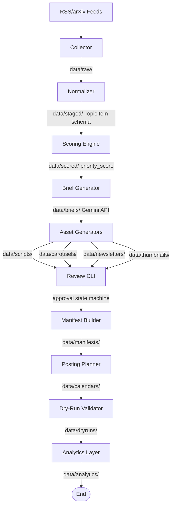

# Content Creation Automation


A source-grounded, AI-powered content pipeline that automatically finds, ranks, and repurposes ML/AI research into educational content assets.

## The Problem

Instead of bouncing between RSS feeds, Twitter, and paper aggregators every morning, Aryan built a pipeline that does it automatically — and turns what it finds into ready-to-publish educational content for ML/AI students. The problem with existing AI content generators is they prioritize volume over accuracy and often hallucinate technical details. The insight here was that a single, highly constrained pipeline with a strict "grounded-or-nothing" rule beats a dozen noisy feeds. The result is a robust, transparent engine that takes raw XML and arXiv papers and transforms them into validated, ready-to-review educational assets.

## What It Does

1. **Collects** → from arXiv, blogs, RSS feeds
2. **Scores** → student usefulness, novelty, credibility
3. **Summarizes** → source-grounded educational briefs
4. **Generates** → scripts, carousels, newsletters, thumbnails
5. **Reviews** → human approval state machine
6. **Plans** → 7-day content calendar with diversity rules
7. **Validates** → dry-run publishing workflow with checklists

## Why This Architecture

**Staged pipeline over monolithic generator**
Reason: By decoupling ingestion, scoring, and generation, each stage is independently testable and replaceable. If an API fails or a prompt drifts, the failure is isolated.

**Schema-first development with Pydantic**
Reason: Parallel branch development requires frozen contracts. Pydantic ensures that data structures like `TopicItem` and `Brief` remain strictly typed and validated across all pipeline stages.

**Config-driven scoring (scoring.yaml)**
Reason: Content strategy changes frequently. By moving scoring weights (e.g., student_usefulness, explainability) to a YAML file, we can tune the pipeline's behavior without touching core code.

**Grounded generation with anti-hallucination rules**
Reason: Educational content cannot afford fabricated claims. The system strictly separates raw extraction from interpretation and marks missing data as `unknown` to prevent the model from guessing.

**Hybrid manifest builder**
Reason: Tracking the state of multiple asset types per topic requires a single source of truth. The manifest aggregates on-disk assets without coupling the specific generators to the tracking logic.

**Soft-warn dry-run before publishing**
Reason: A planner needs to see the full picture, including non-ready assets, before committing to a schedule. The dry-run provides a checklist of warnings and blocks rather than auto-failing.

## Architecture Flow Diagram



## Tech Stack

| Layer | Technology |
| --- | --- |
| **Language** | Python 3.12 |
| **Data Validation** | Pydantic v2 |
| **LLM Provider** | Gemini API (gemini-2.5-flash) |
| **Ingestion** | feedparser |
| **Environment** | uv |
| **Testing** | pytest |
| **CLI Framework** | argparse |
| **Configuration** | PyYAML |

## Project Structure

```text
Content-Creation/
├── README.md                 # Project overview and setup
├── pyproject.toml            # Dependencies and project metadata
├── config/                   # YAML configurations
│   ├── feeds.yaml            # Source definitions
│   ├── publishing.yaml       # Planner and cadence rules
│   └── scoring.yaml          # Priority weights
├── data/                     # Local JSON storage (git-ignored)
│   ├── raw/                  # Original XML/HTML
│   ├── staged/               # Validated TopicItems
│   ├── scored/               # Topics with priority scores
│   ├── briefs/               # Summarized context
│   ├── scripts/              # Video drafts
│   ├── carousels/            # Slide drafts
│   ├── newsletters/          # Email drafts
│   ├── thumbnails/           # Prompt drafts
│   ├── manifests/            # Aggregated topic states
│   ├── calendars/            # Weekly content schedules
│   ├── dryruns/              # Pre-publish validation reports
│   ├── analytics/            # Post performance tracking
│   └── logs/                 # Structured pipeline run logs
├── docs/                     # Internal documentation
│   ├── project-context.md    # Architecture and goals
│   ├── schema.md             # Shared data contracts
│   └── voice-and-style.md   # Editorial constraints
├── prompts/                  # Markdown system prompts
│   ├── summarize.md          # Brief generation prompt
│   ├── short_video.md        # Video script generation
│   ├── carousel.md           # Carousel slide generation
│   ├── newsletter.md         # Newsletter generation
│   └── thumbnail.md          # Thumbnail prompt generation
├── src/
│   └── content_creation/
│       ├── cli.py            # Main argparse entry point
│       ├── collectors/       # RSS/Atom fetchers
│       ├── generation/       # Gemini API wrappers
│       ├── models/           # Pydantic schema definitions
│       ├── planning/         # Calendar and dry-run logic
│       ├── scoring/          # Rules engine and flags
│       ├── storage/          # Local JSON file handlers
│       └── utils/            # Logging and config utilities
└── tests/                    # pytest suite (125 tests)
```

## Setup

### Prerequisites
- Python 3.10+
- uv package manager
- Gemini API key (free tier sufficient for development)

### Installation
```bash
git clone https://github.com/00-Aryan/Content-Creation-Automation
cd Content-Creation-Automation
uv sync
export GEMINI_API_KEY=your_key_here
uv run python -m pytest --tb=short -q  # verify 125 tests pass
```

### Running the Pipeline (end to end)

#### Single Command (recommended)
```bash
uv run python -m content_creation.cli run-pipeline --top 5
```

#### With auto-approve (development/testing only)
```bash
uv run python -m content_creation.cli run-pipeline --top 5 --auto-approve
```

#### Step by Step
```bash
uv run python -m content_creation.cli collect --all
uv run python -m content_creation.cli score-topics
uv run python -m content_creation.cli generate-briefs --top 5
uv run python -m content_creation.cli generate-assets --top 5
uv run python -m content_creation.cli build-all-manifests
uv run python -m content_creation.cli review-assets --topic-id <topic_id>
uv run python -m content_creation.cli batch-approve --asset-type all --all
uv run python -m content_creation.cli plan-week
uv run python -m content_creation.cli dry-run
uv run python -m content_creation.cli init-analytics
```

## Key Design Constraints

- **Never invent facts — grounded or nothing:** If a source does not state a detail, the model cannot infer it. Missing data is explicitly marked as `unknown`.
- **Every asset traceable to source URL:** Generation is mathematically tied to its origin. All content retains a deterministic ID pointing back to the raw material.
- **Human review required before scheduling:** Nothing is published automatically. Every generated asset must pass through an explicit human approval state machine.
- **Config-driven, not hardcoded:** Weights, freshness thresholds, and format schedules are managed via YAML, keeping the execution logic pure.

## Future Roadmap

1. **Web dashboard for review and approval workflow:** Upgrades the CLI state machine to a visual interface to reduce friction during editorial reviews.
2. **Multi-language content support:** Localizes generation prompts to support international ML/AI students without duplicating ingestion logic.
3. **Performance feedback loop into scoring weights:** Uses historical engagement data from the analytics layer to dynamically adjust novelty and usefulness priority scores.
4. **Image generation integration (Gemini free tier):** Transforms text-based thumbnail prompts into actual synthesized imagery directly within the pipeline.
5. **Platform API integration for auto-posting:** Bridges the gap between the dry-run checklist and production endpoints for approved calendars.
6. **RAG for semantic deduplication and analogy reuse tracking:** Prevents the pipeline from repeatedly covering identical technical concepts or exhausting its library of pedagogical metaphors.

## Author

Aryan Kumar  
GitHub: https://github.com/00-Aryan  

---
Built as a portfolio project to demonstrate end-to-end ML/AI systems thinking, LLM pipeline engineering, and educational content strategy.
