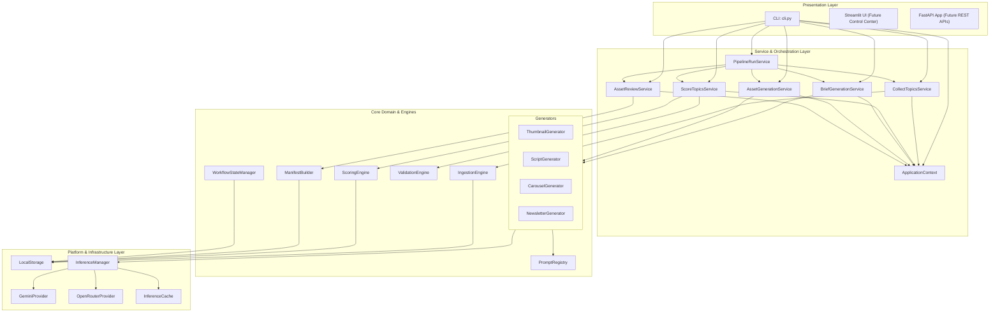

# Backend Architecture Snapshot (v0.5)

This document provides a comprehensive blueprint of the backend architecture of the `content-creation` factory pipeline following the Phase 7 CLI delegation refactor. The system operates on a clean separation of concerns, moving from ad-hoc inline orchestration to structured application services.

---

## 1. Layer Diagram

The backend follows a strict layered architecture to ensure decoupling, maintainability, and clean dependency management.



---

## 2. Dependency Direction

Dependency flow is strictly **downward** and **inward**:
1. **No Circular Dependencies:** Lower layers have absolutely zero knowledge of the layers above them. The Domain and Platform layers do not import from Application Services, and Application Services do not import from the CLI/Presentation layer.
2. **Context-Driven Injection:** All Services accept a unified [ApplicationContext](file:///home/aryan/May-2026/Content-Creation/src/content_creation/application/context.py) object at runtime. This prevents direct hardcoding of file system paths, configurations, or database handles.
3. **DTO Boundaries:** Layer boundaries are crossed using typed, frozen Data Transfer Objects (DTOs) and Pydantic models (such as `CollectResult`, `ScoreResult`, `BriefGenerationResult`, `AssetGenerationResult`, and `ReviewResult`), ensuring that Presentation components never manage raw domain state calculations.

---

## 3. Service Responsibilities

Below is an overview of the core services and their runtime characteristics:

| Service Class | Orchestrated Responsibility | Input Parameters | Return DTO / Model |
| :--- | :--- | :--- | :--- |
| [CollectTopicsService](file:///home/aryan/May-2026/Content-Creation/src/content_creation/application/collect_topics_service.py) | Parses feeds configuration, initiates the ingestion engine, and saves raw topic candidates. | `ctx: ApplicationContext`, `source_filter: Optional[str]` | `CollectResult` (contains list of new `TopicItem` and count) |
| [ScoreTopicsService](file:///home/aryan/May-2026/Content-Creation/src/content_creation/application/score_topics_service.py) | Scores raw topics against rulesets, runs strict schema/heuristic validation, and persists outputs. | `ctx: ApplicationContext`, `limit: Optional[int]` | `ScoreResult` (contains lists of scored/rejected items, counts) |
| [BriefGenerationService](file:///home/aryan/May-2026/Content-Creation/src/content_creation/application/brief_generation_service.py) | Filters and ranks top topics, invokes Gemini to produce deep structured briefs, and handles rate-limits. | `ctx: ApplicationContext`, `top_n: int`, `api_key: Optional[str]`, `rate_limit_delay: float` | `BriefGenerationResult` (contains briefs, failure details, and counts) |
| [AssetGenerationService](file:///home/aryan/May-2026/Content-Creation/src/content_creation/application/asset_generation_service.py) | Resolves format maps (scripts, carousels, newsletters, thumbnails) and generates asset files for selected briefs. | `ctx: ApplicationContext`, `top_n: int`, `api_key: Optional[str]`, `rate_limit_delay: float` | `AssetGenerationResult` (contains count details per type, failure details) |
| [AssetReviewService](file:///home/aryan/May-2026/Content-Creation/src/content_creation/application/asset_review_service.py) | Inspects current asset statuses, reads review queues, applies review choices, and recompiles manifests. | `ctx: ApplicationContext`, `topic_id: str`, `decisions: List[AssetDecision]` (for modification) | `ReviewResult` (contains manifest and approval counts) or `List[AssetReviewItem]` (for queries) |
| [PipelineRunService](file:///home/aryan/May-2026/Content-Creation/src/content_creation/application/pipeline_run_service.py) | Executes collection, scoring, briefs, assets, manifest compilation, and optional auto-approval sequentially. | `ctx: ApplicationContext`, `top_n: int`, `source_filter: Optional[str]`, `auto_approve: bool`, `api_key: Optional[str]` | `PipelineRunResult` (contains log path, success flag, stages run, and detailed summaries) |

---

## 4. Storage Ownership

All persistent operations are owned by [LocalStorage](file:///home/aryan/May-2026/Content-Creation/src/content_creation/storage/local.py), which is wrapped and exposed by the dependency container [ApplicationContext](file:///home/aryan/May-2026/Content-Creation/src/content_creation/application/context.py).

*   `data/staged/` — Raw topic items collected from RSS/feed sources.
*   `data/scored/` — Topic items populated with validation flags, priority scores, and updated statuses (`scored` / `rejected`).
*   `data/briefs/` — Gemini-generated educational briefs detailing content guidelines and recommended formats.
*   `data/thumbnails/` — Thumbnail asset metadata containing generated layout designs and copy.
*   `data/scripts/` — Short-form video scripts (hooks, main points, call-to-actions).
*   `data/carousels/` — Social media carousel slides containing visual guides and text copies.
*   `data/newsletters/` — Email newsletter drafts.
*   `data/manifests/` — Topic asset manifests compiling compilation status (`partial`, `complete`, `blocked`).
*   `data/workflow_state/` — Logs of completed and failed pipeline stages for tracking workflow state.
*   `data/calendars/` — Weekly publishing schedules (JSON and Markdown calendar logs).
*   `data/dryruns/` — Reports generated by the dry-run validation steps.
*   `data/analytics/` — Snapshots containing views, reach, comments, saves, and CTR for posted content.
*   `data/logs/` — Run-by-run pipeline execution logs.

---

## 5. Workflow Ownership

Workflow execution states are strictly governed by [WorkflowStateManager](file:///home/aryan/May-2026/Content-Creation/src/content_creation/workflow/state.py).
*   **Idempotency & Cost Prevention:** Checks if specific formats (thumbnails, scripts, newsletters, carousels) have been generated successfully by calling `stage_completed(topic_id, stage)`.
*   **Decoupled State Tracking:** Rather than mutating primary asset contents or directory models, the state manager records state transitions in `data/workflow_state/<topic_id>.json`.
*   **Service Boundary:** The `AssetGenerationService` reads from and writes to the workflow state tracker, keeping generators clean of state management code.

---

## 6. Prompt Ownership

All engineering prompts are decoupled from execution logic via [PromptRegistry](file:///home/aryan/May-2026/Content-Creation/src/content_creation/prompts/registry.py).
*   **Declarative Templates:** Prompts reside in `/prompts` as raw text files (e.g. briefs, carousels, video scripts).
*   **Token-Safe Variable Injection:** System prompts and templates are resolved using safe variable rendering through `PromptRegistry.get_prompt()`.
*   **Decoupled Domain:** None of the generative domain models or utilities contain hardcoded prompt strings.

---

## 7. Inference Ownership

Model queries are decoupled via the `content_creation.inference` namespace:
*   [InferenceManager](file:///home/aryan/May-2026/Content-Creation/src/content_creation/inference/manager.py) — Routes prompt requests to designated API providers.
*   **Provider Adapters:** Custom adapters standardise communication with endpoints like `GeminiProvider` (direct API wrapper) and `OpenRouterProvider` (remote endpoint adapter).
*   **Resiliency & caching:** Includes backoff-retries on 429 errors and an `InferenceCache` database wrapper to avoid duplicate LLM charges for repetitive test runs.

---

## 8. Extension Points for Streamlit

The refactored service layer allows seamless integration of a Streamlit-based control center:
1. **Instantiate Context:**
   ```python
   import streamlit as st
   from pathlib import Path
   from content_creation.application import ApplicationContext

   @st.cache_resource
   def get_app_ctx():
       return ApplicationContext.create(Path.cwd())
   ```
2. **Execute Actions on Service Triggers:**
   ```python
   from content_creation.application import PipelineRunService

   ctx = get_app_ctx()
   if st.button("Run Full Pipeline"):
       result = PipelineRunService().run(ctx, top_n=5)
       st.success(f"Pipeline executed successfully. Log: {result.log_path}")
   ```
3. **Queue Visualization:** Read standard directories directly using `ctx.storage` methods and render human-in-the-loop review actions with `AssetReviewService`.

---

## 9. Extension Points for FastAPI

The backend can be converted into a RESTful API service wrapper using FastAPI:
1. **Dependency Injection Setup:**
   ```python
   from fastapi import FastAPI, Depends
   from pathlib import Path
   from content_creation.application import ApplicationContext

   app = FastAPI()

   def get_ctx() -> ApplicationContext:
       return ApplicationContext.create(Path.cwd())
   ```
2. **Expose Actions as Background Tasks:**
   ```python
   from fastapi import BackgroundTasks
   from content_creation.application import CollectTopicsService

   @app.post("/api/v1/collect")
   async def trigger_collection(background_tasks: BackgroundTasks, ctx: ApplicationContext = Depends(get_ctx)):
       service = CollectTopicsService()
       background_tasks.add_task(service.run, ctx)
       return {"status": "accepted", "message": "Collection task started in the background."}
   ```

---

## 10. Technical Debt Backlog

The following areas are identified for improvement in subsequent backend updates:
1. **Rate Limiting Refinement:** Replace simple synchronous sleep counters (`rate_limit_delay`) with a tokens/request bucket rate limiter inside `InferenceManager`.
2. **Configurable Model Routing:** Extract hardcoded model settings (e.g. `gemini-2.5-flash`) from generators into unified config files (`config/models.yaml`).
3. **Database Client Integration:** Migrate `LocalStorage` JSON read/writes to an database interface (e.g. Supabase client).
4. **Structured Error Handling:** Introduce format-specific parsing recovery loops in asset generators when LLM outputs fail initial Pydantic validations.
