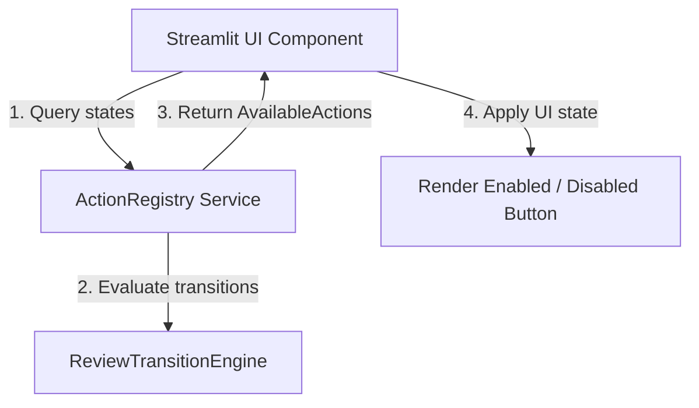

# Phase 11.4 — Action Registry Architecture

**Date:** 2026-06-04
**Status:** COMPLETE
**Scope:** Canonical Action Registry architecture for mapping artifact states to operator actions

---

## 1. Registry Inventory

This inventory registers all operator-facing and system actions defined in the system. It maps each high-level registry action constant to its unique identifier from [phase11_3_operator_action_model.md](file:///home/aryan/May-2026/Content-Creation/docs/architecture/phase11_3_operator_action_model.md).

| Registry Action Key | Action ID | Category | Target Artifact | Description |
|:---|:---|:---|:---|:---|
| `COLLECT_TOPICS` | `collect` | GENERATION | TopicItem | Ingest topics from configured RSS/arXiv feeds |
| `SCORE_TOPICS` | `score_topics` | GENERATION | ScoredTopicItem | Score and validate staged raw topics |
| `GENERATE_BRIEF` | `generate_briefs` | GENERATION | Brief | Generate educational brief via Gemini API |
| `GENERATE_CI` | `generate_ci` | GENERATION | ContentIntelligence | Generate content intelligence report |
| `GENERATE_STORYBOARD` | `generate_storyboards` | GENERATION | Storyboard | Generate detailed storyboard layout |
| `GENERATE_THUMBNAIL` | `generate_assets` | GENERATION | Thumbnail | Generate post thumbnail asset metadata |
| `GENERATE_SCRIPT` | `generate_assets` | GENERATION | Script | Generate short video script |
| `GENERATE_CAROUSEL` | `generate_assets` | GENERATION | Carousel | Generate image carousel slide sequence |
| `GENERATE_NEWSLETTER` | `generate_assets` | GENERATION | Newsletter | Generate email newsletter asset |
| `REVIEW_BRIEF` | `review_brief` | REVIEW | Brief | Load brief for operator review |
| `APPROVE_BRIEF` | `approve_brief` | APPROVAL | Brief | Set brief status to APPROVED |
| `REJECT_BRIEF` | `reject_brief` | APPROVAL | Brief | Set brief status to REJECTED |
| `REVIEW_STORYBOARD` | `review_storyboard` | REVIEW | Storyboard | Load storyboard for operator review |
| `APPROVE_STORYBOARD` | `approve_storyboard` | APPROVAL | Storyboard | Set storyboard status to APPROVED |
| `REJECT_STORYBOARD` | `reject_storyboard` | APPROVAL | Storyboard | Set storyboard status to REJECTED |
| `REVIEW_ASSETS` | `review_assets` | REVIEW | AssetBundle | Inspect all assets for a given topic |
| `APPROVE_ASSET` | `approve_asset` | APPROVAL | Asset | Approve a specific asset (Script, Carousel, etc.) |
| `REJECT_ASSET` | `reject_asset` | APPROVAL | Asset | Reject a specific asset |
| `BATCH_APPROVE` | `batch_approve` | APPROVAL | Multiple Assets | Approve all pending assets for a topic |
| `BUILD_MANIFEST` | `build_manifest` | ORCHESTRATION | TopicManifest | Compile manifest files for a single topic |
| `BUILD_ALL_MANIFESTS` | `build_all_manifests` | ORCHESTRATION | TopicManifests | Rebuild manifests for all active topics |
| `PLAN_WEEK` | `plan_week` | PLANNING | WeeklyCalendar | Schedule approved assets into 7-day calendar |
| `DRY_RUN` | `dry_run` | VALIDATION | DryRunReport | Validate scheduled assets for publishing readiness |
| `PUBLISH` | `publish` | PUBLISHING | ScheduledPost | Deliver finalized post to destination channel |
| `INIT_ANALYTICS` | `init_analytics` | SYSTEM | PostAnalytics | Create performance tracking records |
| `UPDATE_ANALYTICS` | `update_analytics` | SYSTEM | PostAnalytics | Load performance metrics into tracking records |
| `RUN_PIPELINE` | `run_pipeline` | ORCHESTRATION | Pipeline | Execute pipeline from ingestion to manifest building |

---

## 2. ActionAvailabilityRule Model

To prevent scattering availability logic across components, we model the rules as discrete, declarative configurations. Below is the Python schema representing the rules engine.

```python
from dataclasses import dataclass, field
from enum import Enum
from typing import Optional, FrozenSet, Dict, List
from content_creation.workflow.states import ArtifactLifecycleState

class VisibilityRule(str, Enum):
    """Controls how the UI displays the action button."""
    ALWAYS = "always"                    # Always visible in the UI (shows disabled if blocked)
    IF_ALLOWED = "if_allowed"            # Visible only when all preconditions are satisfied
    IF_NOT_TERMINAL = "if_not_terminal"  # Visible unless the artifact is in a terminal state
    NEVER = "never"                      # Hidden from UI (used for background-only tasks)

@dataclass(frozen=True)
class DependencyRequirement:
    """Explicit dependency on another artifact's state."""
    artifact_type: str                  # e.g., "brief", "storyboard"
    required_state: ArtifactLifecycleState
    optional: bool = False              # If True, prints a warning instead of blocking execution

@dataclass(frozen=True)
class ActionAvailabilityRule:
    """The canonical mapping configuration for a single operator action."""
    action_id: str
    target_artifact_type: str
    allowed_states: FrozenSet[ArtifactLifecycleState]
    forbidden_states: FrozenSet[ArtifactLifecycleState]
    dependency_requirements: List[DependencyRequirement] = field(default_factory=list)
    blocking_reasons: Dict[str, str] = field(default_factory=dict)
    visibility: VisibilityRule = VisibilityRule.ALWAYS
    enabled: bool = True
    notes: Optional[str] = None
```

---

## 3. Blocking Reason Catalog

This catalog details the specific failure code and context returned when an action violates its rule checks. These codes are mapped to human-readable explanations displayed directly in UI headers, buttons, or tooltips.

| Blocking Reason Code | Action ID Affected | Meaning | Recommended Action |
|:---|:---|:---|:---|
| `BLOCKED_MISSING_CONFIG` | `collect` | Feeds config file is missing | Create `config/feeds.yaml` |
| `BLOCKED_NO_STAGED_TOPICS` | `score_topics` | No raw topics exist in `data/staging/` | Run topics collection task first |
| `BLOCKED_MISSING_SCORED_TOPIC`| `generate_briefs` | The source topic has no scoring record | Run scoring pipeline on this topic |
| `BLOCKED_TOPIC_REJECTED` | `generate_briefs` | Topic scored below threshold / was rejected | Select a different topic |
| `BLOCKED_BRIEF_NOT_APPROVED` | `generate_ci`, `generate_storyboards` | Upstream brief is not approved | Review and approve the brief |
| `BLOCKED_MISSING_STORYBOARD` | `generate_assets` | Storyboard file does not exist | Run storyboard generator |
| `BLOCKED_STORYBOARD_NOT_APPROVED` | `generate_assets` | Storyboard exists but is not approved | Review and approve the storyboard |
| `BLOCKED_ASSET_ALREADY_EXISTS` | `generate_assets` | Target asset file is already populated | Override explicitly or reject asset |
| `BLOCKED_DEPENDENCY_REJECTED` | `generate_storyboards` | Upstream brief is in a rejected state | Regenerate or revise the brief |
| `BLOCKED_NO_READY_MANIFESTS` | `plan_week` | No topics have fully approved asset packages | Complete reviews for scheduled topics |
| `BLOCKED_MISSING_CALENDAR` | `dry_run` | Weekly calendar has not been generated | Run week planning step |
| `BLOCKED_DRY_RUN_FAILED` | `publish` | Scheduled post failed publishing validation checks | Fix missing assets or state mismatch |
| `BLOCKED_ALREADY_TERMINAL` | `approve_*`, `reject_*` | The artifact is already in a terminal state | No further action possible |

---

## 4. State → Action Matrix

The tables below map the exact availability of operator actions based on the current canonical state of the artifact. These states are defined in [states.py](file:///home/aryan/May-2026/Content-Creation/src/content_creation/workflow/states.py).

### 4.1 Brief Action Matrix

Target Artifact: `Brief` (A3)
Upstream Dependency: `ScoredTopicItem` (A2)

| State | Action ID | Status | Visibility | Blocking Code | Reason / Notes |
|:---|:---|:---|:---|:---|:---|
| **MISSING** | `generate_briefs` | **Available** | `ALWAYS` | None | Scored topic exists; brief ready for generation |
| | `approve_brief` | Blocked | `NEVER` | `BLOCKED_ALREADY_TERMINAL` | Brief does not exist |
| | `reject_brief` | Blocked | `NEVER` | `BLOCKED_ALREADY_TERMINAL` | Brief does not exist |
| **DRAFT** | `generate_briefs` | Blocked | `ALWAYS` | `BLOCKED_ASSET_ALREADY_EXISTS`| Brief already in draft; edits should be manual |
| | `approve_brief` | **Available** | `ALWAYS` | None | Operator can approve the draft |
| | `reject_brief` | **Available** | `ALWAYS` | None | Operator can reject the draft |
| **NEEDS_REVIEW** | `generate_briefs` | Blocked | `ALWAYS` | `BLOCKED_ASSET_ALREADY_EXISTS`| Locked for manual intervention |
| | `approve_brief` | **Available** | `ALWAYS` | None | Operator can approve directly |
| | `reject_brief` | **Available** | `ALWAYS` | None | Operator can reject |
| **APPROVED** | `generate_briefs` | Blocked | `IF_NOT_TERMINAL`| `BLOCKED_ALREADY_TERMINAL` | Terminal state; consumes downstream processes |
| | `approve_brief` | Blocked | `ALWAYS` | `BLOCKED_ALREADY_TERMINAL` | Already approved |
| | `reject_brief` | Blocked | `ALWAYS` | `BLOCKED_ALREADY_TERMINAL` | Cannot reject approved artifact |
| **REJECTED** | `generate_briefs` | **Available** | `ALWAYS` | None | Allows regeneration after rejection |
| | `approve_brief` | Blocked | `ALWAYS` | `BLOCKED_ALREADY_TERMINAL` | Cannot approve rejected artifact |
| | `reject_brief` | Blocked | `ALWAYS` | `BLOCKED_ALREADY_TERMINAL` | Already rejected |

### 4.2 Storyboard Action Matrix

Target Artifact: `Storyboard` (A5)
Upstream Dependency: `Brief` (A3)

| State | Action ID | Status | Visibility | Blocking Code | Reason / Notes |
|:---|:---|:---|:---|:---|:---|
| **MISSING** | `generate_storyboards`| **Available** | `ALWAYS` | None | Allowed if Brief status = `APPROVED` |
| | `generate_storyboards`| Blocked | `ALWAYS` | `BLOCKED_BRIEF_NOT_APPROVED` | Brief must be approved first |
| | `approve_storyboard` | Blocked | `NEVER` | `BLOCKED_ALREADY_TERMINAL` | Storyboard does not exist |
| **DRAFT** | `generate_storyboards`| Blocked | `ALWAYS` | `BLOCKED_ASSET_ALREADY_EXISTS`| Storyboard already exists |
| | `approve_storyboard` | **Available** | `ALWAYS` | None | Operator can approve the storyboard |
| | `reject_storyboard` | **Available** | `ALWAYS` | None | Operator can reject the storyboard |
| **NEEDS_REVIEW**| `approve_storyboard` | **Available** | `ALWAYS` | None | Operator can approve storyboard |
| | `reject_storyboard` | **Available** | `ALWAYS` | None | Operator can reject storyboard |
| **APPROVED** | `generate_assets` | **Available** | `ALWAYS` | None | Triggers downstream asset generation |
| | `approve_storyboard` | Blocked | `ALWAYS` | `BLOCKED_ALREADY_TERMINAL` | Already approved |
| **REJECTED** | `generate_storyboards`| **Available** | `ALWAYS` | None | Allows regeneration after rejection |

### 4.3 Asset Action Matrix

Target Artifacts: `Script`, `Carousel`, `Newsletter`, `Thumbnail` (A6-A9)
Upstream Dependency: `Storyboard` (A5)

| State | Action ID | Status | Visibility | Blocking Code | Reason / Notes |
|:---|:---|:---|:---|:---|:---|
| **MISSING** | `generate_assets` | **Available** | `ALWAYS` | None | Storyboard exists (regardless of its approval) |
| | `generate_assets` | Blocked | `ALWAYS` | `BLOCKED_MISSING_STORYBOARD`| Storyboard file must exist on disk |
| | `approve_asset` | Blocked | `NEVER` | `BLOCKED_ALREADY_TERMINAL` | Asset does not exist |
| **DRAFT** | `approve_asset` | **Available** | `ALWAYS` | None | Operator can approve individual asset |
| | `reject_asset` | **Available** | `ALWAYS` | None | Operator can reject individual asset |
| **NEEDS_REVIEW**| `approve_asset` | **Available** | `ALWAYS` | None | Operator can approve individual asset |
| | `reject_asset` | **Available** | `ALWAYS` | None | Operator can reject individual asset |
| **APPROVED** | `approve_asset` | Blocked | `ALWAYS` | `BLOCKED_ALREADY_TERMINAL` | Already approved |
| | `reject_asset` | Blocked | `ALWAYS` | `BLOCKED_ALREADY_TERMINAL` | Cannot reject once approved |
| **REJECTED** | `generate_assets` | **Available** | `ALWAYS` | None | Re-runs generation for rejected asset only |

---

## 5. Registry API Design

The Action Registry will expose a clean, state-free API to query action states, fetch available transitions, and validate actions prior to execution.

### 5.1 Query & Response Models

```python
from typing import List, Optional
from dataclasses import dataclass

@dataclass(frozen=True)
class AvailableAction:
    """Return payload mapping an action to its availability status."""
    action_id: str
    is_available: bool
    visibility: str                      # ALWAYS | IF_ALLOWED | IF_NOT_TERMINAL | NEVER
    blocking_code: Optional[str] = None  # e.g., "BLOCKED_BRIEF_NOT_APPROVED"
    blocking_message: Optional[str] = None # e.g., "Upstream Brief must be APPROVED."
    notes: Optional[str] = None

@dataclass(frozen=True)
class ActionResultValidation:
    """Validation response prior to action execution."""
    allowed: bool
    blocking_code: Optional[str] = None
    reason: Optional[str] = None
```

### 5.2 API Interface

```python
class ActionRegistry:
    """Single source of truth query engine for action rules."""

    def __init__(self, rules: List[ActionAvailabilityRule]) -> None:
        self._rules = {rule.action_id: rule for rule in rules}

    def get_actions(
        self,
        *,
        artifact_type: str,
        current_state: ArtifactLifecycleState,
        dependencies: Dict[str, ArtifactLifecycleState],
        file_exists: bool
    ) -> List[AvailableAction]:
        """Query all registered actions for an artifact based on state context.

        Parameters
        ----------
        artifact_type : str
            Type of the target artifact (e.g. "storyboard").
        current_state : ArtifactLifecycleState
            Canonical state of the target artifact.
        dependencies : Dict[str, ArtifactLifecycleState]
            States of related upstream/downstream artifacts.
        file_exists : bool
            True if the target file actually exists on disk.
        """
        # Resolves rules matching target_artifact_type
        # Evaluates allowed_states, forbidden_states, and dependencies
        # Returns List[AvailableAction]
        pass

    def validate_action(
        self,
        action_id: str,
        *,
        current_state: ArtifactLifecycleState,
        dependencies: Dict[str, ArtifactLifecycleState],
        file_exists: bool
    ) -> ActionResultValidation:
        """Validate if a specific action can safely execute.

        Raises ValueError if action_id is not registered.
        """
        # Evaluates the targeted ActionAvailabilityRule
        # Returns ActionResultValidation
        pass
```

---

## 6. UI Integration Strategy

The registry acts as the backend engine driving the Streamlit interface, ensuring button and view behavior matches state logic dynamically.



### 6.1 Button Visibility & Enabled Rules
- **Invisible Buttons:** If `visibility == VisibilityRule.NEVER` or `visibility == VisibilityRule.IF_ALLOWED` (and `is_available == False`), the button is omitted from rendering.
- **Disabled Buttons:** If `visibility == VisibilityRule.ALWAYS` and `is_available == False`, the button is rendered with:
  - An inline disabled attribute.
  - A contextual tooltip showing the `blocking_message` (e.g. *"This button is disabled because: Upstream Brief must be APPROVED"*).

### 6.2 Status Banners & Workflow Badges
- **Status Banners:** If an action is blocked due to a missing dependency, the UI displays a warning banner referencing the blocking code.
- **Next-Action Recommendations:** If `current_state` is a non-terminal reviewable state, the page highlights the primary action (e.g., green-highlighted "Approve" button if the brief is in `REVIEWED`).

---

## 7. Future Workflow Engine Integration

The Action Registry links to downstream execution modules as the gatekeeper of execution sanity.

* **Action Availability Engine (Phase 11.5):** Uses the `ActionRegistry` to filter lists of available operations in bulk across many topics.
* **UI Workflow Guidance (Phase 11.6):** Feeds from `get_actions` to recommend actions dynamically.
* **Job Tracking & Queueing (Phase 11.7):** Validates the action rules before pushing a task payload into the worker queue. If validation fails, the job fails immediately with the corresponding blocking code without invoking LLM pipelines.
* **Notifications (Phase 11.8):** Emits status changes when actions succeed, allowing alerting systems to notify channels when artifacts transition states.
