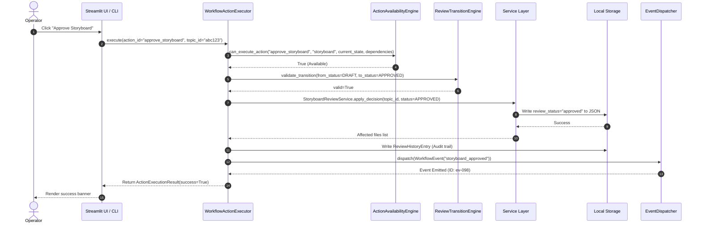
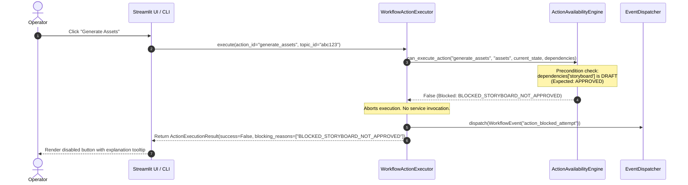

# Phase 11.5 — Workflow Action Execution Architecture

**Date:** 2026-06-04  
**Status:** PROPOSED  
**Scope:** Canonical execution layer architecture and audit for operator-triggered actions.

---

## 1. Executive Summary & Findings

This document defines the architecture for the **Workflow Action Execution Layer** of the Content Creation Factory. Currently, the system has a deterministic [action_availability_engine.py](file:///home/aryan/May-2026/Content-Creation/src/content_creation/workflow/action_availability_engine.py) to declare which actions are valid for an artifact state, and a [review_transition_engine.py](file:///home/aryan/May-2026/Content-Creation/src/content_creation/workflow/review_transition_engine.py) to check review transitions. However, there is no centralized execution controller that sits between these validation engines and the underlying service methods.

### Current State Findings:
1. **Lack of Unified Enforcement:** CLI commands and UI wrappers call backend services directly. Preconditions and availability checks are either duplicated at the call site or bypassed entirely.
2. **Audit Gaps (INC-05):** The CLI `batch-approve` command manipulates local files directly and calls the manifest builder, bypassing the `AssetReviewService` entirely. As a result, no `ReviewHistoryEntry` is generated for batch-approved assets.
3. **No Central Event Pipeline:** State-changing actions do not emit unified workflow events. Downstream systems (like future notifications or job trackers) have no single bus to subscribe to.
4. **Scattered Error and Result Handling:** Service outcomes are returned as custom status models (e.g., `ReviewResult`, `BriefGenerationResult`) or raise raw exceptions instead of providing a standardized `ActionExecutionResult`.

To bridge this gap, we design the **`WorkflowActionExecutor`**, a canonical execution manager responsible for intercepting all action requests, validating them against availability rules and state transitions, invoking the underlying services, logging audit trails, emitting events, and returning a unified execution payload.

---

## 2. Operator Action Execution Inventory

The table below maps all 23 primary operator actions defined in [phase11_3_operator_action_model.md](file:///home/aryan/May-2026/Content-Creation/docs/architecture/phase11_3_operator_action_model.md) to their underlying service components, CLI handlers, target files, and current verification methods.

| Action ID | Action Name | Category | Service Class & Method | CLI Command | Target Artifact / Storage Path | Verification Method |
| :--- | :--- | :--- | :--- | :--- | :--- | :--- |
| **A01** | `collect` | GENERATION | [CollectTopicsService](file:///home/aryan/May-2026/Content-Creation/src/content_creation/application/collect_topics_service.py).run | `collect` | `data/staging/*.json` | File creation check |
| **A02** | `score_topics` | GENERATION | [ScoreTopicsService](file:///home/aryan/May-2026/Content-Creation/src/content_creation/application/score_topics_service.py).run | `score-topics` | `data/scored/*.json` | `priority_score` populated |
| **A03** | `generate_briefs` | GENERATION | [BriefGenerationService](file:///home/aryan/May-2026/Content-Creation/src/content_creation/application/brief_generation_service.py).run | `generate-briefs` | `data/briefs/*.json` | `review_status` is draft/needs_review |
| **A04** | `generate_ci` | GENERATION | [ContentIntelligenceService](file:///home/aryan/May-2026/Content-Creation/src/content_creation/application/content_intelligence_service.py).run | (via pipeline) | `data/content_intelligence/*.json` | File creation check |
| **A05** | `generate_storyboards` | GENERATION | [StoryboardService](file:///home/aryan/May-2026/Content-Creation/src/content_creation/application/storyboard_service.py).run | (via pipeline) | `data/storyboards/*.json` | File creation check |
| **A06** | `generate_assets` | GENERATION | [AssetGenerationService](file:///home/aryan/May-2026/Content-Creation/src/content_creation/application/asset_generation_service.py).run | `generate-assets` | `data/scripts/`, `data/carousels/`, etc. | Multi-file existence check |
| **A07** | `review_brief` | REVIEW | [BriefReviewService](file:///home/aryan/May-2026/Content-Creation/src/content_creation/application/brief_review_service.py).get_review_item | (service only) | Read-only Brief metadata | Returns BriefReviewItem |
| **A08** | `approve_brief` | APPROVAL | [BriefReviewService](file:///home/aryan/May-2026/Content-Creation/src/content_creation/application/brief_review_service.py).apply_decision | (service only) | `data/briefs/{topic_id}.json` | `review_status = "approved"` |
| **A09** | `reject_brief` | APPROVAL | [BriefReviewService](file:///home/aryan/May-2026/Content-Creation/src/content_creation/application/brief_review_service.py).apply_decision | (service only) | `data/briefs/{topic_id}.json` | `review_status = "rejected"` |
| **A10** | `review_storyboard` | REVIEW | [StoryboardReviewService](file:///home/aryan/May-2026/Content-Creation/src/content_creation/application/storyboard_review_service.py).get_review_item | (service only) | Read-only Storyboard metadata | Returns StoryboardReviewItem |
| **A11** | `approve_storyboard` | APPROVAL | [StoryboardReviewService](file:///home/aryan/May-2026/Content-Creation/src/content_creation/application/storyboard_review_service.py).apply_decision | (service only) | `data/storyboards/{topic_id}.json` | `review_status = "approved"` |
| **A12** | `reject_storyboard` | APPROVAL | [StoryboardReviewService](file:///home/aryan/May-2026/Content-Creation/src/content_creation/application/storyboard_review_service.py).apply_decision | (service only) | `data/storyboards/{topic_id}.json` | `review_status = "rejected"` |
| **A13** | `review_assets` | REVIEW | [AssetReviewService](file:///home/aryan/May-2026/Content-Creation/src/content_creation/application/asset_review_service.py).get_review_queue | `review-assets` | Read-only Manifest/Asset data | Returns List[AssetReviewItem] |
| **A14** | `approve_asset` | APPROVAL | [AssetReviewService](file:///home/aryan/May-2026/Content-Creation/src/content_creation/application/asset_review_service.py).apply_decisions | `review-assets` | `data/{asset_type}/{topic_id}.json` | `review_status = "approved"` |
| **A15** | `reject_asset` | APPROVAL | [AssetReviewService](file:///home/aryan/May-2026/Content-Creation/src/content_creation/application/asset_review_service.py).apply_decisions | `review-assets` | `data/{asset_type}/{topic_id}.json` | `review_status = "rejected"` |
| **A16** | `batch_approve` | APPROVAL | Storage inline manipulation (Bypass Path) | `batch-approve` | Multiple asset folders | `review_status` updated in files |
| **A17** | `build_manifest` | ORCHESTRATION | [ManifestBuilder](file:///home/aryan/May-2026/Content-Creation/src/content_creation/manifest.py).build | `build-manifest` | `data/manifests/{topic_id}.json` | File matches schema |
| **A18** | `build_all_manifests` | ORCHESTRATION | [ManifestBuilder](file:///home/aryan/May-2026/Content-Creation/src/content_creation/manifest.py).build_all | `build-all-manifests` | `data/manifests/*.json` | Rebuilds all topic manifests |
| **A19** | `plan_week` | PLANNING | [PostingPlanner](file:///home/aryan/May-2026/Content-Creation/src/content_creation/planning/planner.py).plan_week | `plan-week` | `data/calendars/{week_start}.json` | Output JSON / Markdown exists |
| **A20** | `dry_run` | VALIDATION | [DryRunValidator](file:///home/aryan/May-2026/Content-Creation/src/content_creation/planning/dryrun.py).run | `dry-run` | `data/dryruns/{week_start}.json` | Output JSON / Markdown exists |
| **A21** | `init_analytics` | SYSTEM | Local storage instantiation in CLI | `init-analytics` | `data/analytics/{post_id}.json` | Instantiates JSON metadata |
| **A22** | `update_analytics` | SYSTEM | Interactive fields update in CLI | `update-analytics` | `data/analytics/{post_id}.json` | Fields written to JSON |
| **A23** | `run_pipeline` | ORCHESTRATION | [PipelineRunService](file:///home/aryan/May-2026/Content-Creation/src/content_creation/application/pipeline_run_service.py).run | `run-pipeline` | Full end-to-end execution | Log file creation, execution table |

---

## 3. WorkflowActionExecutor Design

The `WorkflowActionExecutor` serves as the central manager through which all state-mutating actions must pass.

### Responsibilities:
1. **Pre-execution Verification:** Query the `ActionAvailabilityEngine` to verify if the action is blocked by rules or state restrictions.
2. **Transition Validation:** Intersect with the `ReviewTransitionEngine` to verify if the requested transition is valid.
3. **Dependency Verification:** Inspect the filesystem/storage context to confirm necessary prerequisite files exist.
4. **Service Dispatching:** Call the underlying service or business logic class.
5. **Post-execution Recording:** Save a `ReviewHistoryEntry` (or standard audit log entry) for all mutations.
6. **Workflow Event Emission:** Dispatches standardized workflow events to an event pipeline.
7. **Structured Packaging:** Captures durations, warnings, changes, and returns a standard `ActionExecutionResult`.

### Conceptual Python Interface:

```python
from dataclasses import dataclass, field
from typing import Dict, List, Optional, Any
from pathlib import Path
import time

from content_creation.application.context import ApplicationContext
from content_creation.workflow.action_availability_engine import ActionAvailabilityEngine
from content_creation.workflow.review_transition_engine import ReviewTransitionEngine
from content_creation.workflow.states import ArtifactLifecycleState
from content_creation.models.review_history import ReviewHistoryEntry

@dataclass(frozen=True)
class WorkflowEvent:
    event_id: str
    action_id: str
    target_artifact_id: str
    timestamp: str
    payload: Dict[str, Any]

class EventDispatcher:
    """Emits events to background workers, logs, and notification channels."""
    def dispatch(self, event: WorkflowEvent) -> None:
        # Implemented in Phase 11.8 (Notification / Messaging System)
        pass

class WorkflowActionExecutor:
    """Canonical executor that wraps and coordinates all pipeline and review action runs."""
    
    def __init__(
        self,
        ctx: ApplicationContext,
        availability_engine: ActionAvailabilityEngine,
        transition_engine: ReviewTransitionEngine,
        event_dispatcher: Optional[EventDispatcher] = None
    ) -> None:
        self.ctx = ctx
        self.availability_engine = availability_engine
        self.transition_engine = transition_engine
        self.event_dispatcher = event_dispatcher or EventDispatcher()

    def execute(
        self,
        action_id: str,
        target_artifact_type: str,
        target_artifact_id: str,
        payload: Dict[str, Any],
        operator_id: str = "system",
        notes: Optional[str] = None
    ) -> "ActionExecutionResult":
        """Executes a workflow action after verifying preconditions, states, and history logs.
        
        Parameters
        ----------
        action_id : str
            The identifier of the action (e.g., 'approve_brief', 'generate_briefs').
        target_artifact_type : str
            Type of artifact to act on (e.g., 'brief', 'storyboard').
        target_artifact_id : str
            Unique ID of the artifact (usually the topic_id).
        payload : Dict[str, Any]
            Parameters required by the service (API keys, parameters, options).
        operator_id : str
            Who triggered the action ('operator_streamlit', 'cli', 'system').
        notes : str, optional
            Operator review notes or reason details.
        """
        start_time = time.perf_counter()
        
        # 1. Resolve current state and dependencies
        current_state = self._resolve_lifecycle_state(target_artifact_type, target_artifact_id)
        dependencies = self._resolve_dependencies(target_artifact_type, target_artifact_id)

        # 2. Check Action Availability Engine
        if not self.availability_engine.can_execute_action(
            action_id, target_artifact_type, current_state, dependencies
        ):
            blocking_reason = self.availability_engine.explain_blocking_reason(
                action_id, target_artifact_type, current_state, dependencies
            )
            return ActionExecutionResult.fail_blocked(
                action_id=action_id,
                blocking_code="BLOCKED_ACTION",
                message=blocking_reason or "Action is currently blocked by availability rules."
            )

        # 3. If action is an approval/rejection transition, validate transition graph
        if action_id in {"approve_brief", "reject_brief", "approve_storyboard", "reject_storyboard", "approve_asset", "reject_asset"}:
            from_status = self._map_to_review_status(current_state)
            to_status = self._map_target_review_status(action_id)
            val_result = self.transition_engine.validate_transition(from_status, to_status)
            if not val_result.valid:
                return ActionExecutionResult.fail_blocked(
                    action_id=action_id,
                    blocking_code="INVALID_TRANSITION",
                    message=val_result.reason
                )

        # 4. Invoke the target service method
        try:
            affected_files = self._dispatch_to_service(
                action_id, target_artifact_type, target_artifact_id, payload, notes
            )
        except Exception as e:
            execution_time = time.perf_counter() - start_time
            return ActionExecutionResult(
                action_id=action_id,
                success=False,
                execution_status="failed",
                affected_artifacts={},
                warnings=[],
                blocking_reasons=[f"EXCEPTION: {str(e)}"],
                execution_time=execution_time,
                event_ids=[]
            )

        # 5. Log audit trail
        self._record_audit_entry(
            action_id=action_id,
            target_artifact_type=target_artifact_type,
            target_artifact_id=target_artifact_id,
            previous_state=current_state,
            operator_id=operator_id,
            notes=notes
        )

        # 6. Emit events
        event = self._emit_workflow_event(action_id, target_artifact_id, payload)
        
        execution_time = time.perf_counter() - start_time
        return ActionExecutionResult(
            action_id=action_id,
            success=True,
            execution_status="completed",
            affected_artifacts=affected_files,
            warnings=[],
            blocking_reasons=[],
            execution_time=execution_time,
            event_ids=[event.event_id] if event else []
        )
```

---

## 4. Canonical `ActionExecutionResult` Model

The output returned by the `WorkflowActionExecutor` is standardized to guarantee that callers (CLIs, UI, or job workers) can interact with outcomes programmatically.

```python
@dataclass(frozen=True)
class ActionExecutionResult:
    """The standard response contract representing the outcome of a workflow action execution."""

    action_id: str
    success: bool
    execution_status: str                     # completed | failed | skipped | blocked
    affected_artifacts: Dict[str, str]        # Maps artifact type to filepath or ID (e.g. {"brief": "data/briefs/xyz.json"})
    warnings: List[str]                       # Soft validation messages (e.g., ["Quality score below desired threshold"])
    blocking_reasons: List[str]               # Blocking reason codes or exceptions
    execution_time: float                     # Elapsed execution time in seconds
    event_ids: List[str] = field(default_factory=list) # Emitted event UUID references

    @classmethod
    def fail_blocked(cls, action_id: str, blocking_code: str, message: str) -> "ActionExecutionResult":
        return cls(
            action_id=action_id,
            success=False,
            execution_status="blocked",
            affected_artifacts={},
            warnings=[],
            blocking_reasons=[f"{blocking_code}: {message}"],
            execution_time=0.0,
            event_ids=[]
        )
```

---

## 5. Workflow Execution Sequences

### 5.1 Successful Execution Flow
This diagram illustrates the sequence when an operator triggers a valid action (e.g. approving a storyboard) via the UI page.



### 5.2 Blocked Execution Flow
This diagram illustrates the sequence when a blocked action is requested (e.g., generating assets for a storyboard that has not been approved yet).



---

## 6. Bypass Analysis & Vulnerability Mapping

An audit of the codebase reveals several locations that run operations by bypassing validation checks, direct-mutating files, or leaving audit gaps.

```
Codebase Entrypoints & Services
 ├── CLI Entrypoints (cli.py)             --> Bypasses validation check prior to run
 ├── UI Client Adapter (client.py)        --> Bypasses validation check prior to run
 ├── Batch Approve Handler (cli.py)       --> BYPASS: Mutates state directly; NO History Log
 └── Application Services (*_service.py)  --> Mutate storage files directly
```

### 6.1 Audit Details

#### 1. CLI Commands Direct Service Execution
* **Description:** Commands like `generate-briefs` or `generate-assets` resolve services directly and trigger execution without invoking the validation engine.
* **Vulnerability:** If an operator runs `generate-assets` on the CLI for a topic where the storyboard doesn't exist, the CLI runs until the service throws a `ValueError` or crashes, rather than cleanly blocking it at the entrypoint.
* **Compliance Level:** `PARTIALLY COMPLIANT` (Services do internal file checks, but validation is not centralized).
* **Remediation:** CLI command handlers must route all actions through `WorkflowActionExecutor.execute`.

#### 2. Batch Approve Handler (`cli.py:L344-407`)
* **Description:** The `batch-approve` command updates files directly through `storage.update_asset_status` and calls `ManifestBuilder` manually.
* **Vulnerability:** It completely bypasses review services. No `ReviewHistoryEntry` is generated. It writes status records with no audit trail, violating regulatory tracking.
* **Compliance Level:** `NON-COMPLIANT`
* **Remediation:** Refactor the batch-approve CLI parser to loop over targets and invoke `WorkflowActionExecutor.execute("approve_asset")` for each target. This registers proper history entries and triggers manifests rebuilds cleanly.

#### 3. UI Service Client Adapter (`client.py:L200-226`)
* **Description:** Streamlit client wraps calls to `apply_brief_decision` and `apply_storyboard_decision` directly.
* **Vulnerability:** The UI is responsible for checking availability on the frontend (button disabling), but nothing guards the backend adapter from executing a raw state mutation if a browser script or stale session bypasses button states.
* **Compliance Level:** `NON-COMPLIANT`
* **Remediation:** UI client adapter must call `WorkflowActionExecutor.execute(...)` instead of invoking raw services directly.

#### 4. Service-Layer Direct Storage Manipulation
* **Description:** Backend service methods (like `BriefReviewService.apply_decision`) interact with the low-level `LocalStorage` write APIs directly.
* **Vulnerability:** Any script importing application services can modify states arbitrarily without enforcing availability guards.
* **Compliance Level:** `PARTIALLY COMPLIANT`
* **Remediation:** Enforce that state changes are wrapped by validation. Optionally require authentication / execution context in service level methods, or guard state writes in the repository layer.

---

## 7. Integration Contracts

Future packages and interfaces will consume the execution layer by binding to the standard executor.

```
       ┌────────────────────────┐
       │   Streamlit UI Pages   │
       └───────────┬────────────┘
                   │ Calls execute()
                   ▼
┌──────────────────────────────────────┐
│       WorkflowActionExecutor         ├─────┐
└──────────────────┬───────────────────┘     │
                   │ Dispatches              │ Returns
                   ▼                         │ ActionExecutionResult
┌──────────────────────────────────────┐     │
│           Service Layer              │     │
│  (Brief, Storyboard, Asset svcs)     │     │
└──────────────────────────────────────┘     │
                   ▲                         │
                   │                         │
                   └─────────────────────────┘
```

### 7.1 Streamlit UI
* **Interaction:** The UI queries the `ActionAvailabilityEngine` during component rendering to set button disabled/enabled states and tooltips. Upon user interaction, the UI calls:
  `executor.execute(action_id, target_artifact_type, target_artifact_id, payload)`
* **Result Consumption:** The UI parses the `ActionExecutionResult` and renders toast alerts, green success flags, or red modal warnings.

### 7.2 Job System (Phase 11.7)
* **Interaction:** The background runner parses queue payloads. Before starting background LLM tasks, the task worker invokes:
  `executor.execute(action_id, target_artifact_type, target_artifact_id, payload)`
* **Preconditions Gate:** If the executor returns `success=False` with a `BLOCKED_*` reason, the job worker aborts immediately, marking the job status as `FAILED` or `SKIPPED` without wasting API tokens on unapproved drafts.

### 7.3 Notification System (Phase 11.8)
* **Interaction:** The notification router registers handlers with the `EventDispatcher`.
* **Flow:** When the executor dispatches a `brief_approved` event, the dispatcher broadcasts it, notifying team channels (Slack/Discord) or updating review queues in real time.

### 7.4 CLI
* **Interaction:** CLI commands collect parser arguments, build payload dicts, and delegate execution to the executor.
* **Exit Codes:** CLI handles `ActionExecutionResult` by displaying validation logs and mapping `success=True` to exit code `0`, and `success=False` to non-zero exit codes.

---

## 8. Risks & Mitigation Strategies

| Risk | Description | Impact | Mitigation Strategy |
| :--- | :--- | :--- | :--- |
| **Race Conditions** | Two operator triggers (e.g. streamlit UI and CLI) request actions on the same artifact file concurrently. | State desync or file corruption. | Implement file-level locks (e.g. `fcntl` or `.lock` sidecar files) during read-modify-write phases inside the executor. |
| **Stale State UI Execution** | The operator renders a page showing "Approve Storyboard" as available. A background task rejects it in the background. The operator clicks the button on the stale UI. | Overwriting new state with outdated transition. | The executor must re-fetch and validate the lifecycle state of the artifact inside a critical transaction section before calling the service. |
| **Blocking Event Loop** | Event dispatching takes too long (e.g., webhook timeout in future messaging), stalling the main execution thread. | UI lags, timeouts. | Configure the Event Dispatcher to emit events asynchronously using a separate thread pool or a non-blocking queue. |
| **Orchestrated Action Failures** | In orchestration actions like `run_pipeline`, a middle stage fails. The executor needs to report success of early stages while logging the failures. | Desynchronized state logs. | Return partial execution states within the `ActionExecutionResult` using the `affected_artifacts` map and detailed `warnings` list. |

---

## 9. Readiness Assessment

We evaluate the system readiness for introducing the execution architecture across two target categories:

### 1. Existing Assets Readiness (Brief, Storyboard, Assets, Manifest)
* **Status:** **HIGH**
* **Rationale:** The system already maps these components to canonical states via [state_mappers.py](file:///home/aryan/May-2026/Content-Creation/src/content_creation/workflow/state_mappers.py). The existing services (`BriefReviewService`, `AssetReviewService`) already manage status updates and review history recording, making them easy to adapt.

### 2. Planning, Validation, and Ingestion Services
* **Status:** **MEDIUM**
* **Rationale:** The posting planner and dry run services are not currently structured as review services. They do not write `ReviewHistoryEntry` records or have structured `ActionDecision` models.
* **Action Item:** Standardize `PostingPlanner.plan_week` and `DryRunValidator.run` to return affected artifact paths so the executor can log audit metadata.

### Next Steps for Implementation (Phase 11.6+):
1. Create `src/content_creation/workflow/action_executor.py` containing the `WorkflowActionExecutor` class.
2. Refactor [client.py](file:///home/aryan/May-2026/Content-Creation/src/content_creation/ui/services/client.py) to route UI page commands through the executor.
3. Update CLI parser actions to run through the executor.
4. Modify `batch-approve` in [cli.py](file:///home/aryan/May-2026/Content-Creation/src/content_creation/cli.py) to execute actions through the executor loop to log proper review history entries.
