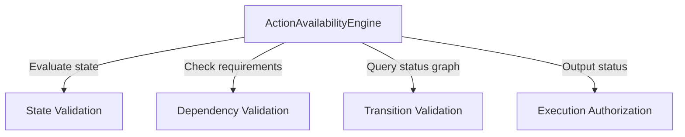

# Phase 11.6.1 — Action Availability Engine Design Audit

**Date:** 2026-06-04  
**Status:** PROPOSED  
**Scope:** Architecture Design Document for the Action Availability Engine.

---

## 1. Current Validation Inventory

Before implementing the centralized `ActionAvailabilityEngine`, state validation and dependency checks were scattered across multiple entry points and backend services. The table below documents these validation mechanisms, their locations, responsibilities, and limitations.

| Validation Mechanism | File Path / Location | Responsibility | Limitations / Drawbacks |
| :--- | :--- | :--- | :--- |
| **Transition Graph Validation** | [ReviewTransitionEngine](file:///home/aryan/May-2026/Content-Creation/src/content_creation/workflow/review_transition_engine.py) | Asserts review transition validity (e.g., `DRAFT -> APPROVED`, `NEEDS_REVIEW -> REJECTED`). | Unaware of artifact dependencies (e.g., whether storyboard files exist or are approved). |
| **Scored Topic Validation** | [ScoreTopicsService](file:///home/aryan/May-2026/Content-Creation/src/content_creation/application/score_topics_service.py) | Screens topics against priority score threshold and runs pydantic validation. | Coupled to topic model scoring; cannot check downstream brief status. |
| **In-Line Brief Dependency Check** | [StoryboardService](file:///home/aryan/May-2026/Content-Creation/src/content_creation/application/storyboard_service.py) | Raises `ValueError` if the upstream brief is missing or not approved. | Scattered validation logic; cannot inspect availability without triggering service execution. |
| **Asset Filesystem Gating** | [AssetGenerationService](file:///home/aryan/May-2026/Content-Creation/src/content_creation/application/asset_generation_service.py) | Checks if storyboards exist and aborts if missing. | Bypasses standard domain state layer; couples execution to direct disk paths. |
| **Interactive CLI Option Gating** | [cli.py](file:///home/aryan/May-2026/Content-Creation/src/content_creation/cli.py) | Basic checks for environment variables (`GEMINI_API_KEY`) and input directories. | Bypasses logical workflow matrix checks (e.g., planning allowed for unapproved manifests). |
| **Direct File Existence UI Hiding** | `pages/*.py` in Streamlit | Enables or disables page elements based on raw path checks (e.g., `Path(file).exists()`). | Tightly coupled UI to filesystem structure; bypasses workflow validations; high risk of stale UI state. |

---

## 2. Action Availability Engine Responsibilities

The `ActionAvailabilityEngine` is a deterministic, side-effect-free evaluator. It is the single source of truth for gating operator actions. It resolves the executable options for any given artifact and dependency configuration.



### 1. State Validation
Verifies if the target artifact itself is in a lifecycle state that supports the action. For instance:
* `generate_briefs` is blocked if the Brief is already `APPROVED` or `REJECTED` (terminal).
* `approve_brief` is blocked if the Brief is `MISSING` or `FAILED`.

### 2. Dependency Validation
Verifies whether upstream assets conform to the requirements of the dependency matrix. For instance:
* Asset generation requires that the storyboard layout is `APPROVED`.
* Planning week requires that at least one topic manifest is in an `APPROVED`/`READY` state.

### 3. Transition Validation
Integrates with the [ReviewTransitionEngine](file:///home/aryan/May-2026/Content-Creation/src/content_creation/workflow/review_transition_engine.py) to validate review transitions.
* **Separation of Concerns**: The `ReviewTransitionEngine` remains the sole authority on status changes (graph transitions). The `ActionAvailabilityEngine` maps lifecycle states to `ReviewStatus` enums and coordinates checks between dependencies and transitions.

### 4. Execution Authorization
Returns the authorization level of an action. It evaluates the status to one of the following states:
* `ALLOWED`: The action is fully ready for execution.
* `BLOCKED`: The action is barred due to missing dependencies, terminal states, or invalid transitions.
* `WARNING` / `DEGRADED`: The action is allowed to proceed, but non-critical warnings exist (e.g., optional metrics missing in analytics, or template fallbacks active).

---

## 3. Blocking Reason Catalog

The table below registers the canonical blocking codes, message mappings, and recommendations to be returned when an action is blocked.

| Blocking Reason Code | Action ID Affected | User-Facing Message | Operator-Facing Recommendation |
| :--- | :--- | :--- | :--- |
| `BLOCKED_TOPIC_REJECTED` | `generate_briefs` | Topic scored below threshold or was rejected. | Select a different topic from the staged pool. |
| `BLOCKED_MISSING_SCORED_TOPIC`| `generate_briefs` | Scoring record does not exist for this topic. | Run the `score-topics` command on this topic first. |
| `BLOCKED_BRIEF_MISSING` | `generate_ci`, `generate_storyboards` | Upstream brief is missing. | Generate the brief first. |
| `BLOCKED_BRIEF_NOT_APPROVED` | `generate_storyboards` | Upstream brief is not approved. | Review the brief and set status to APPROVED. |
| `BLOCKED_STORYBOARD_MISSING` | `generate_assets` | Upstream storyboard layout is missing. | Generate the storyboard first. |
| `BLOCKED_STORYBOARD_NOT_APPROVED`| `generate_assets` | Upstream storyboard is not approved. | Review the storyboard and set status to APPROVED. |
| `BLOCKED_ASSET_ALREADY_EXISTS`| `generate_assets` | Target asset already exists in storage. | Archive the asset or provide an override flag. |
| `BLOCKED_DEPENDENCY_REJECTED` | `generate_storyboards` | Upstream brief has been rejected. | Revise the brief or generate a new one. |
| `BLOCKED_NO_READY_MANIFESTS` | `plan_week` | No topics have fully approved manifests. | Review and approve topic assets to compile manifests. |
| `BLOCKED_MISSING_CALENDAR` | `dry_run` | Weekly calendar has not been generated. | Generate the calendar by planning the week first. |
| `BLOCKED_DRY_RUN_FAILED` | `publish` | Dry-run validation has warning/blocked flags. | Fix scheduling conflicts or unapproved assets shown in report. |
| `BLOCKED_UNAPPROVED_ASSET` | `publish` | Scheduled post asset is not approved. | Review and approve the asset for publication. |
| `BLOCKED_ALREADY_TERMINAL` | `approve_brief`, `reject_brief` | Artifact is already in a terminal status. | Revise/regenerate the asset to reopen it. |
| `BLOCKED_INVALID_TRANSITION` | `approve_brief` | Transition violates review graph rules. | Follow standard progression: DRAFT -> NEEDS_REVIEW -> APPROVED. |

---

## 4. ActionAvailabilityResult Model

The `ActionAvailabilityResult` encapsulates the evaluation outcome.

```python
from dataclasses import dataclass
from typing import Dict, List, Optional
from content_creation.workflow.states import ArtifactLifecycleState

@dataclass(frozen=True)
class BlockedAction:
    """Detailed block reason metadata."""
    action_id: str
    blocking_code: str
    blocking_message: str
    recommendation: str

@dataclass(frozen=True)
class ActionAvailabilityResult:
    """Canonical result mapping evaluated states to UI actions."""
    
    allowed: bool
    """True if the action can proceed; False if blocked."""
    
    warnings: List[str]
    """Non-critical warning warnings to highlight in UI."""
    
    blocking_reasons: List[BlockedAction]
    """Populated with codes, messages, and recommendations when allowed=False."""
    
    lifecycle_state: ArtifactLifecycleState
    """The resolved lifecycle state of the target artifact."""
    
    available_actions: List[str]
    """List of action IDs that are valid in the current state."""
    
    recommended_action: Optional[str]
    """The recommended next action to advance the pipeline workflow."""
    
    dependency_status: Dict[str, ArtifactLifecycleState]
    """Map of upstream artifact names to their current lifecycle state."""
```

---

## 5. Dependency Evaluation Model

Dependencies must be formally modeled and validated before execution.

```python
from dataclasses import dataclass
from typing import List
from content_creation.workflow.states import ArtifactLifecycleState

@dataclass(frozen=True)
class DependencyCheck:
    """Evaluation output of a single dependency check."""
    
    dependency_type: str
    """The type of the dependency (e.g., 'storyboard')."""
    
    required_state: ArtifactLifecycleState
    """The minimum required state (e.g., ArtifactLifecycleState.APPROVED)."""
    
    actual_state: ArtifactLifecycleState
    """The resolved current state of the dependency (e.g., ArtifactLifecycleState.DRAFT)."""
    
    optional: bool
    """If True, failure issues a warning instead of blocking execution."""
    
    passed: bool
    """True if actual_state matches required_state or if optional is True."""

@dataclass(frozen=True)
class DependencyEvaluation:
    """Aggregated evaluation details of all checks for an action."""
    
    action_id: str
    """The ID of the target action."""
    
    passed: bool
    """True if all mandatory checks passed; False otherwise."""
    
    checks: List[DependencyCheck]
    """Detail records for all evaluated dependencies."""
```

---

## 6. Action Availability Engine API

The `ActionAvailabilityEngine` is a stateless, pure domain-layer component.

```python
from typing import Dict, List, Optional
from content_creation.workflow.states import ArtifactLifecycleState

class ActionAvailabilityEngine:
    """Authoritative checker for workflow progression gating."""

    def get_available_actions(
        self,
        artifact_type: str,
        current_state: ArtifactLifecycleState,
        dependencies: Dict[str, ArtifactLifecycleState],
    ) -> ActionAvailabilityResult:
        """Determines the complete availability profile of the target artifact.
        
        Parameters
        ----------
        artifact_type : str
            The type of the artifact (e.g., 'brief', 'storyboard').
        current_state : ArtifactLifecycleState
            Lifecycle state of the target artifact.
        dependencies : Dict[str, ArtifactLifecycleState]
            Map of all upstream dependencies and their statuses.
            
        Returns
        -------
        ActionAvailabilityResult
            The structured result containing allowed actions, blocked reasons, and recommendations.
        """
        pass

    def can_execute(
        self,
        action_id: str,
        artifact_type: str,
        current_state: ArtifactLifecycleState,
        dependencies: Dict[str, ArtifactLifecycleState],
    ) -> bool:
        """Shorthand check to see if an action is allowed.
        
        Returns
        -------
        bool
            True if executable, False if blocked by dependencies or state constraints.
        """
        pass

    def get_blocking_reasons(
        self,
        action_id: str,
        artifact_type: str,
        current_state: ArtifactLifecycleState,
        dependencies: Dict[str, ArtifactLifecycleState],
    ) -> List[BlockedAction]:
        """Queries the exact reasons why a specific action is blocked."""
        pass

    def evaluate_dependencies(
        self,
        action_id: str,
        dependencies: Dict[str, ArtifactLifecycleState],
    ) -> DependencyEvaluation:
        """Compares actual dependency states against registered action prerequisites."""
        pass

    def get_recommended_action(
        self,
        artifact_type: str,
        current_state: ArtifactLifecycleState,
        dependencies: Dict[str, ArtifactLifecycleState],
    ) -> Optional[str]:
        """Determines the next logical action required to advance the pipeline workflow."""
        pass
```

---

## 7. Artifact State → Available Action Matrix

The mapping below outlines which actions are available or blocked based on lifecycle state:

### 1. Briefs
* **`MISSING`**: Available: `["generate_briefs"]` | Blocked: `["approve_brief", "reject_brief"]`
* **`DRAFT` / `NEEDS_REVIEW` / `REVIEWED`**: Available: `["approve_brief", "reject_brief"]` | Blocked: `["generate_briefs"]`
* **`APPROVED`**: Available: `["generate_ci", "generate_storyboards"]` | Blocked: `["approve_brief", "reject_brief"]`
* **`REJECTED` / `FAILED`**: Available: `["generate_briefs"]` | Blocked: `["approve_brief", "reject_brief"]`

### 2. Content Intelligence (CI)
* **`MISSING` / `FAILED`**: Available: `["generate_ci"]` (requires approved Brief)
* **`APPROVED`**: Available: `[]` (CI has no further review actions)

### 3. Storyboards
* **`MISSING`**: Available: `["generate_storyboards"]` (requires Brief=`APPROVED` & CI=`APPROVED`) | Blocked: `["approve_storyboard"]`
* **`DRAFT` / `NEEDS_REVIEW`**: Available: `["approve_storyboard", "reject_storyboard"]` | Blocked: `["generate_storyboards"]`
* **`APPROVED`**: Available: `["generate_assets"]` | Blocked: `["approve_storyboard", "reject_storyboard"]`
* **`REJECTED` / `FAILED`**: Available: `["generate_storyboards"]` | Blocked: `["approve_storyboard"]`

### 4. Assets
* **`MISSING`**: Available: `["generate_assets"]` (requires Storyboard=`APPROVED`) | Blocked: `["approve_asset", "batch_approve"]`
* **`DRAFT` / `NEEDS_REVIEW`**: Available: `["approve_asset", "reject_asset", "batch_approve"]` | Blocked: `["generate_assets"]`
* **`APPROVED`**: Available: `["build_manifest"]` | Blocked: `["approve_asset", "batch_approve"]`
* **`REJECTED` / `FAILED`**: Available: `["generate_assets"]` | Blocked: `["approve_asset"]`

### 5. Manifests
* **`MISSING`**: Available: `["build_manifest", "build_all_manifests"]` (requires Brief=`APPROVED`) | Blocked: `["plan_week"]`
* **`APPROVED` (Ready for Planner)**: Available: `["plan_week"]` | Blocked: `[]`

---

## 8. Executor Integration Strategy

The sequence diagram below displays the execution path:

```
Streamlit UI / CLI
       │
       │ (1) execute(action_id, payload)
       ▼
WorkflowActionExecutor
       │
       │ (2) resolve lifecycle state & deps
       ▼
   Storage
       │ (returns status)
       ▼
WorkflowActionExecutor
       │
       │ (3) can_execute(action_id, current_state, deps)
       ▼
ActionAvailabilityEngine
       │
       │ (returns result)
       ▼
WorkflowActionExecutor
       │
       │ (4) validate_transition(from_status, to_status)
       ▼
ReviewTransitionEngine
       │
       │ (returns valid)
       ▼
WorkflowActionExecutor
       │
       │ (5) run(payload)
       ▼
Concrete Service
       │
       │ (6) update_status / save
       ▼
   Storage
```

### 1. Gating / Validation Location
All validation checks occur inside the **`WorkflowActionExecutor`** during the pre-execution phase. It uses the `ActionAvailabilityEngine` and `ReviewTransitionEngine` to verify constraints.

### 2. Business Execution Location
Execution is routed to the concrete **Application Service** class (e.g., `AssetGenerationService` or `BriefReviewService`) after validation checks have completed successfully.

### 3. State Mutation Location
State mutations occur within the **Storage Repository** layer when requested by the application service (e.g., `LocalStorage.update_asset_status`).

---

## 9. UI Integration Strategy

The Streamlit UI components will interact with the availability engine via the `ServiceClient`.

```
                    ┌────────────────────────────┐
                    │ Topic: "Data Science QA"   │
                    └────────────────────────────┘
                                  │
      ┌───────────────────────────┴───────────────────────────┐
      ▼                                                       ▼
┌──────────────┐                                        ┌─────────────┐
│ BRIEF STAGE  │                                        │ ASSET STAGE │
│ status: draft│                                        │ status: none│
└──────────────┘                                        └─────────────┘
      │                                                       │
      ▼                                                       ▼
[ Approve Brief ] (Primary)                             [Generate Assets] (Disabled)
                                                         (Tooltip: "Blocked: storyboard
                                                          must be APPROVED first.")
```

### 1. Enabled Action
If `can_execute` evaluates to `True`, the button is displayed in its active state.

### 2. Blocked Action
If `can_execute` evaluates to `False`, the action button is disabled (`disabled=True` in Streamlit).
* **Hover Tooltip**: The `help` attribute of `st.button` displays the blocking message and the operator-facing recommendation (e.g., `"Blocked: brief is not approved. Review and approve brief first."`).

### 3. Next Recommended Action
The UI queries `get_recommended_action` and renders the recommended action as a highlighted button (e.g., showing a green checkmark or using `type="primary"` styling).

---

## 10. Bypass Prevention Strategy

To ensure that no state modifications bypass the workflow validations, the architecture implements three enforcement gates:

1. **Service Dependency Mapping**: The `ApplicationContext` wraps and exposes the `WorkflowActionExecutor`. Individual services are not exposed directly to UI clients or CLI subcommands.
2. **Mandatory Executor Gate**:
   * All CLI commands are routed through the `WorkflowActionExecutor.execute` pipeline.
   * All Streamlit UI client adapter actions must route through the `ServiceClient` which invokes `WorkflowActionExecutor.execute`.
3. **Internal Repository Protection**: Future iterations will restrict status mutation methods in `LocalStorage` (such as `update_asset_status` or `save_review_history_entry`) so they are only called when authenticated by the executor module, preventing out-of-band updates.

---

## 11. Risks & Mitigation

| Risk | Cause | Mitigation Strategy |
| :--- | :--- | :--- |
| **Stale UI State** | Streamlit caches pages and resources, showing old states after backend updates. | Clear st.cache resources and trigger session state refresh (`st.rerun()`) upon successful execution results. |
| **Race Conditions** | Multiple users triggering LLM generation or approval actions on the same topic concurrently. | Implement a locks directory (`data/locks/{topic_id}.lock`) in the storage engine to block duplicate executions. |
| **Partial Asset Generation** | Generation fails mid-way, leaving a mix of draft and missing files in the directory. | Implement atomic transactional generation: write output to a temporary staging folder first and copy to storage only on success. |
| **Dependency Drift** | Out-of-band updates on files (e.g., manual JSON editing) bypasses lifecycle status logic. | Run a checksum verification or manifest verification during `can_execute` to sync disk state with database. |
| **Concurrent Execution** | Background pipeline and operator CLI commands running simultaneously. | Implement a system-wide execution lock in `LocalStorage` when orchestrating batch runs. |
