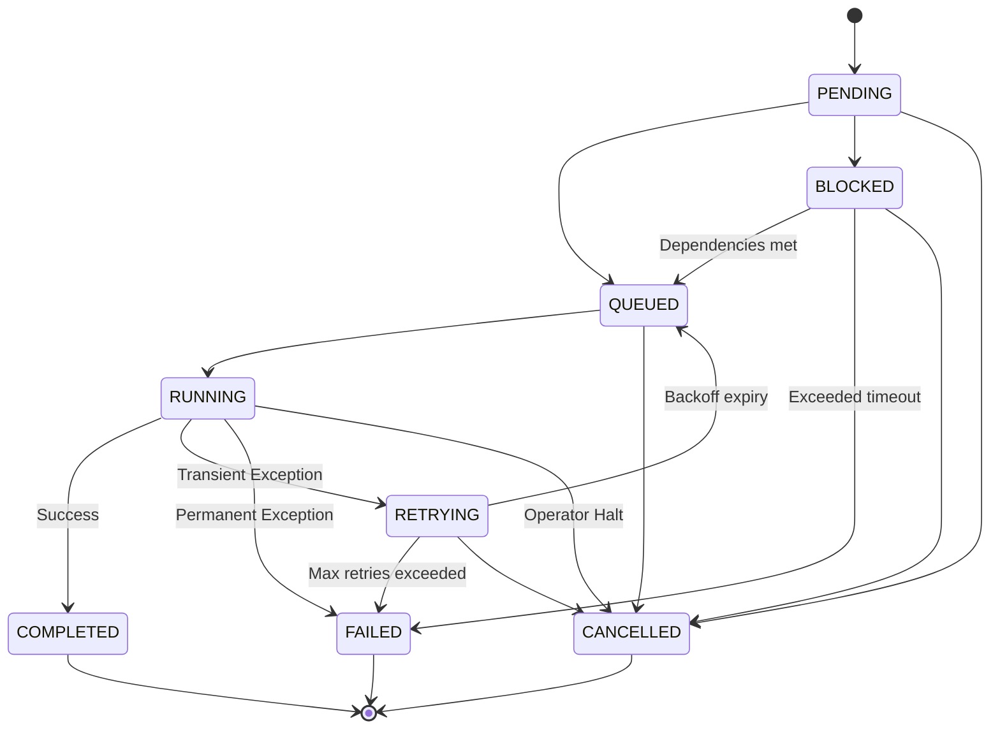

# Phase 11.7.2 — Job Model Design

**Date:** 2026-06-04  
**Status:** PROPOSED  
**Author:** Principal Workflow Architect (Content Ingestion & Synthesis Factory)

---

## 1. Job Entity Design

The canonical `Job` domain model represents a single asynchronous task unit. It maps 1-to-1 with an operation executed on the platform.

```python
from dataclasses import dataclass, field
from datetime import datetime
from typing import Any, Dict, Optional
from uuid import UUID

@dataclass
class Job:
    """Canonical domain representation of an asynchronous workflow execution job."""

    job_id: UUID
    """Unique identifier for this job (UUID4)."""

    job_type: str
    """Classification type of the job (e.g., 'COLLECT', 'GENERATE_BRIEF')."""

    action_id: str
    """The canonical workflow action ID mapped to the Action Registry (e.g. 'generate_briefs')."""

    status: str
    """Current execution status (value of JobStatus enum)."""

    priority: int = 100
    """Priority score (lower value = higher priority, e.g. default 100, urgent 10)."""

    created_at: datetime = field(default_factory=datetime.utcnow)
    """ISO-8601 timestamp of when the job record was created in the queue."""

    started_at: Optional[datetime] = None
    """ISO-8601 timestamp of when the worker began executing this job."""

    completed_at: Optional[datetime] = None
    """ISO-8601 timestamp of when execution reached a terminal state (COMPLETED, FAILED, CANCELLED)."""

    operator_id: str = "system"
    """Classification of the initiator ('streamlit', 'cli', 'system', or user ID)."""

    target_type: str = "all"
    """Target artifact classification (e.g., 'topic', 'brief', 'storyboard', 'weekly_calendar')."""

    target_id: str = "all"
    """The unique target ID (usually topic_id, week_start, or 'all')."""

    payload: Dict[str, Any] = field(default_factory=dict)
    """Arbitrary JSON parameters passed to the application service."""

    result: Optional[Dict[str, Any]] = None
    """JSON output representation of the completed execution result (matches JobResult schema)."""

    error_message: Optional[str] = None
    """Error trace and exception details if status = FAILED."""

    retry_count: int = 0
    """Current number of executed retry attempts."""

    max_retries: int = 3
    """Maximum number of retry attempts allowed before marking the job as FAILED."""

    correlation_id: str = ""
    """Traceability identifier to tie multiple related jobs together (e.g. within a pipeline run)."""
```

---

## 2. Job Status Model & Transitions

The lifecycle of a job is governed by the `JobStatus` state machine.

### 2.1 JobStatus States
* **`PENDING`**: Job created but not yet queued or evaluating prerequisites.
* **`BLOCKED`**: The job cannot be queued because its upstream workflow dependencies are not satisfied (e.g. generating storyboard when brief is not approved).
* **`QUEUED`**: Prerequisites are met; job is sitting in the queue waiting for a worker thread.
* **`RUNNING`**: Worker has claimed the job and execution is in progress.
* **`RETRYING`**: Transient exception encountered; job is scheduled for retry after backoff delay.
* **`COMPLETED`**: Execution finished successfully. (Terminal)
* **`FAILED`**: Permanent error encountered or max retries exceeded. (Terminal)
* **`CANCELLED`**: Explicitly halted by operator request before completion. (Terminal)

### 2.2 Legal State Transitions



---

## 3. Job Type Inventory

The table below maps async-capable actions to their corresponding `JobType`, defining expected inputs and outcomes.

| JobType | Mapped Action ID | Primary Input | Output | Details |
| :--- | :--- | :--- | :--- | :--- |
| **`COLLECT`** | `collect` | Source identifier | Count of new staged papers | Syncs feeds from external providers |
| **`SCORE`** | `score_topics` | Priority weight configuration | Counts of scored/rejected topics | Computes priority metrics |
| **`GENERATE_BRIEF`** | `generate_briefs` | Top-N count, API Key | Generated briefs list | Generates plain-English summaries |
| **`GENERATE_CI`** | `generate_ci` | Top-N count, API Key | Mapped CI instances | Psychological hooks and angles |
| **`GENERATE_STORYBOARD`** | `generate_storyboards`| Top-N count, API Key | Generated storyboard list | Coordinated visual metaphers |
| **`GENERATE_ASSET`** | `generate_assets` | Top-N count, API Key | Asset count details | Generates script, carousel, newsletter |
| **`BUILD_MANIFEST`** | `build_manifest` | Topic ID | TopicManifest path | Compiles format paths |
| **`PLAN_WEEK`** | `plan_week` | Week start date | Weekly calendar path | Generates 7-day schedule |
| **`DRY_RUN`** | `dry_run` | Week start date | Validation report path | Validates post assets |
| **`RUN_PIPELINE`** | `run_pipeline` | Top-N, source, auto-approve | Stages log summary | Sequential end-to-end run |

---

## 4. Payload Contracts

To ensure strict validation at queue entry, each `JobType` enforces a schema:

```json
{
  "COLLECT": {
    "properties": {
      "source": { "type": ["string", "null"] }
    },
    "required": ["source"]
  },
  "SCORE": {
    "properties": {
      "limit": { "type": ["integer", "null"] }
    },
    "required": []
  },
  "GENERATE_BRIEF": {
    "properties": {
      "top_n": { "type": "integer", "minimum": 1 },
      "api_key": { "type": "string", "minLength": 10 }
    },
    "required": ["top_n", "api_key"]
  },
  "GENERATE_CI": {
    "properties": {
      "top_n": { "type": "integer", "minimum": 1 },
      "api_key": { "type": "string", "minLength": 10 }
    },
    "required": ["top_n", "api_key"]
  },
  "GENERATE_STORYBOARD": {
    "properties": {
      "top_n": { "type": "integer", "minimum": 1 },
      "api_key": { "type": "string", "minLength": 10 }
    },
    "required": ["top_n", "api_key"]
  },
  "GENERATE_ASSET": {
    "properties": {
      "top_n": { "type": "integer", "minimum": 1 },
      "api_key": { "type": "string", "minLength": 10 }
    },
    "required": ["top_n", "api_key"]
  },
  "BUILD_MANIFEST": {
    "properties": {
      "topic_id": { "type": "string", "pattern": "^[a-f0-9_]{8,64}$" }
    },
    "required": ["topic_id"]
  },
  "PLAN_WEEK": {
    "properties": {
      "week_start_date": { "type": "string", "format": "date" }
    },
    "required": ["week_start_date"]
  },
  "DRY_RUN": {
    "properties": {
      "week_start": { "type": "string", "format": "date" }
    },
    "required": ["week_start"]
  },
  "RUN_PIPELINE": {
    "properties": {
      "top_n": { "type": "integer", "minimum": 1 },
      "source": { "type": ["string", "null"] },
      "auto_approve": { "type": "boolean" },
      "api_key": { "type": "string", "minLength": 10 }
    },
    "required": ["top_n", "auto_approve", "api_key"]
  }
}
```

---

## 5. Result Contracts

Every completed job returns a structured output payload matching this format:

```json
{
  "$schema": "http://json-schema.org/draft-07/schema#",
  "title": "JobResult",
  "type": "object",
  "properties": {
    "success": { "type": "boolean" },
    "outputs": {
      "type": "object",
      "description": "Key-value pair references to the generated artifacts (e.g. {'brief': 'data/briefs/123.json'})."
    },
    "warnings": {
      "type": "array",
      "items": { "type": "string" }
    },
    "metrics": {
      "type": "object",
      "properties": {
        "execution_time_seconds": { "type": "number" },
        "tokens_consumed": { "type": "integer" }
      },
      "required": ["execution_time_seconds"]
    },
    "emitted_events": {
      "type": "array",
      "items": { "type": "string" }
    }
  },
  "required": ["success", "outputs", "warnings", "metrics", "emitted_events"]
}
```

---

## 6. Persistence & Storage Model

We propose the SQLite relational schema for queue storage (`data/jobs.db`):

```sql
-- SQLite Table Definition
CREATE TABLE IF NOT EXISTS jobs (
    job_id VARCHAR(36) PRIMARY KEY,
    job_type VARCHAR(50) NOT NULL,
    action_id VARCHAR(50) NOT NULL,
    status VARCHAR(20) NOT NULL,
    priority INTEGER DEFAULT 100,
    created_at TIMESTAMP NOT NULL,
    started_at TIMESTAMP,
    completed_at TIMESTAMP,
    operator_id VARCHAR(50) NOT NULL,
    target_type VARCHAR(50) NOT NULL,
    target_id VARCHAR(100) NOT NULL,
    payload TEXT NOT NULL,          -- JSON serialized dict
    result TEXT,                   -- JSON serialized dict (null until completed)
    error_message TEXT,
    retry_count INTEGER DEFAULT 0,
    max_retries INTEGER DEFAULT 3,
    correlation_id VARCHAR(36) NOT NULL
);

-- Performance Indexes
CREATE INDEX IF NOT EXISTS idx_jobs_status_priority ON jobs(status, priority, created_at);
CREATE INDEX IF NOT EXISTS idx_jobs_correlation_id ON jobs(correlation_id);
CREATE INDEX IF NOT EXISTS idx_jobs_target ON jobs(target_type, target_id);
```

### 6.1 Status & Lock Queries
* **Worker Poll Query**:
  ```sql
  SELECT * FROM jobs 
  WHERE status = 'QUEUED' 
  ORDER BY priority ASC, created_at ASC 
  LIMIT 1;
  ```
* **Topic Busy Check (Lock Validation)**:
  ```sql
  SELECT COUNT(*) FROM jobs 
  WHERE target_type = 'topic' 
    AND target_id = :topic_id 
    AND status IN ('QUEUED', 'RUNNING', 'RETRYING');
  ```

### 6.2 Cleanup Strategy
* Terminal jobs (`COMPLETED`, `CANCELLED`, `FAILED`) older than 30 days are automatically deleted or moved to an archive audit log table, maintaining queue performance.

---

## 7. Governance Constraints

To prevent out-of-order state mutations or security bypasses:

1. **Mandatory Routing constraint**: No job worker shall call domain services directly. The job handler *must* route execution exclusively through `WorkflowActionExecutor.execute()`.
2. **Prohibited Execution Paths**:
   * Direct calling of generator classes (e.g. `BriefGenerationService.run()`) from the job worker queue daemon is strictly forbidden.
   * Direct writes to local storage directories bypassing the executor are blocked by partition checks.

---

## 8. Future Compatibility Assessment

* **Notifications**: Supports webhooks or SSE callbacks by registering a callback URL in the `payload` configuration.
* **Dashboard Indexing**: The `status` + `target_id` index allows Streamlit dashboard charts to fetch pending queues instantly.
* **Audit Logs**: The completed records serve as a historical ledger of all platform mutations.

---

## 9. Final Recommendation

We recommend adopting this `Job` data model as-is for Phase 11.7.3. The schema covers all operational fields needed for async workers, locking, retries, and correlation traces.
