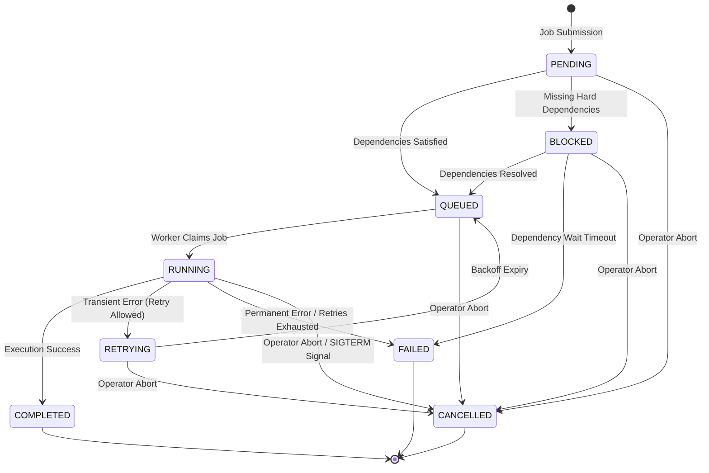

# Phase 11.7.3 — Job State Machine Design

**Date:** 2026-06-04  
**Status:** PROPOSED  
**Author:** Principal Workflow Architect (Content Ingestion & Synthesis Factory)

---

## 1. State Inventory

The asynchronous job processing system uses a highly deterministic, finite set of states to represent a job's lifecycle. Below is the official state inventory, along with the architectural justification for including or excluding specific operational states.

### 1.1 Core Lifecycle States

| State | Classification | Description | Database / Worker Behavior |
| :--- | :--- | :--- | :--- |
| **`PENDING`** | Initial / Idle | The job has been created in the database but is not yet eligible to run. It may be undergoing initial validation or prioritization. | Created record with `created_at` timestamp. Lock checks are not yet active. |
| **`BLOCKED`** | Wait State | The job cannot proceed because its upstream workflow dependencies (e.g., brief approval, topic readiness) are not satisfied. | Evaluated periodically by a dependency resolution check. Retains topic/run identifiers but does not enter the worker queue. |
| **`QUEUED`** | Active Queue | The job's dependencies are fully satisfied, and it is placed in the queue. It is actively waiting for an available worker thread. | Indexed by `priority` and `created_at` for rapid polling by worker daemons. |
| **`RUNNING`** | Active Execution | A worker daemon has claimed the job and is actively executing the associated workflow action via the executor. | Updated with `started_at` timestamp. Worker actively updates `last_heartbeat` to prevent zombie reclamation. |
| **`RETRYING`** | Wait State | Execution encountered a transient failure (e.g., LLM rate limits, network timeouts). The job waits for its backoff delay to expire. | Updated with a `run_after` timestamp. Workers ignore the job until `current_time >= run_after`. |
| **`COMPLETED`** | Terminal (Success) | The job completed successfully, generated its output artifacts, and updated the workflow review state. | **Immutable**. Updated with `completed_at` timestamp. Results JSON stored. Locks released. |
| **`FAILED`** | Terminal (Failure) | The job encountered a permanent failure, ran into a validation error, or exhausted all allowed retries. | **Immutable**. Updated with `completed_at` timestamp. Error trace and diagnostics stored. Locks released. |
| **`CANCELLED`** | Terminal (Aborted) | The job was explicitly cancelled by an operator command or automated supervisor abort. | **Immutable**. Updated with `completed_at` timestamp. Interrupted intermediate files cleaned up. Locks released. |

### 1.2 Evaluation of Excluded States

* **`PAUSED`**: *Excluded*. The Content Ingestion & Synthesis Factory is designed as a batch-oriented content pipeline rather than an interactive long-running manual checklist. Adding a `PAUSED` state introduces unnecessary database locking overhead, queue complexity, and complex worker suspend/resume semantics. If a pipeline needs to halt, operators cancel the execution or prevent new jobs from queuing.
* **`STALLED`**: *Excluded*. Jobs that run past their expected time-to-live (TTL) are classified as timed out. Treating a timeout as a separate state adds redundancy. Under this architecture, stalled jobs are recovered and directly transitioned to `FAILED` (or `QUEUED` if retry-eligible) by the recovery engine.
* **`RECOVERING`**: *Excluded*. Recovery is an instantaneous database state transition operation executed during worker boot-up or supervisor sweep. Storing a persistent `RECOVERING` status on the job record creates race conditions and complicates polling queries.

---

## 2. Transition Graph & Edges

The state machine enforces a strict set of directional edges. State mutations violating this graph are rejected at the database and application levels.

### 2.1 State Transition Diagram



### 2.2 Transition Legality Matrix

The following matrix defines all allowed transitions. Any transition not explicitly marked as **Allowed** is forbidden.

| Source State | Target State | Triggering Event | Database Schema Updates |
| :--- | :--- | :--- | :--- |
| `PENDING` | `QUEUED` | Dependency check confirms all preconditions are satisfied. | `status = 'QUEUED'` |
| `PENDING` | `BLOCKED` | Dependency check detects missing upstream artifacts. | `status = 'BLOCKED'` |
| `PENDING` | `CANCELLED` | Operator aborts the pipeline run before queueing. | `status = 'CANCELLED'`, `completed_at = datetime.utcnow()` |
| `BLOCKED` | `QUEUED` | Upstream artifact state transitions to ready/approved. | `status = 'QUEUED'` |
| `BLOCKED` | `FAILED` | Dependency wait time exceeds system-wide timeout. | `status = 'FAILED'`, `completed_at = datetime.utcnow()`, `error_message = 'Dependency timeout'` |
| `BLOCKED` | `CANCELLED` | Operator aborts the blocked pipeline run. | `status = 'CANCELLED'`, `completed_at = datetime.utcnow()` |
| `QUEUED` | `RUNNING` | Worker claims the task from the queue. | `status = 'RUNNING'`, `started_at = datetime.utcnow()`, `last_heartbeat = datetime.utcnow()` |
| `QUEUED` | `CANCELLED` | Operator cancels the job while it is waiting in queue. | `status = 'CANCELLED'`, `completed_at = datetime.utcnow()` |
| `RUNNING` | `COMPLETED` | Workflow executor reports successful termination. | `status = 'COMPLETED'`, `completed_at = datetime.utcnow()`, `result = serialized_result_json` |
| `RUNNING` | `RETRYING` | Transient failure caught; `retry_count < max_retries`. | `status = 'RETRYING'`, `retry_count += 1`, `run_after = calculated_backoff_timestamp` |
| `RUNNING` | `FAILED` | Permanent error or `retry_count >= max_retries`. | `status = 'FAILED'`, `completed_at = datetime.utcnow()`, `error_message = error_details` |
| `RUNNING` | `CANCELLED` | Active cancel event received by worker process. | `status = 'CANCELLED'`, `completed_at = datetime.utcnow()`, `result = cleanup_info` |
| `RETRYING` | `QUEUED` | Current system time exceeds calculated `run_after` time. | `status = 'QUEUED'` |
| `RETRYING` | `CANCELLED` | Operator cancels the job while it is waiting for retry. | `status = 'CANCELLED'`, `completed_at = datetime.utcnow()` |

### 2.3 Explicitly Forbidden Transitions

To guarantee audit trail integrity, the following transitions are strictly prohibited:
1. **Any Terminal State (`COMPLETED`, `FAILED`, `CANCELLED`) to any other state.** A job's terminal state is immutable. To rerun a failed or cancelled job, a new job record with a unique `job_id` must be created.
2. **`PENDING` / `BLOCKED` / `RETRYING` directly to `RUNNING`.** A job must always pass through `QUEUED` so that queue order and lock checks can be cleanly applied.
3. **`QUEUED` to `RETRYING`.** A job can only retry if it has attempted execution (from `RUNNING`).
4. **`QUEUED` to `COMPLETED` or `FAILED` without entering `RUNNING`.** Every success or failure must represent an execution attempt recorded by a worker, except dependency-timeout failures from `BLOCKED`.

---

## 3. Terminal States & Immutability

When a job transitions to `COMPLETED`, `FAILED`, or `CANCELLED`, it is considered terminal. The system enforces strict immutability invariants:

### 3.1 Database Invariants
* **State Immutability Constraint**: Database check constraints or SQLite triggers must block updates to any column of a job once `status` is set to a terminal value.
* **SQL Constraint Draft**:
  ```sql
  CREATE TRIGGER IF NOT EXISTS enforce_job_immutability
  BEFORE UPDATE ON jobs
  FOR EACH ROW
  WHEN OLD.status IN ('COMPLETED', 'FAILED', 'CANCELLED')
  BEGIN
      SELECT RAISE(FAIL, 'State invariant violation: terminal jobs cannot be modified.');
  END;
  ```

### 3.2 Application Validation
* Any thread attempting to modify a terminal job at the application layer must raise a `TerminalStateViolationError`.
* All cooperative file locks (`data/locks/{lock_name}.lock`) or database-level lock entries associated with the job's `target_id` must be guaranteed to release *before* the transaction committing the terminal status is finalized.

---

## 4. Retry Lifecycle

The retry engine isolates transient operational faults (e.g., Gemini LLM rate limits, network outages) from permanent logical errors (e.g., API key validation failures, code bugs).

### 4.1 Transient vs. Permanent Error Classification

* **Transient Errors (Trigger Retry)**:
  * API Rate Limit Exceptions (HTTP 429)
  * Upstream Service Timeouts (HTTP 503 / 504)
  * SQLite Database Locked / Busy Exceptions
  * Network/Socket Timeouts
* **Permanent Errors (Halt and Fail immediately)**:
  * Authentication/Authorization Failures (Invalid API Key)
  * Schema Validation / Payload Invalidation
  * Prompt Template Syntax Errors
  * Missing hard file-system resources that cannot recover automatically

### 4.2 Exponential Backoff with Jitter Formula

To avoid thundering herd issues on the Gemini LLM endpoints, the backoff interval uses exponential scaling combined with random jitter:

$$T_{\text{backoff}} = \text{base\_delay} \times 2^{\text{retry\_count}} + \text{jitter}$$

* **Parameters**:
  * `base_delay`: 5.0 seconds
  * `retry_count`: The incremented retry count (1-indexed for calculations)
  * `jitter`: A random float value chosen uniformly from $[0.0, 2.0]$ seconds

#### Backoff Interval Reference Table:
| Retry Attempt | `retry_count` | Exponential Factor | Base Delay ($2^n \times 5$) | Jitter Range | Total Delay Window |
| :--- | :---: | :---: | :---: | :---: | :--- |
| 1st Retry | `1` | $2^1 = 2$ | $10.0\text{s}$ | $[0.0, 2.0]\text{s}$ | **$10.0\text{s} - 12.0\text{s}$** |
| 2nd Retry | `2` | $2^2 = 4$ | $20.0\text{s}$ | $[0.0, 2.0]\text{s}$ | **$20.0\text{s} - 22.0\text{s}$** |
| 3rd Retry (Final) | `3` | $2^3 = 8$ | $40.0\text{s}$ | $[0.0, 2.0]\text{s}$ | **$40.0\text{s} - 42.0\text{s}$** |

### 4.3 Database Backoff Representation
Instead of keeping a worker thread blocked or asleep, the worker calculates the target execution time:

$$\text{Run After Time} = \text{Current UTC Time} + T_{\text{backoff}}$$

The worker sets `status = 'RETRYING'` and `run_after = Run After Time` in the database. The worker is then immediately freed to claim other `QUEUED` jobs.

---

## 5. Cancellation Model

Cancellation allows operators to cleanly abort executions. The cancellation lifecycle handles jobs differently depending on their current state.

```
                  [ Operator Triggers Cancel ]
                               │
       ┌───────────────────────┼───────────────────────┐
       ▼                       ▼                       ▼
   [ QUEUED ]             [ RETRYING ]            [ RUNNING ]
       │                       │                       │
       ▼                       ▼                       ▼
Mark status = CANCEL    Mark status = CANCEL     Set Cancel Flag
Worker skips job        Ignored at expiry       Worker catches flag
       │                       │                       │
       └───────────────────────┼───────────────────────┘
                               ▼
                    Rollback DB Transactions
                     Release Topic Locks
                    Emit job_cancelled Event
```

### 5.1 Cancellation Handlers

1. **Cancellation in `QUEUED` / `PENDING` / `BLOCKED`**:
   * The status is updated to `CANCELLED` directly in the database.
   * No active worker has claimed the job yet. When a worker polls the database, it ignores this record.
2. **Cancellation in `RETRYING`**:
   * The status is updated to `CANCELLED` in the database.
   * On backoff expiry, the queue polling query ignores the record because its status is no longer `RETRYING`.
3. **Cancellation in `RUNNING`**:
   * **Cooperative Cancellation**: Worker threads check the database `status` or a memory-mapped cancellation flag before starting critical sub-steps or LLM invocations.
   * **Graceful Abort**: Upon detecting the cancellation signal, the worker:
     1. Aborts further execution steps.
     2. Rolls back any active SQLite database transactions.
     3. Deletes temporary/partial artifact files written during the current run to prevent corruption.
     4. Releases all co-located topic locks (`data/locks/*.lock`).
     5. Transitions the database record to `CANCELLED` with metadata describing the abort point.

---

## 6. Recovery Model (Resiliency & Self-Healing)

Workers run on ephemeral hosting (e.g., Render containers). When a container restarts, or a worker process crashes, jobs marked as `RUNNING` become orphan/zombie records.

### 6.1 Heartbeat Protocol
To distinguish active jobs from crashed jobs, the `jobs` table maintains a `last_heartbeat` timestamp.
* **Worker Duty**: An active worker updates `last_heartbeat = datetime.utcnow()` every 10 seconds during execution.
* **Heartbeat Timeout Window**: 30 seconds. If a job is `RUNNING` but the current time exceeds `last_heartbeat` by more than 30 seconds, it is marked as a zombie.

### 6.2 Supervisor Recovery Routine
A supervisor thread runs at worker startup and sweeps periodically (every 60 seconds) to execute this recovery logic:

```python
def recover_zombie_jobs():
    # Find all running jobs that have timed out or are orphaned
    zombies = db.query("SELECT * FROM jobs WHERE status = 'RUNNING' AND last_heartbeat < :timeout", timeout=utcnow() - 30)
    
    for job in zombies:
        if job.retry_count < job.max_retries:
            # Reschedule the job
            db.execute(
                "UPDATE jobs SET status = 'QUEUED', retry_count = retry_count + 1, started_at = NULL WHERE job_id = :id",
                id=job.job_id
            )
            release_locks(job.target_id)
            emit_event("job_retrying", job_id=job.job_id, reason="Worker heartbeat timeout; rescheduled.")
        else:
            # Exhausted retries
            db.execute(
                "UPDATE jobs SET status = 'FAILED', completed_at = :now, error_message = :err WHERE job_id = :id",
                now=utcnow(),
                err="Worker process crashed or terminated during execution (heartbeat timeout).",
                id=job.job_id
            )
            release_locks(job.target_id)
            emit_event("job_failed", job_id=job.job_id, reason="Worker crashed; retries exhausted.")
```

---

## 7. Event Model & Payloads

State machine transitions emit structured events to feed dashboards, email/Slack alert systems, and audit logs.

### 7.1 Mapped Transitions and Event Types

| State Transition | Emitted Event | Purpose |
| :--- | :--- | :--- |
| `*` -> `PENDING` / `QUEUED` | `job_created` | Registered in queue; ready for execution. |
| `QUEUED` -> `RUNNING` | `job_started` | Worker claimed job; active execution begins. |
| `RUNNING` -> `RETRYING` | `job_retrying` | Transient fault occurred; rescheduling after backoff. |
| `RUNNING` -> `COMPLETED` | `job_completed` | Success; output artifacts ready. |
| `RUNNING` / `RETRYING` -> `FAILED` | `job_failed` | Permanent failure; attention required. |
| `*` -> `CANCELLED` | `job_cancelled` | Operator abort; cleaning up. |

### 7.2 Event Schema Contract

All events must conform to the following JSON payload contract:

```json
{
  "event_id": "848df790-28bf-4c7b-a19c-0c1535492d24",
  "event_type": "job_completed",
  "timestamp": "2026-06-04T21:45:00Z",
  "data": {
    "job_id": "b18b4566-bfbe-451e-b8a7-a4b0d0c3ab41",
    "job_type": "GENERATE_STORYBOARD",
    "action_id": "generate_storyboards",
    "operator_id": "streamlit_ui",
    "correlation_id": "pipeline_run_c828df",
    "target_type": "topic",
    "target_id": "topic_machine_learning_basics",
    "retry_count": 1,
    "elapsed_seconds": 24.15,
    "result": {
      "success": true,
      "outputs": {
        "storyboard_path": "data/storyboards/topic_machine_learning_basics.json"
      },
      "warnings": [],
      "metrics": {
        "execution_time_seconds": 23.8,
        "tokens_consumed": 4200
      }
    }
  }
}
```

---

## 8. Governance Constraints

To protect the platform's state boundary integrity, the Job State Machine must enforce the following architecture constraint:

```
┌──────────────────────┐
│  Background Worker   │
└──────────┬───────────┘
           │
           │ (1) Claim Job & Unpack Payload
           ▼
┌──────────────────────┐
│  Job Handler Runner  │
└──────────┬───────────┘
           │
           │ (2) execute(OperatorAction)
           ▼
┌──────────────────────────────┐
│    WorkflowActionExecutor    │
└──────────┬───────────────────┘
           │
           ├─ (3) Validate Availability (ActionAvailabilityEngine)
           ├─ (4) Check Transitions (ReviewTransitionEngine)
           └─ (5) Invoke Target Service Method
```

### Governance Rules:
1. **Executor Gateway Constraint**: The background worker process is strictly forbidden from invoking application services (e.g. `BriefGenerationService.run()`) directly. It must pack parameters into an `OperatorAction` and route execution through `WorkflowActionExecutor.execute()`.
2. **Availability Check Enforcement**: The executor will run the target through the `ActionAvailabilityEngine`. If the engine blocks the action (e.g. generating brief for a non-existent topic), the executor returns an `ActionExecutionResult` with `success = False` and `blocking_reasons`. The worker must then transition the job status to `FAILED`.
3. **No Direct Filesystem Bypass**: Workers must never write directly to local content store directories; they must rely on the storage operations encapsulated inside the application services.

---

## 9. Future Compatibility Assessment

The Job State Machine design supports the planned scaling roadmap of the Content Ingestion & Synthesis Factory:

* **Distributed Scaling**: Because state and locking information are persisted in SQLite (or Supabase Postgres in cloud deployment), multiple background processes can execute concurrently. Row-level transaction locking (`SELECT ... FOR UPDATE` or database transaction level constraints) guarantees no two workers claim the same `QUEUED` job.
* **Dead-Letter Queues (DLQ)**: Jobs transitioning to `FAILED` with `retry_count == max_retries` are tagged with a `dlq` flag. A dedicated DLQ dashboard allows administrators to inspect payloads, repair external files, and click "Replay" to reset `retry_count = 0` and transition status to `QUEUED`.
* **Notifications (Webhooks/SSE)**: The event emission system supports dispatching events to callback hooks. External systems (e.g. frontend widgets) can subscribe to SSE streams based on the job's `correlation_id` to view real-time update notifications.
* **Progress Tracking**: Long-running jobs (like `run_pipeline`) can write progress metadata (e.g. `{"current_step": 3, "total_steps": 5, "stage_name": "generate_storyboards"}`) to the job record. The Streamlit dashboard can poll this column to display progress bars.

---

## 10. Final Recommendation

We recommend adoption of the proposed Job State Machine. It establishes a highly resilient, traceable, and secure framework for background job execution.

By combining:
1. Structured exponential backoff with random jitter,
2. Cooperative and graceful cancellation checks,
3. Heartbeat-based zombie worker detection and recovery, and
4. Strict enforcement of the `WorkflowActionExecutor` governance boundary,

this design ensures that asynchronous scaling will not compromise the content factory's strict state transition controls.
