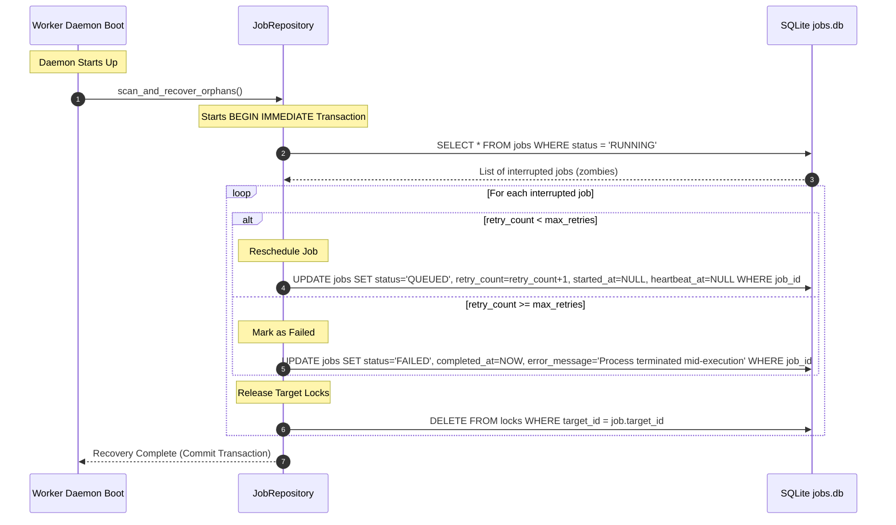
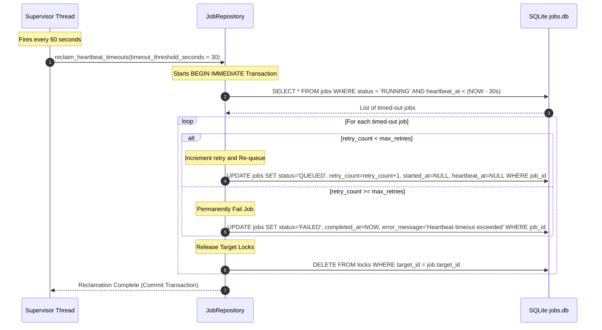

# Phase 11.7.4 — Job Persistence Layer Design

**Date:** 2026-06-04  
**Status:** PROPOSED  
**Author:** Principal Workflow Architect (Content Ingestion & Synthesis Factory)

---

## 1. Persistence Architecture

The background job system decouples task scheduling and queueing from execution. To maintain strict isolation between the database engine and the background worker, we establish a formal persistence boundary using the Repository Pattern.

```
┌────────────────────────────────────────────────────────────────────────┐
│                        Background Worker Daemon                        │
└───────────────────────────────────┬────────────────────────────────────┘
                                    │ (Calls Domain APIs)
                                    ▼
┌────────────────────────────────────────────────────────────────────────┐
│                            JobRepository                               │
│        (Abstract Interface defining clean, domain-centric APIs)         │
└───────────────────────────────────┬────────────────────────────────────┘
                                    │ (Inherits & Implements)
                                    ▼
┌────────────────────────────────────────────────────────────────────────┐
│                          SQLiteJobRepository                           │
│     (Concrete adapter managing connection pools, raw SQL, SQLite transactions) │
└───────────────────────────────────┬────────────────────────────────────┘
                                    │ (SQL Transactions)
                                    ▼
┌────────────────────────────────────────────────────────────────────────┐
│                           jobs.db (SQLite)                             │
│       [ jobs table | idx_jobs_status_priority | locks index ]          │
└────────────────────────────────────────────────────────────────────────┘
```

### 1.1 Architectural Component Definitions

* **`JobRepository`**: The abstract domain interface. It exposes high-level Python methods that accept and return domain entity models (e.g. `Job` dataclass). It has no knowledge of SQL, SQLite, or file paths.
* **`SQLiteJobRepository` (JobStore)**: The concrete implementation of `JobRepository`. It encapsulates SQLite connection handles, executes SQL queries, maps database rows to Python models, and serializes Python dicts into JSON strings.
* **Persistence Boundary**: Application services and workers never write raw SQL or access `jobs.db` directly. All read/write access to jobs and locks is routed strictly through the repository boundary.
* **Transaction Ownership**: SQLite only supports one concurrent writer (locking the database file). The repository implementation is responsible for initiating transactions (`BEGIN IMMEDIATE`), managing rollback logic on write failures, and releasing connections promptly to prevent timeouts.

### 1.2 Data Paths

1. **Write Path (Job Registration & Queueing)**:
   * The client initiates job submission by calling `JobRepository.create_job(job)`.
   * The repository starts an `IMMEDIATE` transaction, checks if the target resource (e.g., a specific `topic_id`) is locked by a running job, and writes the job as `BLOCKED` or `QUEUED` depending on dependency satisfaction.
2. **Read Path (Worker Polling / Dequeueing)**:
   * The worker queries for jobs ready for execution via `JobRepository.acquire_job(worker_id)`.
   * The repository selects the highest priority, oldest `QUEUED` job (where `run_after IS NULL` or `run_after <= NOW`), updates its status to `RUNNING` in a single transaction, and returns the job to the worker.
3. **Update Path (Progress updates & Heartbeats)**:
   * While executing, the worker updates its status and reports progress. The repository writes these values to the database.
   * Periodically, the worker calls `update_heartbeat(job_id)`. This updates the `heartbeat_at` timestamp.
4. **Recovery Path (Zombie Reclamation)**:
   * On startup or in a supervisor thread, the recovery engine queries `JobRepository.get_stalled_jobs(timeout_seconds)`.
   * It reclaims each stalled job, either resetting it back to `QUEUED` (incrementing its retry count) or marking it as `FAILED` (if retries are exhausted).

---

## 2. SQLite Schema Design

The job system is backed by SQLite (`data/jobs.db`). Below is the canonical schema definition for the `jobs` table.

```sql
-- Schema Definition
CREATE TABLE IF NOT EXISTS jobs (
    job_id VARCHAR(36) PRIMARY KEY,
    job_type VARCHAR(50) NOT NULL,
    status VARCHAR(20) NOT NULL,
    priority INTEGER NOT NULL DEFAULT 100,
    action_id VARCHAR(50) NOT NULL,
    operator_id VARCHAR(50) NOT NULL,
    target_type VARCHAR(50) NOT NULL,
    target_id VARCHAR(100) NOT NULL,
    payload_json TEXT NOT NULL,
    result_json TEXT,
    retry_count INTEGER NOT NULL DEFAULT 0,
    max_retries INTEGER NOT NULL DEFAULT 3,
    created_at TIMESTAMP NOT NULL,
    queued_at TIMESTAMP,
    started_at TIMESTAMP,
    completed_at TIMESTAMP,
    run_after TIMESTAMP,
    heartbeat_at TIMESTAMP,
    correlation_id VARCHAR(36) NOT NULL,
    error_message TEXT
);
```

### 2.1 Table Column Specification

| Column Name | SQLite Affinity | Nullable | Primary Index | Secondary Index | Rationale |
| :--- | :--- | :---: | :---: | :---: | :--- |
| `job_id` | `TEXT` | No | Yes | - | Unique UUID4 identifier for job tracing. |
| `job_type` | `TEXT` | No | - | - | Classification of the task type (e.g. `COLLECT`). |
| `status` | `TEXT` | No | - | Yes (Compound) | Current lifecycle state (governs polling queries). |
| `priority` | `INTEGER` | No | - | Yes (Compound) | Lower value = higher execution priority (e.g. 10 vs 100). |
| `action_id` | `TEXT` | No | - | - | Maps to the canonical Workflow Action Registry. |
| `operator_id` | `TEXT` | No | - | - | Client type that triggered the job (e.g. `streamlit`, `cli`). |
| `target_type` | `TEXT` | No | - | Yes (Compound) | Scope target type (e.g., `topic`, `brief`, `weekly_calendar`). |
| `target_id` | `TEXT` | No | - | Yes (Compound) | Key value of target resource (used for operational locks). |
| `payload_json` | `TEXT` | No | - | - | JSON string representing runtime arguments for the action. |
| `result_json` | `TEXT` | Yes | - | - | JSON string holding the `ActionExecutionResult` payload. |
| `retry_count` | `INTEGER` | No | - | - | Number of transient error recovery attempts made. |
| `max_retries` | `INTEGER` | No | - | - | Maximum retry ceiling before moving the job to `FAILED`. |
| `created_at` | `TEXT` | No | - | - | Timestamp when the job record was created (ISO-8601). |
| `queued_at` | `TEXT` | Yes | - | - | Timestamp when the job was moved to `QUEUED` state (ISO-8601). |
| `started_at` | `TEXT` | Yes | - | - | Timestamp when execution began (ISO-8601). |
| `completed_at` | `TEXT` | Yes | - | - | Timestamp when the job entered a terminal state (ISO-8601). |
| `run_after` | `TEXT` | Yes | - | Yes (Compound) | Delay target timestamp. Polling skips job if current time < `run_after`. |
| `heartbeat_at` | `TEXT` | Yes | - | Yes (Compound) | Updated by worker to indicate active progress. |
| `correlation_id`| `TEXT` | No | - | Yes | Groups related jobs inside a single pipeline invocation. |
| `error_message` | `TEXT` | Yes | - | - | Exception stack traces or failure messages for diagnostics. |

### 2.2 Indexing Requirements

SQLite uses B-Trees for indexing. To optimize common queue operations, we require the following indexes:

```sql
-- 1. Optimize worker dequeueing and priority selection
CREATE INDEX IF NOT EXISTS idx_jobs_polling 
ON jobs (status, priority, run_after, queued_at);

-- 2. Optimize duplicate target lock checking (preventing race conditions on topics)
CREATE INDEX IF NOT EXISTS idx_jobs_locks 
ON jobs (target_type, target_id, status);

-- 3. Optimize correlation and pipeline run status aggregates
CREATE INDEX IF NOT EXISTS idx_jobs_correlation 
ON jobs (correlation_id);

-- 4. Optimize zombie sweeps by the recovery supervisor
CREATE INDEX IF NOT EXISTS idx_jobs_zombie_sweep 
ON jobs (status, heartbeat_at);
```

---

## 3. Query Inventory

The repository implementation must expose optimized database calls. The table below catalogs all required SQL queries.

| Query Method | Target SQL Statement | Intended Purpose | Frequency | Index Dependency |
| :--- | :--- | :--- | :---: | :--- |
| `get_job` | `SELECT * FROM jobs WHERE job_id = ?;` | Fetch details of a single job. | Low | `PRIMARY KEY` |
| `get_pending_jobs` | `SELECT * FROM jobs WHERE status = 'PENDING';` | Find jobs ready for dependency resolution check. | Medium | `idx_jobs_polling` |
| `get_running_jobs` | `SELECT * FROM jobs WHERE status = 'RUNNING';` | Monitor currently executing operations. | Low | `idx_jobs_zombie_sweep` |
| `get_jobs_by_target`| `SELECT * FROM jobs WHERE target_type = ? AND target_id = ?;` | Check for existing active jobs targeting the same entity. | High | `idx_jobs_locks` |
| `get_jobs_by_correlation_id`| `SELECT * FROM jobs WHERE correlation_id = ?;` | Aggregate progress of a parent pipeline workflow. | Medium | `idx_jobs_correlation` |
| `get_stalled_jobs` | `SELECT * FROM jobs WHERE status = 'RUNNING' AND heartbeat_at < ?;` | Find zombie jobs whose worker process died. | Low (60s loop) | `idx_jobs_zombie_sweep` |
| `get_retryable_jobs`| `SELECT * FROM jobs WHERE status = 'RETRYING' AND run_after <= ?;` | Fetch jobs waiting for retry whose backoffs have expired. | High (5s loop) | `idx_jobs_polling` |

---

## 4. Transaction Design

To prevent race conditions, lost updates, and corrupted queues, all mutations in the SQLite store must be wrapped in structured, atomic database transactions. Because SQLite locks the database file on writes, we use `BEGIN IMMEDIATE` to escalate locks immediately and avoid `SQLITE_BUSY` deadlocks.

### 4.1 Transaction Specifications

#### 1. Job Creation Transaction
* **Type**: `BEGIN IMMEDIATE`
* **Workflow**:
  1. Check if an active job (`status IN ('QUEUED', 'RUNNING', 'RETRYING')`) already exists for the `(target_type, target_id)`.
  2. If an active job exists, reject creation (or create the job in the `BLOCKED` state depending on the pipeline configuration).
  3. Validate hard preconditions.
  4. If preconditions are met, insert the record with `status = 'QUEUED'` and `queued_at = datetime.utcnow()`.
  5. If preconditions are missing, insert the record with `status = 'BLOCKED'`.
* **Rollback Action**: Rollback on SQL insert error or validation failure. No record is written.

#### 2. Dequeue (Acquire) Transaction
* **Type**: `BEGIN IMMEDIATE`
* **Workflow**:
  1. Poll the database for the next available job:
     ```sql
     SELECT * FROM jobs 
     WHERE status = 'QUEUED' 
       AND (run_after IS NULL OR run_after <= :now)
     ORDER BY priority ASC, queued_at ASC
     LIMIT 1;
     ```
  2. If a job is returned, update its status:
     ```sql
     UPDATE jobs 
     SET status = 'RUNNING', 
         started_at = :now, 
         heartbeat_at = :now 
     WHERE job_id = :job_id;
     ```
  3. Commit and return the job payload to the claiming worker. If no job is found, immediately commit (or rollback) and return `None`.
* **Rollback Action**: Rollback on selection or update failure. The job remains in the `QUEUED` state.

#### 3. State Transition Transaction
* **Type**: `BEGIN IMMEDIATE`
* **Workflow**:
  1. Retrieve the current `status` of the target `job_id`.
  2. Validate that the transition from `current_status` to `target_status` conforms to the transition graph.
  3. If legal, update `status` and set modification timestamps (`completed_at` if transitioning to a terminal state).
* **Rollback Action**: On failure, the transaction is aborted; the job's state remains unchanged.

#### 4. Retry Registration Transaction
* **Type**: `BEGIN IMMEDIATE`
* **Workflow**:
  1. Select the current `retry_count` and `max_retries` for the job.
  2. If `retry_count < max_retries`:
     * Increment `retry_count` by 1.
     * Update status to `RETRYING`.
     * Set `run_after` to the calculated exponential backoff timestamp.
     * Clear lock references on the target resource.
  3. If `retry_count >= max_retries`:
     * Update status to `FAILED`.
     * Set `completed_at` to current time.
     * Populate `error_message`.
* **Rollback Action**: Rollback on database update failure.

#### 5. Cancellation Transaction
* **Type**: `BEGIN IMMEDIATE`
* **Workflow**:
  1. Select `status` and lock identifiers for the target job.
  2. If the job is in a terminal state, abort the cancellation (forbidden).
  3. Update `status = 'CANCELLED'` and `completed_at = datetime.utcnow()`.
  4. Release any active co-located locks associated with the job's `target_id`.
* **Rollback Action**: Rollback on violation or error.

#### 6. Completion Transaction
* **Type**: `BEGIN IMMEDIATE`
* **Workflow**:
  1. Update `status = 'COMPLETED'` and `completed_at = datetime.utcnow()`.
  2. Serialize the execution result object into `result_json`.
  3. Delete target lock files or release the database target lock entries.
* **Rollback Action**: Rollback on update error.

---

## 5. Recovery Model

If a worker process crashes or the container hosting it restarts, jobs that were in the `RUNNING` state remain locked. The recovery module is responsible for auditing and self-healing these orphaned records.

### 5.1 Startup Recovery Flow
When the worker daemon bootstraps, it runs a recovery scan before opening its queue subscription.



### 5.2 Heartbeat Timeout Recovery Flow
During normal operations, a background supervisor thread executes a heartbeat evaluation sweep every 60 seconds.



---

## 6. Cleanup Strategy (Retention & Maintenance)

Because SQLite performance degrades as database file size increases (due to page fragmentation and index re-balancing), we implement a strict data retention and maintenance policy.

### 6.1 Retention Policies

* **`COMPLETED` Jobs**:
  * **Retention Window**: 7 days.
  * **Rationale**: Provides sufficient history for developers and users to view recently finished jobs and download artifacts via the UI dashboard.
* **`FAILED` & `CANCELLED` Jobs**:
  * **Retention Window**: 30 days.
  * **Rationale**: Retained longer to allow operators to inspect stack traces, analyze trends, download debug logs, and perform manual DLQ replays.

### 6.2 Archival and Deletion Workflows

1. **Historical Archival**:
   * Prior to row deletion, terminal records scheduled for removal are copied to a long-term JSON audit log file located at `data/archive/jobs_history_YYYY_MM.json` (or written to an audit table in PostgreSQL if deployed on Supabase).
2. **Pruning Query**:
   * A maintenance task runs daily at 02:00 UTC and executes the following cleanup:
     ```sql
     -- 1. Archive target rows to json file (handled by Repository script)
     -- 2. Execute deletion
     DELETE FROM jobs 
     WHERE status = 'COMPLETED' 
       AND completed_at < datetime('now', '-7 days');

     DELETE FROM jobs 
     WHERE status IN ('FAILED', 'CANCELLED') 
       AND completed_at < datetime('now', '-30 days');
     ```

### 6.3 Database Maintenance Schedule

* **`VACUUM`**: SQLite does not reclaim free disk pages when rows are deleted. To shrink the physical database file size, the supervisor runs `VACUUM;` weekly (Sundays at 03:00 UTC) during off-peak windows.
* **`ANALYZE`**: Runs immediately after `VACUUM` to rebuild index statistics, optimizing SQLite's query planner decisions.

---

## 7. Repository API Specification

The repository pattern is defined in Python using strict type hints and abstract signatures. Below is the canonical interface design.

```python
from abc import ABC, abstractmethod
from datetime import datetime
from typing import Dict, List, Any, Optional
from uuid import UUID
from dataclasses import dataclass

@dataclass
class Job:
    job_id: UUID
    job_type: str
    status: str
    priority: int
    action_id: str
    operator_id: str
    target_type: str
    target_id: str
    payload: Dict[str, Any]
    result: Optional[Dict[str, Any]] = None
    retry_count: int = 0
    max_retries: int = 3
    created_at: datetime = None
    queued_at: Optional[datetime] = None
    started_at: Optional[datetime] = None
    completed_at: Optional[datetime] = None
    run_after: Optional[datetime] = None
    heartbeat_at: Optional[datetime] = None
    correlation_id: str = ""
    error_message: Optional[str] = None

class JobRepository(ABC):
    """Abstract data access interface governing Job entity persistence."""

    @abstractmethod
    def create_job(self, job: Job) -> Job:
        """Register a new job in the database.
        
        Performs concurrency target lock checks. If the target is busy,
        saves the job in the 'BLOCKED' state. Otherwise, saves as 'QUEUED'.
        """
        pass

    @abstractmethod
    def get_job(self, job_id: UUID) -> Optional[Job]:
        """Retrieve a job by its unique ID. Returns None if not found."""
        pass

    @abstractmethod
    def acquire_job(self, heartbeat_timeout_seconds: int = 30) -> Optional[Job]:
        """Atomically claim the next eligible QUEUED job.
        
        Transitions status to 'RUNNING' and updates started_at and heartbeat_at.
        Returns None if no queueable jobs exist.
        """
        pass

    @abstractmethod
    def update_heartbeat(self, job_id: UUID) -> None:
        """Update the heartbeat timestamp for an actively running job."""
        pass

    @abstractmethod
    def update_status(self, job_id: UUID, status: str, result: Optional[Dict[str, Any]] = None, error_message: Optional[str] = None) -> None:
        """Apply a state transition to a job. Enforces transition graph validity."""
        pass

    @abstractmethod
    def cancel_job(self, job_id: UUID) -> bool:
        """Initiate cancellation for a job. Releases associated target locks."""
        pass

    @abstractmethod
    def get_jobs_by_correlation_id(self, correlation_id: str) -> List[Job]:
        """Fetch all jobs matching the given correlation identifier."""
        pass

    @abstractmethod
    def get_jobs_by_target(self, target_type: str, target_id: str) -> List[Job]:
        """Fetch all jobs matching target parameters."""
        pass

    @abstractmethod
    def sweep_expired_retries(self) -> int:
        """Move jobs in RETRYING state back to QUEUED if backoff delay has expired.
        
        Returns the count of transitioned jobs.
        """
        pass

    @abstractmethod
    def sweep_zombies(self, timeout_seconds: int = 30) -> int:
        """Scan running jobs with expired heartbeats and recover or fail them.
        
        Returns the count of recovered jobs.
        """
        pass
```

---

## 8. Governance Constraints

To maintain the architectural boundary of the Content Ingestion & Synthesis Factory:

1. **No Direct Worker-to-Service Execution**: A background worker must never import or invoke application services directly. When executing a job, the worker daemon must instantiate a `WorkflowActionExecutor` and invoke its `execute` method.
2. **Mandatory Executor Gateway**: The `WorkflowActionExecutor` remains the sole manager of action execution, running checks via the `ActionAvailabilityEngine` and `ReviewTransitionEngine` before invoking services.
3. **Isolated SQLite Access**: No direct SQL execution is permitted in worker scripts, application services, CLI controllers, or Streamlit interfaces. All interaction with `jobs.db` must proceed through the `JobRepository` API.

---

## 9. Future Compatibility

This persistence design supports future performance scaling:

* **Lock Manager Integration**: By using the composite index on `(target_type, target_id, status)`, the repository serves as the single source of truth for locks. This eliminates the need for separate lock files.
* **Multi-Worker Concurrency**: SQLite's write-ahead logging (WAL) mode allows concurrent reads and writes. Immediate transactions prevent race conditions during parallel worker polls.
* **Distributed Cloud Migration**: The repository signatures are database-agnostic. The SQLite implementation can be replaced with a Supabase PostgreSQL implementation (`PostgresJobRepository`) without modifying the worker daemon or application code.
* **Progress Tracking**: The `payload_json` and `result_json` schemas accommodate a `progress` key. The UI dashboard can poll this value to display progress bars during long-running tasks.

---

## 10. Operational Risks & Mitigations

| Risk | Impact | Mitigations |
| :--- | :--- | :--- |
| **`SQLITE_BUSY` (Deadlocks)** | Worker execution stalls; threads crash. | 1. Always use `BEGIN IMMEDIATE` transactions for writes.<br>2. Keep transaction blocks extremely short (no network calls inside transactions).<br>3. Enable WAL mode (`PRAGMA journal_mode=WAL;`).<br>4. Configure a connection busy timeout (e.g. 5000ms). |
| **Lost Updates** | Multiple workers claim the same queue task. | 1. The selection and state update must happen inside a single transaction.<br>2. Check status matches `QUEUED` before committing the claim. |
| **Stale Reads** | Workers fetch out-of-date states. | 1. Configure the SQLite connection to run in WAL mode.<br>2. Clear connection cache handles on read queries. |
| **Lock Contention** | System latency spikes on concurrent writes. | 1. Co-locate database file on high-speed local SSD storage.<br>2. Restrict writing operations to fast updates; offload heavy computations to application threads. |
| **Database Bloat** | Query latency increases. | 1. Enforce the daily automated pruning schedule.<br>2. Execute a weekly maintenance task to run `VACUUM` and `ANALYZE`. |
| **Data Corruption** | Database file corruption due to crashes. | 1. Use the SQLite backup API to write nightly dumps to `data/backups/`.<br>2. Run `PRAGMA integrity_check;` on worker startup. |
