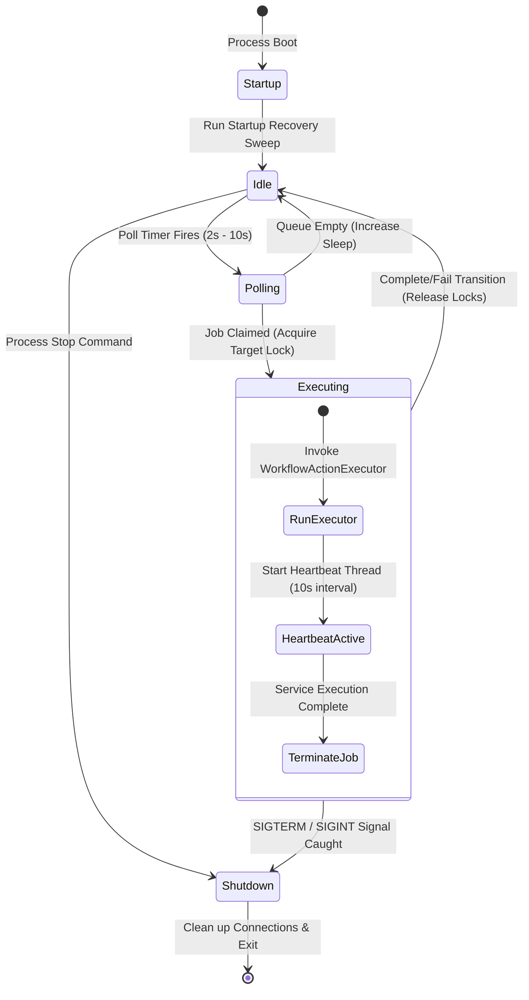
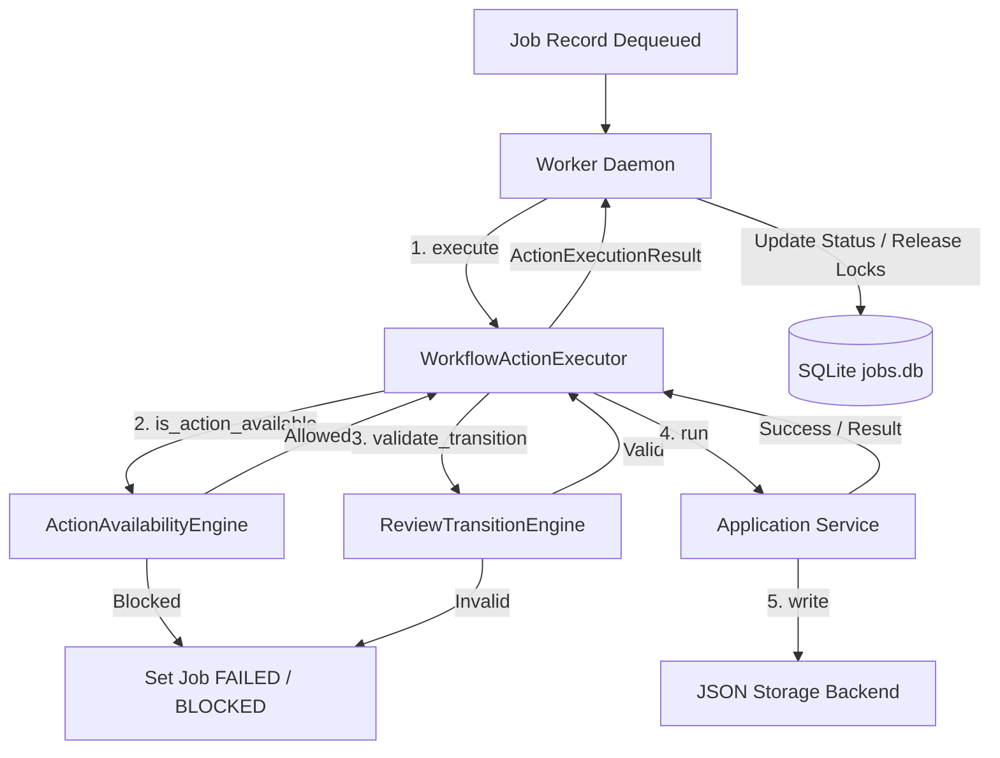

# Phase 11.7.5 — Job Queue & Worker Architecture Design

**Date:** 2026-06-04  
**Status:** PROPOSED  
**Author:** Principal Workflow Architect (Content Ingestion & Synthesis Factory)

---

## 1. Queue Architecture

The background execution layer requires a highly deterministic queueing model to handle both human-initiated and automated tasks.

### 1.1 Queue Type Selection: Priority Queue

We select a **Priority Queue** model (backed by the database indices) rather than a simple FIFO queue.

* **Justification**: In a content production environment, actions initiated directly by human operators in the Streamlit UI (e.g., clicking "Generate Storyboards Now") must preempt background scheduled operations (e.g., automated overnight RSS paper collection or background scoring sweeps).
* **Database Ordering**: Dequeue operations query the database sorted by `priority ASC, queued_at ASC`. Standard background jobs defaults to priority `100`, while interactive user actions are assigned priority `10` or lower.

### 1.2 Queue Ownership Matrix

The table below registers the boundary responsibilities for each component:

| Actor | Action | State Mutations | Side Effects |
| :--- | :--- | :--- | :--- |
| **Client** (Streamlit / CLI / Scheduler) | Submit Job | Instantiates Job; calls Repository. | Pre-validates basic payload schema. |
| **JobRepository** | Enqueue | Inserts job as `QUEUED` or `BLOCKED`. | Performs target lock audits. |
| **Worker Daemon** | Dequeue / Claim | Atomically transitions state from `QUEUED` to `RUNNING`. | Allocates local thread; sets worker owner ID. |
| **WorkflowActionExecutor** | Execute | Evaluates Action Availability & Transitions. | Invokes core application services. |
| **Worker Daemon** | Complete / Fail | Transitions state to `COMPLETED` or `FAILED` / `RETRYING`. | Releases topic locks; saves diagnostic metrics. |
| **Recovery Supervisor** | Reclaim | Transitions zombie jobs (`RUNNING` with stale heartbeats) to `QUEUED` or `FAILED`. | Increments `retry_count`; releases orphaned locks. |

### 1.3 Queue Polling Model

* **Poll Frequency**: The worker daemon queries the database every **2 seconds** during active cycles.
* **Adaptive Sleep Strategy**: To prevent continuous database CPU consumption when idle, the worker employs a linear backoff sleep strategy:
  * If the poll returns no jobs, the sleep interval increments by 1 second on each idle poll up to a **maximum sleep window of 10 seconds**.
  * The receipt of any new job resets the sleep interval to 2 seconds immediately.
* **Backpressure Handling**: The worker pool size defines the concurrent execution capacity. When all worker threads/processes are active, no worker executes a poll query. Jobs simply accumulate in the `QUEUED` state in SQLite, acting as a natural, durable buffer.

---

## 2. Worker Architecture

The worker daemon is a stateless process executing tasks claimed from the queue database.

### 2.1 Worker Lifecycle



### 2.2 Worker Identity & Metadata

On startup, each worker daemon self-registers by generating a unique identifier:

$$\text{worker\_id} = \text{hostname} + \text{"\_"} + \text{process\_id} + \text{"\_"} + \text{uuid4().hex[:8]}$$

This ID is stamped on every job claimed by the worker. The worker maintains sole responsibility for updating the job's `heartbeat_at` timestamp in the database during active execution.

### 2.3 Worker Failure Model & Recovery Policies

| Failure Scenario | Detection Method | Immediate Worker Action | Recovery / Remediation |
| :--- | :--- | :--- | :--- |
| **Process Crash / Container Restart** | Stale Heartbeat (Heartbeat timeout > 30s). | N/A (Process terminated). | Startup recovery sweep or Supervisor thread rolls back state to `QUEUED` (if retries left) or `FAILED`, releasing topic locks. |
| **LLM Provider Timeout / Rate Limit** | Caught Exception (HTTP 429/503/Timeout). | Aborts execution; raises transition trigger. | Repository transitions job to `RETRYING`; schedules retry after exponential backoff. |
| **SQLite Lock Contention** | Database returns `SQLITE_BUSY`. | Retries connection after random short sleep. | Repository connection uses `busy_timeout(5000ms)` and immediate transactions to prevent deadlocks. |
| **Validation Error / Code Bug** | Caught Exception (Pydantic / Logic error). | Aborts execution; writes error details to database. | Transitions job to `FAILED` immediately (non-retryable). |
| **Job Timeout** | Thread execution exceeds Action TTL. | Thread is interrupted; throws `TimeoutError`. | Transitions job to `FAILED` with message `"Job execution timed out."`. |

---

## 3. Queue Claiming Protocol (Concurrency & Race Safety)

To guarantee that no two workers can claim or run the same job concurrently, the dequeue sequence uses a serialized transaction:

```
Worker Daemon                     SQLite jobs.db
     │                                   │
     │ 1. BEGIN IMMEDIATE TRANSACTION     │
     ├──────────────────────────────────>│
     │                                   │
     │ 2. Query oldest QUEUED candidate   │
     ├──────────────────────────────────>│
     │                                   │
     │ 3. Check locks on candidate target│
     ├──────────────────────────────────>│ (Lock active? Skip candidate)
     │                                   │
     │ 4. UPDATE jobs SET status='RUNNING',
     │    worker_id=:id, started_at=NOW, │
     │    heartbeat_at=NOW               │
     │    WHERE job_id=:job_id           │
     ├──────────────────────────────────>│
     │                                   │
     │ 5. COMMIT TRANSACTION             │
     ├──────────────────────────────────>│
     │                                   │
     ▼                                   ▼
```

This strict sequence guarantees:
* **No Double Execution**: If two workers run step 2 concurrently, the SQLite database serialization block forces the second worker's `UPDATE` transaction to wait, ensuring only one worker updates the row status.
* **No Duplicate Claims**: Once the status transitions to `RUNNING`, subsequent queries ignore the record.

---

## 4. Concurrency Model & Resource Locks

### 4.1 Worker Count Strategy: Single-Process Multi-Threaded

For the Content Ingestion & Synthesis Factory MVP, we select a **Single-Process Multi-Threaded Worker** model (using a thread pool size of 2-3).

* **Justification**: The workflow actions are heavily I/O bound (making HTTP requests to the Gemini LLM API, waiting for Groq responses, or writing files). Multi-threading allows overlapping latency.
* **SQLite Single-Writer Compatibility**: Because SQLite locks the database file during writes, having a single worker process with a limited thread pool minimizes write contention and prevents `SQLITE_BUSY` database exceptions.

### 4.2 Resource Lock Integration

To prevent workers from concurrently modifying the same assets (e.g., generating scripts and newsletters for the same topic ID at the same time), workers must check resource locks.

#### Lock Hierarchy and Acquisition Order:
To prevent deadlocks, locks must always be acquired from the highest logical scope down to the lowest:
1. **Calendar Lock** (Scope: `week_start` date calendar)
2. **Topic Lock** (Scope: specific `topic_id` topic)
3. **Manifest Lock** (Scope: specific `topic_id` manifest)

#### Lock Acquisition and Release Order Flow:
```
[Start Job Execution]
       │
       ▼
Acquire Calendar Lock (if planning week)
       │
       ▼
Acquire Topic Lock
       │
       ▼
Acquire Manifest Lock
       │
       ▼
=== Execute Core Application Service ===
       │
       ▼
Release Manifest Lock
       │
       ▼
Release Topic Lock
       │
       ▼
Release Calendar Lock
       │
       ▼
[Complete Job Execution]
```

#### Lock Failure Behavior:
If a worker attempting to run a job finds that a target lock is already held by another active job, the claiming protocol leaves the candidate job in the queue and processes the next eligible task.

---

## 5. Execution Pipeline & Governance

All async operations must pass through the validation gate of the `WorkflowActionExecutor` to verify dependencies and transitions.

### 5.1 Pipeline Flowchart



### 5.2 Stage Input/Output Specifications

1. **Gating Check**:
   * **Input**: `action_id`, `target_artifact_type`, `target_artifact_id`, `payload`.
   * **Output**: `is_allowed` boolean.
   * **Failure Handling**: If action availability fails, the job immediately transitions to `FAILED` (or `BLOCKED` if waiting for dependencies). The blocking reason is written to `error_message`.
2. **Execution Gate**:
   * **Input**: Action configuration and service dependencies.
   * **Output**: Generated file structures in local storage.
   * **Failure Handling**: Service exceptions are caught by the executor. If the error is retryable, status is updated to `RETRYING`. If permanent, status is updated to `FAILED`.
3. **State Commit**:
   * **Input**: `ActionExecutionResult`.
   * **Output**: Job status updated to `COMPLETED`, audit history row saved, and topic locks released.

---

## 6. Retry Processing

The scheduler sweeps the database for jobs in the `RETRYING` state that have exceeded their backoff delay (`current_time >= run_after`) and resets them to `QUEUED`.

### 6.1 Failure Classification Matrix

| JobType | Retryable Failure Conditions | Non-Retryable Failure Conditions |
| :--- | :--- | :--- |
| **`COLLECT`** | HTTP timeouts, temporary feed outages. | Invalid feed URL, filesystem permission errors. |
| **`SCORE`** | SQLite database busy/locked. | Missing config file, schema drift. |
| **`GENERATE_BRIEF`** / **`GENERATE_CI`** / **`GENERATE_STORYBOARD`** / **`GENERATE_ASSET`** | LLM API rate limits (429), API timeouts (503). | Invalid API keys, model schema failure, content policy violations. |
| **`BUILD_MANIFEST`** | SQLite database busy/locked. | Missing generated files, serialization errors. |
| **`PLAN_WEEK`** / **`DRY_RUN`** | SQLite database busy/locked. | Invalid calendar date format, invalid parameters. |

---

## 7. Progress Tracking Model

To support Streamlit progress bars and future SSE/WebSocket notification streams, the worker updates execution progress metadata:

```json
{
  "status": "RUNNING",
  "progress": {
    "current_step": 3,
    "total_steps": 5,
    "step_name": "generate_storyboards",
    "percentage_complete": 60.0,
    "last_updated_at": "2026-06-04T21:49:00Z"
  }
}
```

* **Streamlit Integration**: Streamlit dashboard components query the database for the active job matching the target `correlation_id` every 2 seconds. It extracts the `progress` json block to render a `st.progress()` bar.
* **Future Feeds**: A lightweight gateway can parse these database updates to broadcast real-time SSE events to frontend subscribers.

---

## 8. Governance Verification

The architecture ensures that the background execution layer cannot bypass governance:

* **Storage Access**: Worker scripts are strictly prohibited from writing or reading files in the local content directories. All storage writes remain encapsulated within application services.
* **Direct Mutations**: Workers cannot modify artifact metadata or review states directly in the filesystem; they must invoke `WorkflowActionExecutor.execute()`.
* **Enforcement Point**: The worker daemon only executes actions by passing the job parameters to the executor:
  ```python
  # Canonical enforcement execution pattern
  executor = WorkflowActionExecutor(availability_engine, transition_engine)
  result = executor.execute(
      ctx=ctx,
      action_id=job.action_id,
      target_artifact_type=job.target_type,
      target_artifact_id=job.target_id,
      payload=job.payload,
      operator_id=job.operator_id
  )
  ```

---

## 9. Readiness Assessment

We evaluate the system readiness for implementing the SQLite Job Repository and Worker:

### 9.1 Risks & Mitigations
* **Risk: Database Lock Contention**: SQLite writes may block the UI thread during high worker loads.
  * *Mitigation*: Ensure Write-Ahead Logging (WAL) is enabled in `jobs.db`. Keep database transactions short and use thread-local database connection contexts.
* **Risk: Zombie Jobs Holding Locks**: Process terminations may lock resources indefinitely.
  * *Mitigation*: Implement the recovery supervisor sweeping stale heartbeats (>30s) on boot and periodically.

### 9.2 Recommended Implementation Order

To ensure a structured, testable roll-out, we recommend:
1. **Phase 11.7.6 — Job Repository Implementation**: Implement the SQLite schema, migrations, connection pools, and abstract `JobRepository` API.
2. **Phase 11.7.7 — Claiming and Lock Manager**: Implement atomic dequeueing queries and database-backed lock managers.
3. **Phase 11.7.8 — Worker Daemon & Sweeper**: Build the polling loop, heartbeat threads, and the startup/periodic recovery swept supervisors.
4. **Phase 11.7.9 — Streamlit & UI Integration**: Integrate status cards and progress bars into the admin console.
