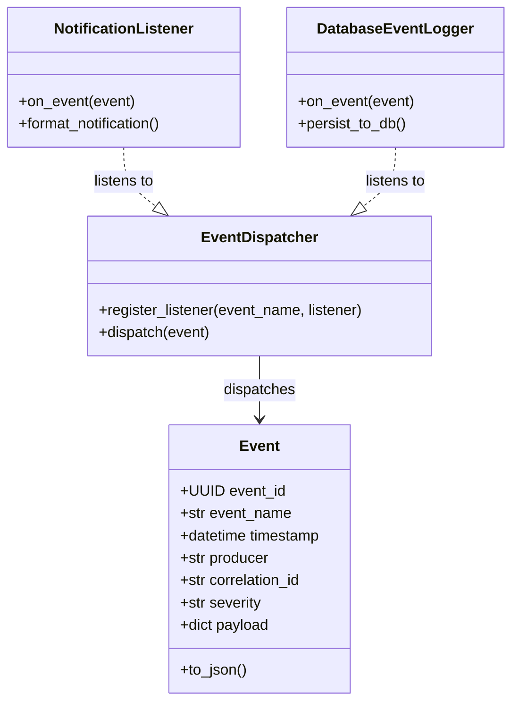

# Phase 11.8.1 — Workflow Event & Notification Architecture Audit

**Date:** 2026-06-04  
**Status:** PROPOSED  
**Author:** Principal Distributed Systems & Workflow Infrastructure Architect

---

## 1. Findings Summary

The current Content Ingestion & Synthesis Factory features robust job queuing, cooperative resource locking, worker execution, and recovery supervisors. However, the system lacks a unified, event-driven communication model. 

### Key Discoveries:
1. **Ad-Hoc String Events**: Currently, `WorkflowActionExecutor` compiles basic event string lists inside `ActionExecutionResult.emitted_events` (e.g., `f"event_{action_id}_{int(start_time)}"`), which are persisted as static JSON blobs inside `jobs.result`. There is no mechanism to dispatch these events to live subscribers.
2. **Missing Real-Time Pub-Sub**: The worker daemon runs in background threads, and the recovery supervisor runs in isolated cycles. There is no central Event Bus or Dispatcher to broadcast state changes to other platform parts (like live UI dashboards or alerting bridges) in real-time.
3. **Implicit Logging Dependencies**: Status changes are tracked primarily via database polling (`status = 'RUNNING'`, `last_heartbeat`) or standard stdout logging (`logging.getLogger`). This poll-based approach creates database overhead and increases latency for operator notifications.
4. **UI Coupling Concerns**: The Streamlit user interface currently pulls logs or queries the job database directly to render lists. A clean, async-friendly Event Bus will decouple the UI layer entirely, allowing it to register as a listener to SSE (Server-Sent Events) or WebSockets in subsequent phases.

---

## 2. Event Source Inventory

The table below catalogs every component in the system where workflow, execution, or infrastructure changes take place, along with the triggering action, current behavior, and opportunities for explicit event emission.

| Component | Triggering Action | Affected Entity | Current Behavior | Event Emission Opportunity |
| :--- | :--- | :--- | :--- | :--- |
| **`WorkflowActionExecutor`** | Successful execution of domain logic | Workflow Target (e.g., Brief, Asset, Storyboard) | Returns `ActionExecutionResult` with basic string list | Emit specific domain events (e.g., `brief_generated`, `storyboard_approved`) with full artifact IDs and payloads |
| **`ReviewTransitionEngine`** | Human operator decision (Approve/Reject) | Workflow Target State | Updates state file on disk | Emit `review_decision_applied` tracking target ID, operator ID, and decision status |
| **`ActionAvailabilityEngine`**| Validation of preconditions and states | Transition Request | Evaluates rules; raises exception or returns boolean | Emit `precondition_validation_failed` indicating blocking rules |
| **`PipelineRunService`** | Multi-stage pipeline run execution | Stages workflow pipeline | Orchestrates sequential sub-actions | Emit `pipeline_stage_started` and `pipeline_stage_completed` |
| **`QueueEngine`** | Job submission, scheduling, and retry calculation | Job Queue / Database | Creates and enqueues Job records | Emit `job_submitted`, `job_queued`, and `job_backoff_scheduled` |
| **`WorkerDaemon`** | Claiming, execution start, thread startup/shutdown | Background Worker Process | claims database row, starts heartbeats | Emit `worker_booted`, `worker_stopped`, `worker_job_claimed` |
| **`RecoverySupervisor`** | Running sweep, zombie detection, stale lock cleanup | Zombie Job & Expired Lock | Reschedules or fails job, expires active lock in DB | Emit `zombie_job_recovered`, `stale_lock_expired` with original owners and timestamps |
| **`JobRepository`** | Job status DB update | SQLite Database rows | Executes SQL statements in transaction | Emit `job_status_changed` tracking state mutations |
| **`LockManager`** | Lock acquisition and release | locks DB table | Inserts or updates lock rows | Emit `lock_acquired`, `lock_released` with resource IDs and owners |

---

## 3. Event Taxonomy

To prevent event structure fragmentation, the system will categorize all emissions into nine distinct categories. Every event must feature a standardized schema containing:
* `event_id` (UUID): Unique event identifier.
* `event_name` (str): Unique dot-notated identifier (e.g. `job.failed`).
* `timestamp` (datetime): UTC timestamp of emission.
* `producer` (str): Identifier of the component emitting the event (e.g. `worker_daemon_1`).
* `payload` (dict): Event-specific metadata.
* `correlation_id` (str): Trace ID grouping related operations across boundaries.
* `severity` (enum): Severity levels: `INFO`, `WARNING`, `CRITICAL`.

### Event Categories:
1. **Workflow Events**: Represent changes in domain-level entity generation (e.g., brief, scripts).
   * *Severity*: `INFO`
2. **Review Events**: Represent human review mutations (e.g., approvals, rejections).
   * *Severity*: `INFO` | `WARNING` (for rejections)
3. **Job Events**: Represent job lifecycle mutations (e.g., created, started, completed).
   * *Severity*: `INFO` | `CRITICAL` (for unexpected crashes)
4. **Queue Events**: Represent queue operations (e.g., scheduling retries, capacity limits).
   * *Severity*: `INFO` | `WARNING` (for delayed jobs)
5. **Worker Events**: Represent worker state updates (e.g., thread starvation, boot-up, shutdown).
   * *Severity*: `INFO` | `CRITICAL` (for worker process crash)
6. **Recovery Events**: Represent supervisor recovery audits (e.g., zombie rescheduling, force fail).
   * *Severity*: `WARNING`
7. **Lock Events**: Represent cooperative lock activities.
   * *Severity*: `INFO` | `WARNING` (for lock contention or timeout)
8. **Notification Events**: Represent delivery system audits (e.g., notification sent, delivery failed).
   * *Severity*: `INFO` | `WARNING`
9. **System Events**: Represent infrastructure status (e.g., database connection reset, SQLite transaction retries).
   * *Severity*: `INFO` | `CRITICAL`

---

## 4. Workflow Event Catalog

This catalog details domain-specific workflow events produced during the execution of content generation pipelines.

| Event Name | Producer | Payload Fields | Consumers | Notification Behavior |
| :--- | :--- | :--- | :--- | :--- |
| **`brief_generated`** | `WorkflowActionExecutor` | `topic_id` (str), `path` (str), `duration` (float) | Manifest Compiler, UI Feed | UI Banner (Info) |
| **`brief_approved`** | `ReviewTransitionEngine` | `topic_id` (str), `operator_id` (str) | Queue Engine (Submits CI) | UI Banner (Info), Toast |
| **`brief_rejected`** | `ReviewTransitionEngine` | `topic_id` (str), `operator_id` (str), `reason` (str) | History Log, UI Feed | Toast (Warning) |
| **`storyboard_generated`** | `WorkflowActionExecutor`| `topic_id` (str), `scene_count` (int) | Manifest Compiler, UI Feed | UI Banner (Info) |
| **`storyboard_approved`**| `ReviewTransitionEngine` | `topic_id` (str), `operator_id` (str) | Queue Engine (Submits Assets) | UI Banner (Info), Toast |
| **`asset_generated`** | `WorkflowActionExecutor` | `topic_id` (str), `types` (list[str]) | UI Feed, Manifest Compiler | UI Banner (Info) |
| **`asset_approved`** | `ReviewTransitionEngine` | `topic_id` (str), `operator_id` (str) | Queue Engine (Submits Manifest)| UI Banner (Success), Toast |
| **`manifest_built`** | `WorkflowActionExecutor` | `topic_id` (str), `path` (str) | UI Feed, Scheduler | UI Banner (Success) |
| **`planner_completed`** | `WorkflowActionExecutor` | `week_start` (str), `job_id` (UUID) | UI Feed, Scheduler | Toast (Success) |
| **`dry_run_completed`** | `WorkflowActionExecutor` | `week_start` (str), `warnings` (list[str])| UI Feed, Operator Dashboard | Banner/Alert (Warning/Success) |

---

## 5. Job Event Catalog

Job events track the asynchronous processing pipeline stages of background tasks. Every job event payload must conform to a standardized schema.

### Standard Job Event Payload Schema:
```json
{
  "job_id": "uuid-string",
  "job_type": "GENERATE_ASSET",
  "status": "RUNNING",
  "operator_id": "client_ui",
  "correlation_id": "corr-uuid-string",
  "target_type": "topic",
  "target_id": "topic_987",
  "retry_count": 1,
  "max_retries": 3,
  "timestamp": "2026-06-04T22:22:13Z"
}
```

### Job Lifecycle Catalog:
1. **`job_created`**: Emitted when a job is first submitted to the database in the `PENDING` state.
2. **`job_queued`**: Emitted when a job's dependencies are satisfied and it becomes eligible for claiming.
3. **`job_started`**: Emitted when a worker claims the job and transitions it to `RUNNING`.
4. **`job_retried`**: Emitted when transient errors occur and the job is scheduled with exponential backoff.
5. **`job_completed`**: Emitted upon successful execution by the `WorkflowActionExecutor`. Contains execution duration.
6. **`job_failed`**: Emitted when a job encounters a permanent error or exhausts all retries. Contains the `error_message`.
7. **`job_cancelled`**: Emitted when an operator Cancels a job in the queue or triggers cooperative cancel.
8. **`job_recovered`**: Emitted by `RecoverySupervisor` when a stalled zombie job is rescheduled or failed.

---

## 6. Notification Requirement Matrix

Notifications are operator-facing highlights generated from underlying events. They are filtered and routed based on severity and actionability:

| Event | Category | Severity | Actionability | Notification Type | Recommended Delivery Channel |
| :--- | :--- | :--- | :--- | :--- | :--- |
| `job_failed` | Job | **CRITICAL** | High (Requires log inspect / retry trigger) | Alert Banner, History Entry | UI Alert, Slack webhook |
| `stale_lock_expired`| Recovery | **WARNING** | Medium (Indicates worker crashed mid-job) | Warning Toast | UI Toast, Web console |
| `zombie_job_recovered`| Recovery | **WARNING** | Medium (Alerts that job has been rescheduled) | Informational Toast | UI Toast, Event Feed |
| `brief_approved` | Review | **INFO** | Low (Confirmation of stage transition) | Info Toast | UI Toast |
| `asset_generated` | Workflow | **INFO** | High (Human review now required to proceed) | Review Request Banner | UI Review Section, Toast |
| `dry_run_completed` | Workflow | **INFO** | High (Operator must review validation errors) | Planning Assessment Banner | UI Planning Page, Email report |

---

## 7. Delivery Architecture Options

We evaluate four delivery mechanisms to distribute notification updates from background workers to operators without introducing architecture coupling:

### Option A: Polling Database (Current Approach)
* *Mechanism*: UI makes requests every 3-5 seconds querying `jobs` and `locks` tables.
* *Pros*: Simple to code, no active connections needed.
* *Cons*: High database read overhead, delayed UI response (up to the poll interval).

### Option B: Server-Sent Events (SSE) (Recommended Option)
* *Mechanism*: Fast API HTTP endpoint exposes a text/event-stream connection. The UI listens to this stream.
* *Pros*: Unidirectional real-time streaming, light on browser resources, native browser support.
* *Cons*: Requires persistent connection pool handling on the server.

### Option C: WebSocket Connection
* *Mechanism*: Bidirectional TCP connection established between UI and Server.
* *Pros*: Extremely low latency, bidirectional interaction.
* *Cons*: High overhead, complex handshake and reconnection strategies.

### Option D: Out-of-Band Integration (Slack / Email Webhooks)
* *Mechanism*: Lightweight publisher pushes event payload to Slack webhook or SMTP relay on critical failures.
* *Pros*: Operates independent of UI state, alerts offline operators.
* *Cons*: Requires external credential storage and setup.

---

## 8. Risks

1. **SQLite Locking Contention**: Writing every single event to a database table could cause `SQLITE_BUSY` conflicts during high concurrency claims. 
   * *Mitigation*: Restrict persistent events to core lifecycle state changes and run event logging in immediate transactions.
2. **Clock Discrepancies**: Timestamps on distributed worker daemons must remain synchronized.
   * *Mitigation*: Standardize on naive UTC ISO strings generated strictly inside database triggers or relative delta offsets.
3. **Thundering Herd Notifications**: Multiple background worker threads generating rapid-fire logs can flood UI banner feeds.
   * *Mitigation*: Implement throttling, grouping, and deduplication at the UI notification listener level.
4. **Reliability Guarantees**: Under extreme crash scenarios, events might fail to write.
   * *Mitigation*: Design the recovery supervisor to act as a fallback, identifying discrepancies even if the event stream dropped.

---

## 9. Governance Constraints

To preserve security and structural boundaries, the event system must respect these rules:
1. **Zero UI Imports in Core**: Neither `worker_daemon.py`, `recovery_supervisor.py`, nor `queue_engine.py` may import `streamlit` or UI dependencies.
2. **No Direct Messaging**: Worker daemons must never invoke UI rendering or direct API callbacks.
3. **One-Way Emission**: Workers, managers, and executors only emit event models. The event bus dispatches, and the notification manager subscribes.
4. **Persistence Isolation**: Event storage must remain decoupled from domain model logic. 

---

## 10. Recommended Event Model



### Class Draft:
```python
from dataclasses import dataclass, field
from datetime import datetime
from typing import Any, Callable, Dict, List
from uuid import UUID, uuid4

@dataclass(frozen=True)
class Event:
    event_id: UUID = field(default_factory=uuid4)
    event_name: str
    timestamp: datetime = field(default_factory=datetime.utcnow)
    producer: str
    correlation_id: str
    severity: str
    payload: Dict[str, Any] = field(default_factory=dict)

class EventDispatcher:
    def __init__(self) -> None:
        self._listeners: Dict[str, List[Callable[[Event], None]]] = {}

    def register_listener(self, event_name: str, callback: Callable[[Event], None]) -> None:
        if event_name not in self._listeners:
            self._listeners[event_name] = []
        self._listeners[event_name].append(callback)

    def dispatch(self, event: Event) -> None:
        # Match exact name or wildcard (e.g. "job.*")
        listeners = self._listeners.get(event.event_name, [])
        category = event.event_name.split(".")[0] + ".*"
        listeners_wildcard = self._listeners.get(category, [])
        
        for callback in listeners + listeners_wildcard:
            try:
                callback(event)
            except Exception:
                pass
```

### Persistence Tables Schema:
```sql
CREATE TABLE IF NOT EXISTS events (
    event_id TEXT PRIMARY KEY,
    event_name TEXT NOT NULL,
    timestamp TEXT NOT NULL,
    producer TEXT NOT NULL,
    correlation_id TEXT NOT NULL,
    severity TEXT NOT NULL,
    payload_json TEXT NOT NULL
);

CREATE INDEX IF NOT EXISTS idx_events_name ON events (event_name);
CREATE INDEX IF NOT EXISTS idx_events_correlation ON events (correlation_id);
```

---

## 11. Readiness Assessment For Phase 11.8.2

The existing codebase implements all prerequisites (models, queues, worker execution thread isolation, and SQL persistence schemas). The baseline execution remains stable. 

We are fully **READY** to proceed to **Phase 11.8.2 (Workflow Event System Implementation)**.
