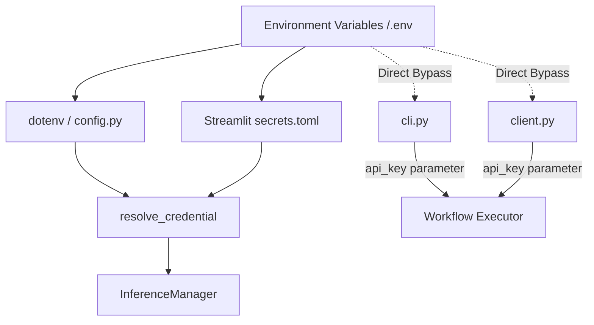

# Phase 11.9.2 — Platform Secrets & Security Audit Report

## 1. Executive Summary
This report presents a comprehensive security, secrets, and configuration hardening audit of the Content Creation Platform. The objective is to identify potential credential leaks, architectural boundary violations, logging vulnerabilities, and deployment misconfigurations before production release.

Overall, the platform maintains a **clean secret management posture** with no hardcoded credentials committed to version control. However, several **critical configuration and architectural vulnerabilities** must be resolved before deployment, particularly regarding Streamlit server hardening and bypasses of the centralized credential loading layer.

---

## 2. Repository Security Audit

### 2.1 Git Exclusion Review (`.gitignore`)
The root [.gitignore](file:///home/aryan/May-2026/Content-Creation/.gitignore) was inspected. It correctly excludes all sensitive and environment-specific resources:
- **Environment files:** `.env`, `ENV/`, `env/`, `venv/`, `.venv/` (Line 99-105)
- **Local Data & Artifacts:** `data/` (Line 137) is excluded, preventing local SQLite databases (`events.db`, `metrics.db`, `audit.db`, `jobs.db`, `locks.db`, `notifications.db`) and LLM output files (briefs, scripts, manifests) from being tracked.
- **Log Outputs:** `logs/` and `*.log` (Line 138-139) are excluded.

*Verdict: **SECURE**. Secret leak protection via git index is enforced.*

### 2.2 Local Configuration Files
Configuration files in the [config/](file:///home/aryan/May-2026/Content-Creation/config) directory were audited:
- [feeds.yaml](file:///home/aryan/May-2026/Content-Creation/config/feeds.yaml)
- [publishing.yaml](file:///home/aryan/May-2026/Content-Creation/config/publishing.yaml)
- [scoring.yaml](file:///home/aryan/May-2026/Content-Creation/config/scoring.yaml)

All config files consist of static metadata, metrics configurations, and feed targets. No access keys, credentials, or network configuration variables are hardcoded.

*Verdict: **SECURE**. Config schemas contain no sensitive information.*

### 2.3 Presentation Configurations
The Streamlit configuration file [.streamlit/config.toml](file:///home/aryan/May-2026/Content-Creation/.streamlit/config.toml) was audited. Several **CRITICAL** vulnerabilities were identified:
- **Broad Binding:** `address = "0.0.0.0"` binds the web dashboard to all network interfaces.
- **CORS Disabled:** `enableCORS = false` exposes the dashboard to cross-origin scripting vulnerabilities.
- **XSRF Disabled:** `enableXsrfProtection = false` disables Cross-Site Request Forgery validation.

*Verdict: **VULNERABLE (CRITICAL)**. Production deployments will be highly susceptible to browser-based hijacking and CSRF.*

---

## 3. Secret Discovery Scan
A full-repository regex and keyword scan was executed.

- **API Keys / Tokens:** Scan for key prefixes (`AIzaSy` for Gemini/Google, `sk-` for OpenAI/OpenRouter) returned zero active credentials.
- **Placeholders:** Placeholder strings (e.g. `export GEMINI_API_KEY=AIzaSy...`, `GEMINI_API_KEY = "AIzaSy..."`) exist in [README.md](file:///home/aryan/May-2026/Content-Creation/README.md) and [product_definition.md](file:///home/aryan/May-2026/Content-Creation/docs/ui/product_definition.md). These are purely conceptual and safe.
- **Test Credentials:** In [test_inference_fallback.py](file:///home/aryan/May-2026/Content-Creation/tests/test_inference_fallback.py#L24) and [test_credentials.py](file:///home/aryan/May-2026/Content-Creation/tests/test_credentials.py#L9), mock strings such as `"sk-or-mock-key-1234"` and `"env-gemini-key"` are used inside temporary environments.

*Verdict: **SECURE**. Zero active credentials or private keys are present in the repository.*

---

## 4. Configuration Boundary Audit

### 4.1 Configuration Pipeline Mapping
The configuration and environment data flows as follows:



### 4.2 Architectural Boundary Violations
Clean architecture mandates that the presentation layer should not own credential resolution or pass secret parameters directly to Application Services.
- **The Violation:** UI components in [client.py](file:///home/aryan/May-2026/Content-Creation/src/content_creation/ui/services/client.py#L203) and CLI handlers in [cli.py](file:///home/aryan/May-2026/Content-Creation/src/content_creation/cli.py#L370) directly query `os.environ.get("GEMINI_API_KEY")` and pass it as a parameter (`api_key`) to application executor methods.
- **The Centralized Layer:** `resolve_credential(key)` in [credentials.py](file:///home/aryan/May-2026/Content-Creation/src/content_creation/inference/credentials.py) exists but is bypassed by the UI and CLI consumers. Bypassing this layer duplicates config loading logic and risks exposing credential handling inconsistencies.

*Verdict: **DEGRADED (MEDIUM)**. Credential resolution is fragmented between UI and infrastructure layers.*

---

## 5. Logging Audit

### 5.1 Structured Pipeline Logs
The `PipelineLogger` in [logging.py](file:///home/aryan/May-2026/Content-Creation/src/content_creation/utils/logging.py#L68) records run states to `data/logs/pipeline_*.jsonl`.
- Logs include timestamps, stage identifiers, durations, and metadata summaries.
- The `api_key` payload argument passed to the workflow executor is **not** written to the JSON logs.
- Exception handlers log the stringified error (`str(e)`). 

### 5.2 Provider Error Classification
- [openrouter.py](file:///home/aryan/May-2026/Content-Creation/src/content_creation/inference/providers/openrouter.py) and [gemini.py](file:///home/aryan/May-2026/Content-Creation/src/content_creation/inference/providers/gemini.py) construct structured `ProviderError` payloads. They sanitize exceptions and limit output to status codes and truncated error text.
- API headers containing Bearer tokens are kept in-memory within the connection adapter and are not emitted.

*Verdict: **SECURE**. Structured logging and exception boundaries successfully prevent credential leaks.*

---

## 6. Storage Audit

The platform utilizes local SQLite databases.
- **Schemas:** Schemas for `audit` ([audit/schema.py](file:///home/aryan/May-2026/Content-Creation/src/content_creation/audit/schema.py)), `events` ([events/store/schema.py](file:///home/aryan/May-2026/Content-Creation/src/content_creation/events/store/schema.py)), and `metrics` ([metrics/schema.py](file:///home/aryan/May-2026/Content-Creation/src/content_creation/metrics/schema.py)) persist entity attributes, event names, and compliance status. They do not store credentials.
- **Event Payloads:** Event store `payload_json` preserves event args, but execution parameters (like API keys) are omitted from the event payloads.
- **Job Payload Danger:** The `jobs` table ([jobs/schema.py](file:///home/aryan/May-2026/Content-Creation/src/content_creation/jobs/schema.py#L27)) stores `payload_json TEXT`. If credentials are passed as job parameters when submitting background tasks, the API key will be written in plaintext inside the local `jobs.db`. While the job system is currently dead code in the CLI (runs synchronously in-process), this represents a high latent security risk.

*Verdict: **ACCEPTABLE WITH HIGH LATENT RISK**. No active credentials reside in databases, but the Job Queue database is designed to serialize payloads in plaintext.*

---

## 7. Threat Inventory & Risk Matrix

| Threat ID | Threat Description | Class | Likelihood | Impact | Attack Scenario | Remediation |
|---|---|---|---|---|---|---|
| **THR-001** | Insecure Streamlit Server Settings | **CRITICAL** | High | High | Attackers use CSRF/XSRF scripts or cross-origin requests to programmatically execute pipeline runs or fetch files since CORS/XSRF validations are disabled. | Enforce `enableCORS = true` and `enableXsrfProtection = true` in staging/production configs. |
| **THR-002** | Unauthenticated Execution Dashboard | **CRITICAL** | High | High | Anonymous visitors load the dashboard and click "Run Full Pipeline" repeatedly, causing massive API token consumption and large financial charges. | Implement Basic Auth or proxy-gated authentication over the Streamlit port. |
| **THR-003** | Latent Plaintext Secrets in Job Queue | **HIGH** | Medium | High | If background jobs are enabled in future phases and the UI/CLI submits jobs with `api_key` in the payload, the credentials will be saved in plaintext in `jobs.db`. | Strip or mask `api_key` variables before writing job structures to `payload_json`. |
| **THR-004** | SSRF in Collector Ingestion | **MEDIUM** | Low | High | If user-defined RSS feed URLs are enabled without host validations, an attacker can input a cloud link-local address (e.g. `http://169.254.169.254/`) to steal instance tokens. | Restrict feed URLs to domain allowlists and block loopback/link-local address resolution. |
| **THR-005** | Credential Resolution Duplication | **MEDIUM** | High | Low | UI and CLI components directly query `os.environ`, bypassing centralized resolution routines. Updates to credential storage require edits in multiple places. | Refactor consumers to call `resolve_credential` and move secret handling out of UI controllers. |

---

## 8. Prioritized Remediation Roadmap

### Priority 1: Critical (Must Fix Before Cloud Deployment)
1. **Harden Streamlit Settings:** Re-enable XSRF and CORS protections in [.streamlit/config.toml](file:///home/aryan/May-2026/Content-Creation/.streamlit/config.toml):
   ```toml
   [server]
   enableCORS = true
   enableXsrfProtection = true
   ```
2. **Dashboard Ingress Authentication:** Block unauthorized public access to the port by adding an authentication middleware layer (e.g., using `streamlit-authenticator` or a sidecar proxy).

### Priority 2: High (Fix Prior to Future Feature Releases)
1. **Centralize Credential Resolution:** Refactor `cli.py` and UI `client.py` to route all key lookups through `resolve_credential` in `credentials.py` instead of accessing `os.environ` directly.
2. **Job System Masking:** Implement a sanitization helper in the `QueueEngine` to redact variables named `api_key` or `access_token` from `payload_json` before persistence.

### Priority 3: Medium/Low (Security Hardening)
1. **Secure Ingestion Allowlist:** Hardcode domain validations in `rss.py` or `IngestionEngine` to verify feed target URLs do not point to local subnets or Link-Local endpoints.
2. **Inject Model Configuration:** Move model name strings (like `"gemini-2.5-flash"`) from generator code to `config/inference.yaml` to decouple models from application code.
