# execution Plan: v0.6 Pipeline Completion

This document defines the technical execution plan to integrate the **Content Intelligence (CI)** and **Storyboard** stages into the production pipeline.

---

## 1. Execution Roadmap

```mermaid
gantt
    title Pipeline Completion Timeline (Dependency Order)
    dateFormat  X
    axisFormat %d
    
    section Phase 1: Storage
    Storage Integration            :active, p1, 0, 2
    
    section Phase 2: Workflow
    Workflow Stage Registry        :active, p2, after p1, 1
    
    section Phase 3: Services
    ContentIntelligenceService     :active, p3, after p2, 2
    StoryboardService              :active, p4, after p3, 2
    
    section Phase 4: Refactoring
    AssetGeneration Conversion     :active, p5, after p4, 3
    
    section Phase 5: Pipeline
    PipelineRunService Integration :active, p6, after p5, 2
    
    section Phase 6: Validation
    Regression & Live Smoke Tests  :active, p7, after p6, 2
```

---

## 2. Detailed Rollout Phases

### Phase 1: Storage Integration
*   **Objective:** Extend the data persistence layer to support the folders, reads, writes, and list queries for the new domain repositories.
*   **Dependency Order:** Phase 0 (Pre-requisite for all services).
*   **Files Affected:**
    *   [LocalStorage](file:///home/aryan/May-2026/Content-Creation/src/content_creation/storage/local.py)
    *   [ApplicationContext](file:///home/aryan/May-2026/Content-Creation/src/content_creation/application/context.py)
*   **Estimated LOC:** ~30 LOC
*   **Risk Level:** **Low**
*   **Rollback Strategy:** Revert changes to storage files (`git checkout HEAD -- src/content_creation/storage/local.py src/content_creation/application/context.py`).
*   **Required Tests:** Extend `tests/test_storage.py` to assert that `save_content_intelligence()` and `save_storyboard()` successfully read/write valid JSON to disk.

---

### Phase 2: Workflow Integration
*   **Objective:** Register new workflow states to support resumability and avoid duplicate API calls for Content Intelligence and Storyboards.
*   **Dependency Order:** Phase 1.
*   **Files Affected:**
    *   [WorkflowStateManager](file:///home/aryan/May-2026/Content-Creation/src/content_creation/workflow/state.py)
*   **Estimated LOC:** ~15 LOC
*   **Risk Level:** **Low**
*   **Rollback Strategy:** Revert changes to workflow file.
*   **Required Tests:** Extend `tests/test_utils.py` to verify that `stage_completed(topic_id, "content_intelligence")` behaves correctly.

---

### Phase 3: ContentIntelligenceService
*   **Objective:** Implement the application orchestrator service for Content Intelligence.
*   **Dependency Order:** Phase 2.
*   **Files Affected:**
    *   `src/content_creation/application/content_intelligence_service.py` (New File)
    *   `src/content_creation/application/__init__.py` (Updated exports)
*   **Estimated LOC:** ~60 LOC
*   **Risk Level:** **Medium** (contains Gemini API call and format structure validation)
*   **Rollback Strategy:** Delete new file; remove exports.
*   **Required Tests:** Create `tests/test_content_intelligence_service.py` with mock validations of LLM responses and quality-check fallbacks.

---

### Phase 4: StoryboardService
*   **Objective:** Implement the application orchestrator service for Storyboards.
*   **Dependency Order:** Phase 3.
*   **Files Affected:**
    *   `src/content_creation/application/storyboard_service.py` (New File)
    *   `src/content_creation/application/__init__.py` (Updated exports)
*   **Estimated LOC:** ~60 LOC
*   **Risk Level:** **Medium** (coordinate claims allocation logic)
*   **Rollback Strategy:** Delete new file; remove exports.
*   **Required Tests:** Create `tests/test_storyboard_service.py` using Mock briefs and CI payloads.

---

### Phase 5: AssetGenerationService Storyboard Consumption
*   **Objective:** Refactor generators and orchestrators to consume storyboards instead of briefs.
*   **Dependency Order:** Phase 4.
*   **Files Affected:**
    *   [AssetGenerationService](file:///home/aryan/May-2026/Content-Creation/src/content_creation/application/asset_generation_service.py)
    *   [ThumbnailGenerator](file:///home/aryan/May-2026/Content-Creation/src/content_creation/generation/thumbnail.py)
    *   [ScriptGenerator](file:///home/aryan/May-2026/Content-Creation/src/content_creation/generation/script.py)
    *   [CarouselGenerator](file:///home/aryan/May-2026/Content-Creation/src/content_creation/generation/carousel.py)
    *   [NewsletterGenerator](file:///home/aryan/May-2026/Content-Creation/src/content_creation/generation/newsletter.py)
*   **Estimated LOC:** ~100 LOC (Refactoring method signatures)
*   **Risk Level:** **High** (direct impact on asset structure and LLM prompting)
*   **Rollback Strategy:** Discard local changes via git.
*   **Required Tests:** Update generator integration tests inside `tests/test_generation_scaffold.py` and `tests/test_asset_generation_service.py` to pass mock Storyboards.

---

### Phase 6: PipelineRunService Orchestration
*   **Objective:** Update the end-to-end pipeline runner to execute the new stages sequentially.
*   **Dependency Order:** Phase 5.
*   **Files Affected:**
    *   [PipelineRunService](file:///home/aryan/May-2026/Content-Creation/src/content_creation/application/pipeline_run_service.py)
    *   [cli.py](file:///home/aryan/May-2026/Content-Creation/src/content_creation/cli.py)
*   **Estimated LOC:** ~50 LOC
*   **Risk Level:** **Medium**
*   **Rollback Strategy:** Revert changes using git.
*   **Required Tests:** Update `tests/test_pipeline_run_service.py` to assert the correct execution stages order.

---

### Phase 7: Validation and Regression Testing
*   **Objective:** Execute automated regression test suites and manual smoke tests.
*   **Dependency Order:** Phase 6.
*   **Files Affected:**
    *   All regression verification files.
*   **Estimated LOC:** ~60 LOC (test code only)
*   **Risk Level:** **Low**
*   **Rollback Strategy:** N/A (Verification phase)
*   **Required Tests:** Live smoke testing utilizing test sources to confirm logging outputs.

---

## 3. Risk & Architectural Concerns

### 3.1 Highest-Risk Phase
> [!WARNING]
> **Phase 5: AssetGenerationService Storyboard Consumption**
Refactoring all four asset generators to consume `Storyboard` instead of `Brief` changes core schemas, model fields, and prompt inputs. This phase carries the highest probability of breaking formatting rules or regression validations.

### 3.2 Likely Regressions
1.  **Gemini Rate Limiting (429):** The target pipeline adds two more Gemini calls (`ContentIntelligence` and `Storyboard`) per topic. This increases LLM api usage and requests-per-minute load, making 429 backoff rate handling critical.
2.  **Output Parsing Failures:** The storyboard and content intelligence JSON blocks returned by Gemini may occasionally suffer parsing anomalies, which can halt downstream asset creation.

### 3.3 Architectural Concerns
*   **Service Coupling:** Guard against leakage of prompt generation details into the application layer. Services must delegate text orchestration to generators, keeping the services thin.
*   **Fallback Isolation:** Ensure that if `ContentIntelligence` fallback kicks in (generating empty/default fields due to low quality), the `StoryboardService` handles it gracefully rather than crashing.

---

## 4. Recommendations & Verdict

### Final Implementation Order
1.  **Phase 1 (Storage):** Create folders and persistence endpoints first.
2.  **Phase 2 (Workflow):** Register the state indicators.
3.  **Phase 3 (Content Intelligence):** Implement and validate `ContentIntelligenceService`.
4.  **Phase 4 (Storyboard):** Implement and validate `StoryboardService`.
5.  **Phase 5 (Asset Refactoring):** Migrate asset generation logic toStoryboard.
6.  **Phase 6 (Pipeline Integration):** Wire the pipeline runner service and the CLI display panels.

### Go / No-Go Verdict

**VERDICT: GO**

The plan is decoupled, respects the established v0.5 service boundaries, and utilizes existing domain structures. The execution layout permits safe testing checkpoints at the end of each phase.
