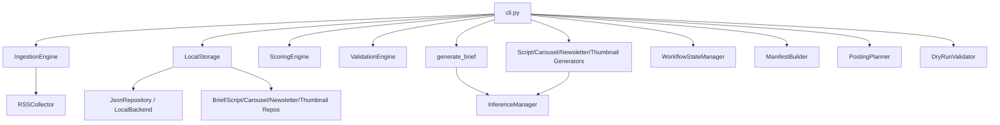
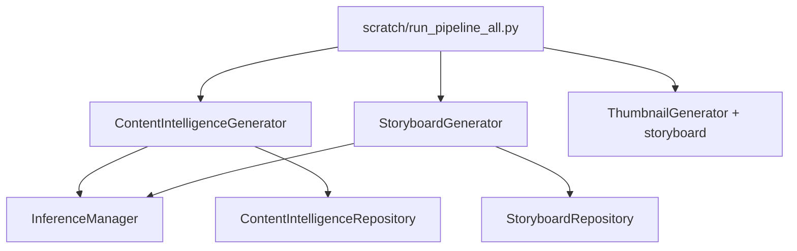

# Dead Code Audit

**Date:** 2026-06-02  
**Branch:** `feature/streamlit-control-center`  
**Scope:** `src/content_creation/` (102 Python files including `tests/`, `scratch/`)  
**Method:** Static reference tracing from CLI entry point (`content-creation` → `cli:main`), package `__init__.py` exports, cross-module imports (`rg`), and manual verification of call paths. No source files were modified.

---

## Executive summary

The codebase is **not broadly dead** — the Week 1–4 CLI pipeline (ingest → score → brief → assets → manifest → plan → dry-run → analytics) is wired and reachable. The largest gap is **architectural orphaning**: the **Content Intelligence** and **Storyboard** domains are implemented and tested but **never invoked from `cli.py` or `LocalStorage`**, so they are dead on the production path while remaining active in tests and `scratch/run_pipeline_all.py`.

Secondary findings: a full **`scoring/rules.py` module** superseded by `SimpleRule` placeholders, **`BaseCollector.collect()`** bypassed by `IngestionEngine.run()`, several **storage/workflow helper methods** with zero callers, and **package-level public APIs** (`get_config`, `models` barrel, `shared` barrel) exported but unused.

| Category | Count (approx.) | Risk if removed blindly |
|----------|-----------------|-------------------------|
| **A — Definitely dead** | 12 symbols | Low–medium |
| **B — Probably dead** | 6 symbols / 1 module | Medium |
| **C — Public API, unused internally** | 10+ exports | Low (breaking for external importers) |
| **D — Future extension points** | 8+ symbols | High (planned features) |

---

## Methodology

1. **Entry points:** `pyproject.toml` script `content-creation = content_creation.cli:main`; package root `content_creation/__init__.py`.
2. **Reachability:** Forward trace from `cli.py` command handlers; backward trace for each candidate symbol.
3. **Verification:** For each candidate, document **inbound** (who references it) and **outbound** (what it references).
4. **Exclusions:** Tests prove behavior but do not make code “live” in production; `scratch/` is noted separately (not installed).
5. **Tools:** `rg` reference search; automated `vulture` was unavailable in the environment.

---

## Area review

### CLI (`cli.py`)

| Command | Reachable stack |
|---------|-----------------|
| `collect`, `status`, `list-topics`, `validate-items` | `IngestionEngine`, `LocalStorage`, `RSSCollector` |
| `score-topics`, `review-scores`, `scoring-dashboard` | `ScoringEngine`, `ValidationEngine`, `LocalStorage` |
| `generate-briefs`, `generate-assets`, `run-pipeline` | `generate_brief`, `*Generator`, `WorkflowStateManager`, `ManifestBuilder` |
| `batch-approve`, `build-manifest`, `build-all-manifests` | `ManifestBuilder`, `LocalStorage.update_asset_status` |
| `plan-week`, `dry-run`, `init-analytics`, `update-analytics` | `PostingPlanner`, `DryRunValidator`, analytics models |
| `review-assets` | `LocalStorage`, `ReviewStatus` |

**Not wired in CLI:** `ContentIntelligenceGenerator`, `StoryboardGenerator`, `StoryboardRepository`, `ContentIntelligenceRepository`, `get_config`, `get_config_summary`, `BaseCollector.collect`.

### Generators (`generation/`)

| Symbol | Production | Notes |
|--------|------------|-------|
| `generate_brief` | Yes (`cli`) | Not exported from `generation/__init__.py` |
| `ScriptGenerator`, `CarouselGenerator`, `NewsletterGenerator`, `ThumbnailGenerator` | Yes | All use `InferenceManager` |
| `ThumbnailGenerator.generate(..., storyboard=None)` | Partial | Parameter never passed from `cli.py` (extension point) |

### Domains (`domains/`)

| Domain | Generator | Repository | `LocalStorage` | CLI |
|--------|-----------|--------------|----------------|-----|
| brief | — (uses `generation/brief`) | `BriefRepository` | Delegated | Yes |
| script / carousel / newsletter / thumbnail | — | `*Repository` | Delegated | Yes |
| **content_intelligence** | `ContentIntelligenceGenerator` | `ContentIntelligenceRepository` | **No** | **No** |
| **storyboard** | `StoryboardGenerator` | `StoryboardRepository` | **No** | **No** |

`scratch/run_pipeline_all.py` is the only non-test orchestrator for CI → Storyboard → Thumbnail(with storyboard).

### Repositories & storage

- **`LocalStorage`** is the production facade; domain repos are used via `save_*` / `list_*` delegation only.
- **`JsonRepository.exists` / `JsonRepository.get`:** used in tests and scratch for CI/Storyboard; **never** called on brief/script/carousel paths from `LocalStorage`.
- **Dead `LocalStorage` methods:** `scored_exists`, `list_dryruns` (defined, no callers in `src/` or `tests/`).

### Inference (`inference/`)

Fully reachable from all generators and domain generators via `InferenceManager.generate`. Subcomponents (`RetryManager`, `InferenceCache`, `HealthTracker`, providers) are used internally by the manager. **`InferenceManager.health`** is only accessed from tests, not from `src/` production code.

### Platform (`platform/storage/`)

`JsonRepository`, `LocalBackend` — **live** (via `LocalStorage` and domain repos). `platform/__init__.py` is an empty stub (no exports).

### Scoring (`scoring/`)

- **Live:** `ScoringEngine` + `SimpleRule`, `ValidationEngine`, `load_scoring_config`, rule classes in `validation.py`.
- **Orphaned from engine:** entire **`scoring/rules.py`** (`RecencyRule`, `SourceQualityRule`, `KeywordRule`, `QualityRule`) — only `tests/test_scoring_rules.py` imports them.

### Collectors (`collectors/`)

- **`RSSCollector`:** live via `IngestionEngine`.
- **`BaseCollector.collect()`:** **never called**; `IngestionEngine.run()` inlines `fetch` → `parse` → per-record `normalize`.

### Workflow (`workflow/`)

- **`WorkflowStateManager`:** live in `generate-assets` and `run-pipeline` (`stage_completed`, `mark_completed`, `mark_failed`).
- **Unused public methods:** `get_pending_stages`; `load_state` / `save_state` only used inside the manager (not dead, but not external API consumers).

### Shared (`shared/`)

- **`ReviewStatus`, `TopicId`:** widely used via **direct submodule imports** (`shared.enums`, `shared.types`).
- **`shared/__init__.py` barrel:** **no importers** (`from content_creation.shared import ...`).

### Package public APIs (unused internally)

| Export location | Symbol | Inbound (production) |
|-----------------|--------|----------------------|
| `content_creation/__init__.py` | `get_config` | None |
| `content_creation/utils/__init__.py` | `get_config` | None |
| `content_creation/models/__init__.py` | Full barrel (`Brief`, `Script`, …) | None (`from content_creation.models import` unused) |
| `content_creation/workflow/__init__.py` | `WorkflowState`, `ArtifactState` | None (only `WorkflowStateManager` imported) |
| `content_creation/generation/__init__.py` | Generators only | No `generate_brief` |
| `content_creation/scoring/__init__.py` | `Scorer`, `ScoringRule` | Only via submodules in practice |

---

## Findings by category

### A — Definitely dead

Unreachable in `src/` production paths (tests/docs/scratch may still reference).

| File | Symbol | Inbound references | Outbound references | Confidence |
|------|--------|-------------------|---------------------|------------|
| `collectors/base.py` | `BaseCollector.collect` | Definition only | `fetch`, `parse`, `normalize` | **High** |
| `scoring/engine.py` | `get_config_summary` | Definition only | `get_enabled_rules`, config fields | **High** |
| `scoring/engine.py` | `get_enabled_rules` | `get_config_summary` only | `self.rules` | **High** |
| `planning/planner.py` | `DAY_NAMES` | Definition only | — | **High** |
| `storage/local.py` | `scored_exists` | Definition only | `LocalBackend.exists` | **High** |
| `storage/local.py` | `list_dryruns` | Definition only | filesystem glob | **High** |
| `workflow/state.py` | `WorkflowStateManager.get_pending_stages` | Definition + audit docs | `load_state` | **High** |
| `utils/config.py` | `get_config` | Package `__all__` only | `load_env_file`, `load_yaml_config`, `get_env_var` | **High** |

### B — Probably dead

Likely abandoned or superseded; confirm intent before deletion.

| File | Symbol | Rationale | Confidence |
|------|--------|-----------|------------|
| `scoring/rules.py` | **Entire module** (`RecencyRule`, `SourceQualityRule`, `KeywordRule`, `QualityRule`) | `ScoringEngine` uses `SimpleRule` placeholders only; rules file only imported by tests | **High** |
| `domains/*/__init__.py` (brief, script, carousel, newsletter, thumbnail) | Package stubs | Docstring-only; repositories imported by path | **Medium** |
| `platform/__init__.py` | Module stub | Empty; consumers use `platform.storage` | **Medium** |
| `domains/__init__.py` | Module stub | Docstring-only | **Medium** |
| `inference/providers/__init__.py` | Module stub | Docstring-only | **Medium** |
| `models/brief.py` | `ReviewStatus` re-export | `# noqa: F401 — backward compat`; all callers use `shared.enums` | **Medium** |

### C — Public API but unused internally

Exported or public, but no in-repo production caller. May be intended for Streamlit, SDK, or notebooks.

| File | Symbol | Notes |
|------|--------|-------|
| `content_creation/__init__.py` | `get_config`, `setup_logging` | `setup_logging` used from `cli`; `get_config` never |
| `utils/config.py` | `load_env_file`, `get_env_var`, `ConfigError` | `load_env_file`/`get_env_var` only via `get_config` or tests |
| `utils/logging.py` | `get_logger` | Tests only; modules use `logging.getLogger` |
| `models/__init__.py` | Barrel re-exports | No `from content_creation.models import` usage |
| `shared/__init__.py` | `ReviewStatus`, `TopicId` barrel | Direct submodule imports used instead |
| `workflow/__init__.py` | `WorkflowState`, `ArtifactState` | Internal to `WorkflowStateManager` |
| `workflow/state.py` | `load_state`, `save_state` | Public methods; only internal callers |
| `platform/storage/json_repository.py` | `exists`, `get` | Used for CI/Storyboard in tests; not via `LocalStorage` asset repos |
| `inference/manager.py` | `health` property | Tests only |
| `scoring/__init__.py` | `Scorer`, `ScoringRule` | Exported; engine imports from `base` directly |

### D — Future extension points

Implemented and tested; not connected to CLI/`LocalStorage` yet. Documented in `docs/ui/`, `docs/architecture/`, `scratch/`.

| File | Symbol | Purpose |
|------|--------|---------|
| `domains/content_intelligence/` | `ContentIntelligenceGenerator`, `ContentIntelligenceRepository`, models | CI v1 pipeline stage |
| `domains/storyboard/` | `StoryboardGenerator`, `StoryboardRepository`, `Storyboard` | Storyboard v1 + thumbnail integration |
| `generation/thumbnail.py` | `generate(..., storyboard=None)` | Storyboard-owned thumbnail fields |
| `prompts/registry.py` | CI/storyboard prompt keys | Registered; only used when domain generators run |
| `scoring/rules.py` | Real scoring rules | Alternative to `SimpleRule` placeholders |
| `collectors/base.py` | `collect()` | Intended orchestration API for new collectors |
| `inference/manager.py` | `enable_cache=False`, custom `provider`/`model` | Advanced inference configuration (defaults only in prod) |

---

## Candidate reference matrix

### High-impact orphans (domains)

#### `ContentIntelligenceGenerator` / `ContentIntelligenceRepository`

| Direction | References |
|-----------|------------|
| **Inbound** | `tests/test_content_intelligence.py`, `scratch/run_pipeline_all.py`, `domains/content_intelligence/__init__.py` |
| **Outbound** | `InferenceManager`, `PromptRegistry`, `Brief`, `quality.evaluate_brief_quality`, `model.*` |
| **CLI** | None |
| **Storage** | No `LocalStorage` paths under `data/content_intelligence/` |

#### `StoryboardGenerator` / `StoryboardRepository`

| Direction | References |
|-----------|------------|
| **Inbound** | `tests/test_storyboard.py`, `tests/test_thumbnail_storyboard_integration.py`, `scratch/run_pipeline_all.py` |
| **Outbound** | `ContentIntelligence`, `InferenceManager`, `PromptRegistry`, `Brief` |
| **CLI** | None |
| **Storage** | No `LocalStorage` integration |

### Definitely dead symbols (detail)

#### `BaseCollector.collect`

| Direction | References |
|-----------|------------|
| **Inbound** | None (definition only) |
| **Outbound** | `self.fetch()`, `self.parse()`, `self.normalize()` |
| **Superseded by** | `IngestionEngine.run()` lines 52–77 (inline loop) |

#### `get_config` / `get_config_summary` / `get_enabled_rules`

| Symbol | Inbound | Outbound |
|--------|---------|----------|
| `get_config` | `__init__.py` exports | `load_env_file`, `load_yaml_config`, `get_env_var` |
| `get_config_summary` | None | `get_enabled_rules`, `ScoringConfig` fields |
| `get_enabled_rules` | `get_config_summary` | `self.rules` |

#### `DAY_NAMES`

| Direction | References |
|-----------|------------|
| **Inbound** | None |
| **Outbound** | — (planner uses numeric `weekday()` / config, not day names) |

#### `LocalStorage.scored_exists` / `list_dryruns`

| Method | Inbound | Outbound |
|--------|---------|----------|
| `scored_exists` | None | `LocalBackend.exists(scored_dir, …)` |
| `list_dryruns` | None | `dryruns_dir.glob` (mirror of `list_calendars` pattern) |

---

## Modules summary

| Module | Status | Notes |
|--------|--------|-------|
| `scoring/rules.py` | **B — Probably dead** in production | Kept alive by unit tests |
| `domains/content_intelligence/*` | **D — Extension** | Complete but not in CLI |
| `domains/storyboard/*` | **D — Extension** | Complete but not in CLI |
| `domains/{brief,script,carousel,newsletter,thumbnail}/__init__.py` | Stub | Not dead code, empty packages |
| `scratch/run_pipeline_all.py` | Out of package | Untracked scratch; references private `storage._brief_repo` |
| `tests/*` | Support code | Not audited as dead |

---

## Dead Code Priority List

Sorted by **confidence × impact**. Deletion risk: **Low** = safe with test update; **High** = breaks planned UI/pipeline.

| Priority | File | Symbol | Category | Confidence | Deletion risk | Notes |
|----------|------|--------|----------|------------|---------------|-------|
| 1 | `domains/content_intelligence/` + `domains/storyboard/` | Generators + repos + models | **D** | High (orphan) | **High** | Do not delete — wire into CLI/`LocalStorage` per architecture docs |
| 2 | `scoring/rules.py` | Module (4 rule classes) | **B** | High | Medium | Tests depend; engine never loads |
| 3 | `collectors/base.py` | `collect` | **A** | High | Low | Remove or switch `IngestionEngine` to call it |
| 4 | `storage/local.py` | `scored_exists`, `list_dryruns` | **A** | High | Low | Symmetry APIs never adopted |
| 5 | `scoring/engine.py` | `get_config_summary`, `get_enabled_rules` | **A** | High | Low | Or wire to `scoring-dashboard` CLI |
| 6 | `planning/planner.py` | `DAY_NAMES` | **A** | High | Low | Unused constant |
| 7 | `workflow/state.py` | `get_pending_stages` | **A** | High | Low | Planned for resumable UI |
| 8 | `utils/config.py` | `get_config` | **A/C** | High | Low–Medium | Packaged public API |
| 9 | `content_creation/__init__.py` | `get_config` export | **C** | High | Low | Remove from `__all__` if dropping |
| 10 | `models/__init__.py` | Barrel imports | **C** | High | Medium | External importers unknown |
| 11 | `shared/__init__.py` | Barrel imports | **C** | High | Low | Prefer direct imports already |
| 12 | `workflow/__init__.py` | `WorkflowState`, `ArtifactState` exports | **C** | High | Low | Streamlit docs reference manager only |
| 13 | `generation/thumbnail.py` | `storyboard` parameter | **D** | High | **High** | Integration point for storyboard path |
| 14 | `platform/storage/json_repository.py` | `exists` (asset repos) | **C** | Medium | Low | Used in CI/Storyboard tests |
| 15 | `inference/manager.py` | `health` property | **C** | Medium | Medium | Observability / UI health page |
| 16 | `utils/logging.py` | `get_logger` | **C** | Medium | Low | Redundant with stdlib pattern |
| 17 | `models/brief.py` | `ReviewStatus` re-export | **B** | Medium | Low | Backward-compat shim |
| 18 | `generation/__init__.py` | Missing `generate_brief` | **C** | Medium | Low | Omit from barrel, not dead itself |

---

## Import verification summary

### Live production graph (simplified)

### Disconnected subgraph (tests + scratch only)

---

## Recommendations (audit only)

1. **Do not delete** `domains/content_intelligence` or `domains/storyboard` — treat as **incomplete integration** (Category D), not dead code.
2. **Consolidate ingestion** — either call `BaseCollector.collect()` from `IngestionEngine.run()` or remove `collect()` to avoid dual orchestration logic.
3. **Resolve `scoring/rules.py`** — wire rules into `ScoringEngine._initialize_rules()` or move module to tests/archive with an explicit ADR.
4. **Trim storage API surface** — `scored_exists`, `list_dryruns`, and unused `JsonRepository.exists` on asset repos, or implement callers (e.g. `scoring-dashboard`, dry-run listing).
5. **Package exports** — align `__all__` with actual usage (`get_config`, `models` barrel) before any Streamlit control center ships.
6. **Next audit** — when Streamlit lands on this branch, re-run this audit against UI import paths in `docs/ui/page_inventory.md`.

---

## Files not analyzed as dead

- `tests/` — consumers of otherwise-unreferenced APIs  
- `docs/` — architecture references do not constitute code usage  
- `prompts/*.md` — all registry keys are reachable **if** matching generators run  
- `config/*.yaml` — loaded by CLI/planner/scoring  

---

*End of audit. No repository files were modified.*
