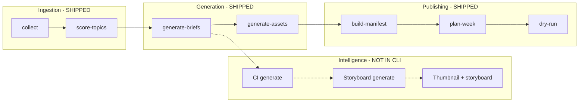

# E2E Test Strategy — Minimum Suite for Production Confidence

**Date:** 2026-06-02  
**Author role:** Principal QA Architect  
**Scope:** `content-creation` CLI and generation pipeline  
**Baseline:** 194 unit/integration tests, **62%** line coverage ([test_coverage_completeness.md](./test_coverage_completeness.md))  
**Deliverable:** Strategy only — **no test implementation** in this document.

---

## 1. Purpose and principles

### Goal

Define the **smallest set of end-to-end journeys** that, if green in CI, gives justified confidence that:

1. A student-facing run can move from **raw topic → scored → brief → assets → manifest → calendar → dry-run** without silent data loss.
2. **Inference failover** works when wired through real call chains (not only isolated unit tests).
3. **Workflow resumability** (`generate-assets` / `run-pipeline`) behaves correctly on disk.
4. **Future domains** (Content Intelligence → Storyboard → Thumbnail) are regression-safe once integrated into CLI.

### Design principles

| Principle | Application |
|-----------|-------------|
| **Hermetic** | `tmp_path` workspace; no real RSS, Gemini, or OpenRouter calls. |
| **Production entry points** | Prefer `cli.main()` with patched `sys.argv` and `Path.cwd()` (extends `test_e2e_verification.py`). |
| **Mock at the network boundary** | Patch `feedparser.parse` for collect; patch `GeminiProvider.generate_once` / `OpenRouterProvider.generate_once` (not `InferenceManager` at class level) so retry, cache, health, and failover execute real code. |
| **Deterministic fixtures** | Fixed RSS entries, fixed JSON LLM payloads, real prompt files copied into `tmp_path/prompts/`. |
| **Fast by default** | Mark `@pytest.mark.integration` and `@pytest.mark.slow` where `time.sleep` cannot be patched to no-op. |
| **Minimum, not exhaustive** | One happy path + one failure path per journey where risk warrants it. |

### What E2E is not (stays in unit tests)

- Pydantic model validation in isolation  
- Individual scoring rule math (`scoring/rules.py`)  
- Provider HTTP status-code classification without going through `InferenceManager`  
- Interactive `review-assets` stdin loops (use focused CLI component tests or manual QA)

---

## 2. Critical user journeys (overview)



| ID | Journey | Production status | Tier |
|----|---------|-------------------|------|
| **E2E-01** | collect → score | Shipped (`cli`) | **P0** |
| **E2E-02** | collect → score → brief | Shipped (`cli`) | **P0** |
| **E2E-03** | brief → assets (thumbnail + format assets) | Shipped (`cli`) | **P0** |
| **E2E-04** | run-pipeline (collect → score → brief → assets → manifests) | Shipped (`cli`) | **P0** |
| **E2E-05** | Failover generation path | Shipped (all generators use `InferenceManager`) | **P0** |
| **E2E-06** | manifest → plan-week → dry-run | Shipped (`cli`) | **P0** |
| **E2E-07** | Workflow resumability (skip completed stages) | Shipped (`generate-assets`) | **P1** |
| **E2E-08** | brief → Content Intelligence | **Not in CLI** (scratch + unit tests) | **P1** |
| **E2E-09** | CI → Storyboard | **Not in CLI** | **P1** |
| **E2E-10** | Storyboard → thumbnail (field override) | **Not in CLI** (parameter exists) | **P1** |
| **E2E-11** | Rejection gate (short text / low score) | Shipped (`ScoringEngine`) | **P2** |
| **E2E-12** | Missing API key / config | Shipped (`cli`) | **P2** |

**Minimum suite for current production:** **E2E-01 through E2E-06** (6 journeys, ~8–10 test functions).  
**Minimum suite after CI/Storyboard CLI integration:** add **E2E-08–10** (+3 journeys).  
**Resilience add-on:** **E2E-07, 11, 12** (+3 journeys).

---

## 3. Shared test harness (specification)

All journeys should reuse a single harness (future `tests/e2e/conftest.py`).

### Workspace layout (`tmp_path`)

```
{tmp_path}/
  config/feeds.yaml          # 1 enabled feed
  config/scoring.yaml        # valid weights summing to 1.0
  config/publishing.yaml     # weekly_targets for planner/dry-run
  prompts/*.md               # copy from repo or minimal stubs
  data/                      # created by commands
```

### Environment patches

| Variable / patch | Value |
|------------------|-------|
| `GEMINI_API_KEY` | `"test-gemini-key"` |
| `OPENROUTER_API_KEY` | unset (unless failover test) |
| `pathlib.Path.cwd` | `return_value=tmp_path` |
| `time.sleep` | no-op (avoid 5s delays in generation loops) |

### LLM response fixture (canonical brief JSON)

```json
{
  "why_it_matters": "Test importance",
  "plain_english_summary": ["A", "B", "C"],
  "student_takeaway": "Learn X",
  "analogy": "Like Y",
  "limitation": "Scope Z",
  "audience_fit": "Beginners",
  "recommended_formats": ["short_video"],
  "review_status": "draft"
}
```

Analogous fixtures required per asset type (script, carousel, newsletter, thumbnail) and per domain (CI, storyboard) — reuse shapes from `tests/test_*` modules.

### Mock boundary (recommended)

```text
patch("content_creation.collectors.rss.feedparser.parse")     # ingestion
patch.object(GeminiProvider, "generate_once", side_effect=...) # inference
patch.object(OpenRouterProvider, "generate_once", side_effect=...) # failover only
```

**Do not** patch `InferenceManager` at class level in E2E tests — that bypasses the production path under test.

---

## 4. Journey specifications

---

### E2E-01 — collect → score

**Maps to:** Week 1 ingestion + prioritization.  
**Existing coverage:** `tests/test_e2e_verification.py::test_e2e_pipeline` (partial — keep and extend).

#### User story

Operator ingests one new RSS item and scores all staged topics.

#### Inputs

| Input | Detail |
|-------|--------|
| CLI | `content-creation collect --all` then `content-creation score-topics` |
| `feeds.yaml` | One enabled feed, `category: paper` |
| Mock RSS | One entry: valid `link`, `title`, `summary` ≥100 chars, `published_parsed` |
| `scoring.yaml` | All five rules enabled with standard weights |

#### Expected outputs

| Artifact | Path | Condition |
|----------|------|-----------|
| Raw audit | `data/raw/{source_id}_*.json` | ≥1 file |
| Staged topic | `data/staged/{topic_id}.json` | `status` = `staged` |
| Scored topic | `data/scored/{topic_id}.json` | `status` = `scored`, `priority_score` present |
| Exit code | — | `0` for both commands |

#### Failure modes to cover

| Mode | Trigger | Expected behavior |
|------|---------|-------------------|
| **F1 — Empty feed** | `entries = []` | collect succeeds, 0 staged; score succeeds, 0 scored |
| **F2 — Duplicate collect** | Run collect twice | Second run: 0 new items, no duplicate staged files |
| **F3 — Short raw text** | summary &lt; rejection threshold | Item scored with `status=rejected` or rejection flags (per `ScoringEngine`) |

#### Assertions (minimum)

1. `main()` returns `0`.  
2. Staged file validates as `TopicItem`.  
3. Scored file validates as `ScoredTopicItem` with `priority_score >= 0`.  
4. `topic_id` deterministic from URL (same id after re-collect).  
5. **F2:** staged file count unchanged on second collect.

#### Coverage gained (estimate)

| Module | Δ coverage | Notes |
|--------|------------|-------|
| `cli.py` (collect, score-topics) | +3–4% of file | ~120 lines |
| `ingestion.py` | +5% | already high; E2E confirms CLI glue |
| `collectors/rss.py` | +5% | `parse()` exercised in full loop |
| `scoring/engine.py` | +5% | via CLI not direct |
| **Project total** | **+2–3%** | Baseline 62% → ~64–65% |

---

### E2E-02 — collect → score → brief

**Maps to:** `generate-briefs` or `run-pipeline` stage 3.

#### User story

Top scored topic receives an on-disk brief ready for asset generation.

#### Inputs

| Input | Detail |
|-------|--------|
| Precondition | E2E-01 outputs (or seed `data/scored/` directly) |
| CLI | `content-creation generate-briefs --top 1` **or** pipeline stage only |
| `GEMINI_API_KEY` | set |
| Mock `generate_once` | Returns canonical brief JSON (success) |
| Prompts | `prompts/summarize.md` present under `tmp_path` |

#### Expected outputs

| Artifact | Path | Condition |
|----------|------|-----------|
| Brief | `data/briefs/{topic_id}.json` | Valid `Brief`; `topic_id` matches scored item |
| Fields | — | `plain_english_summary` length 3; `review_status` in `draft` / `needs_review` |
| Exit code | — | `0` |

#### Failure modes

| Mode | Trigger | Expected behavior |
|------|---------|-------------------|
| **F1 — Missing API key** | unset `GEMINI_API_KEY` | exit `1`, stderr mentions key |
| **F2 — Inference failure** | `generate_once` → `success=False` | fallback brief saved, `review_status=needs_review` |
| **F3 — raw_text &lt; 100** | scored item with short text | `ValueError` / command error before LLM call |
| **F4 — Malformed JSON** | invalid JSON from provider | fallback brief, not crash |

#### Assertions

1. Brief file exists and round-trips through `Brief.model_validate`.  
2. `brief.topic_id == scored_item.id`.  
3. `brief.source_url == scored_item.url`.  
4. Mock called once per generated brief (not per skipped existing file).  
5. **F2/F4:** `why_it_matters == "needs_review"` (or project fallback constant).  
6. **F3:** no brief file created.

#### Coverage gained

| Module | Δ coverage | Notes |
|--------|------------|-------|
| `cli.py` (`generate-briefs`) | +8–10% of file | ~150 lines |
| `generation/brief.py` | +15–20% | real `InferenceManager` path |
| `inference/manager.py` | +5% | integration with brief |
| `prompts/registry.py` | +5% | `get("brief","summarize")` |
| **Project total** | **+4–5%** | 62% → ~66–67% |

---

### E2E-03 — brief → assets

**Maps to:** `generate-assets` (thumbnail + format-specific assets + `WorkflowStateManager`).

#### User story

Given an approved brief with `recommended_formats: ["short_video"]`, system writes thumbnail and script JSON artifacts and records workflow completion.

#### Inputs

| Input | Detail |
|-------|--------|
| Seed | `data/briefs/{topic_id}.json` with `recommended_formats: ["short_video"]` |
| CLI | `content-creation generate-assets --top 1` |
| Mocks | Distinct `generate_once` responses per `task_type` (thumbnail, script) |
| Workflow dir | `data/workflow_state/` (empty) |

#### Expected outputs

| Artifact | Path | Condition |
|----------|------|-----------|
| Thumbnail | `data/thumbnails/{topic_id}.json` | `ThumbnailPrompt` valid |
| Script | `data/scripts/{topic_id}.json` | `Script.format == "short_video"` |
| Workflow state | `data/workflow_state/{topic_id}.json` | stages `thumbnail`, `script` → `completed` |
| Exit code | — | `0` |

#### Failure modes

| Mode | Trigger | Expected behavior |
|------|---------|-------------------|
| **F1 — Free-text format** | `recommended_formats: ["Technical Deep Dive"]` | maps via `FREETEXT_TO_FORMAT` → script generated |
| **F2 — Generator exception** | `generate_once` raises | `mark_failed` for stage; other stages may still run |
| **F3 — Pre-existing asset** | script file already on disk | skip generation (no overwrite) |
| **F4 — No briefs** | empty `data/briefs/` | message + exit `0` |

#### Assertions

1. Thumbnail + script files exist.  
2. Workflow JSON contains `stages.thumbnail.status == "completed"`.  
3. **F1:** script exists (format normalized).  
4. **F2:** `stages.thumbnail.status == "failed"` (or script failed if that stage throws).  
5. **F3:** mock call count unchanged for pre-existing type.  
6. `time.sleep` not required for test duration (patched).

#### Coverage gained

| Module | Δ coverage | Notes |
|--------|------------|-------|
| `cli.py` (`generate-assets`) | +10–12% of file | ~200 lines |
| `workflow/state.py` | **+80–100%** | currently **0%** |
| `generation/thumbnail.py`, `script.py` | +5% each | via real manager |
| `manifest.py` (`FREETEXT_TO_FORMAT`) | +5% | indirect |
| **Project total** | **+5–7%** | largest single win for untested module |

---

### E2E-04 — run-pipeline (happy path)

**Maps to:** `content-creation run-pipeline --top 1` (optionally without `--auto-approve`).

#### User story

Single command runs collect → score → brief → assets → build-manifests with structured logging.

#### Inputs

| Input | Detail |
|-------|--------|
| CLI | `run-pipeline --top 1` |
| Mocks | RSS + all `generate_once` side effects |
| Config | feeds + scoring + prompts |

#### Expected outputs

| Artifact | Condition |
|----------|-----------|
| Staged + scored + brief + thumbnail (+ script if format mapped) | present |
| Manifest | `data/manifests/{topic_id}.json` exists |
| Pipeline log | `data/logs/pipeline_*.jsonl` exists, ≥4 stage records |
| Exit code | `0` (individual stage errors may be logged but pipeline continues — assert documented behavior) |

#### Failure modes

| Mode | Trigger | Expected behavior |
|------|---------|-------------------|
| **F1 — Collect failure** | `feedparser` raises | stage `collect` logs error; later stages may run on stale data |
| **F2 — Stage skip** | brief already exists | `generate-briefs` count 0, no duplicate brief |

#### Assertions

1. Final manifest exists.  
2. JSONL log parseable; stages include `collect`, `score`, `generate-briefs`, `generate-assets`, `build-manifests`.  
3. No uncaught exception from `main()`.  
4. **F2:** brief mtime unchanged if pre-seeded.

#### Coverage gained

| Module | Δ coverage | Notes |
|--------|------------|-------|
| `cli.py` (`run-pipeline`) | +15–20% of file | ~280 lines |
| `utils/logging.py` (`PipelineLogger`) | **+60–80%** | currently partial |
| Cross-module orchestration | — | confidence, not line % |
| **Project total** | **+6–8%** | 62% → ~68–70% cumulative with E2E-02/03 |

---

### E2E-05 — Failover generation path

**Maps to:** `InferenceManager.generate` failover when primary fails; exercised through **`generate_brief`** (smallest surface).

#### User story

When Gemini exhausts retries, OpenRouter produces the brief and the artifact is still saved.

#### Inputs

| Input | Detail |
|-------|--------|
| Env | `OPENROUTER_API_KEY=test-or-key` |
| Invocation | `generate_brief(scored_item, registry, api_key)` **or** CLI `generate-briefs --top 1` |
| Mock sequence | `GeminiProvider.generate_once` → `success=False` (non-retryable or exhausted); `OpenRouterProvider.generate_once` → success + brief JSON |

#### Expected outputs

| Output | Condition |
|--------|-----------|
| Brief file | saved with valid schema |
| Provider used | OpenRouter path invoked exactly once after primary failure |
| Health | `manager.health.get("gemini").consecutive_failures >= 1` (if asserting at API level) |

#### Failure modes

| Mode | Trigger | Expected behavior |
|------|---------|-------------------|
| **F1 — Both fail** | both providers `success=False` | fallback brief (`needs_review`) |
| **F2 — Cooldown skip** | 3× `record_failure("gemini")` before generate | primary not called; fallback only |
| **F3 — No fallback key** | no `OPENROUTER_API_KEY`, primary fails | fallback brief |

#### Assertions

1. `OpenRouterProvider.generate_once` called.  
2. Brief persisted.  
3. **F1:** `review_status == needs_review`.  
4. **F2:** `GeminiProvider.generate_once` not called.  
5. Retry manager executed (call count on primary &gt; 0 if retryable errors used).

#### Coverage gained

| Module | Δ coverage | Notes |
|--------|------------|-------|
| `inference/manager.py` | +3% | complements `test_inference_critical.py` |
| `generation/brief.py` | +10% | end-to-end failover wiring |
| `cli.py` | +2% | if CLI path chosen |
| **Project total** | **+2–3%** | high **confidence** ROI vs line % |

---

### E2E-06 — manifest → plan-week → dry-run

**Maps to:** Publishing readiness path.

#### User story

Approved manifest yields a weekly calendar; dry-run reports assets ready.

#### Inputs

| Input | Detail |
|-------|--------|
| Seed | brief, thumbnail, script on disk with `review_status: approved` |
| Seed manifest | `ready_for_planner: true` or run `build-all-manifests` |
| CLI | `plan-week` → `dry-run --week-start YYYY-MM-DD` |
| `publishing.yaml` | `weekly_targets` with `short_video: 1` |

#### Expected outputs

| Artifact | Condition |
|----------|-----------|
| Calendar | `data/calendars/{week_start}.json` with ≥1 `ScheduledPost` |
| Dry-run report | `data/dryruns/{week_start}.json`; `blocked_count == 0` when all approved |
| Exit code | `0` |

#### Failure modes

| Mode | Trigger | Expected behavior |
|------|---------|-------------------|
| **F1 — Not ready for planner** | manifest `ready_for_planner: false` | empty or reduced calendar |
| **F2 — Missing asset file** | delete script after calendar built | dry-run `blocked_count > 0` |
| **F3 — needs_review asset** | one asset draft | dry-run warnings / not “all ready” |

#### Assertions

1. `WeeklyCalendar.total_posts >= 1` (happy path).  
2. Dry-run `ready_count` matches approved posts.  
3. **F2:** `blocked_count >= 1`, recommended actions mention missing asset.  
4. Scheduled post `topic_id` matches manifest.

#### Coverage gained

| Module | Δ coverage | Notes |
|--------|------------|-------|
| `cli.py` (plan-week, dry-run, build-manifest) | +8% of file | |
| `planning/planner.py` | +5% | integration |
| `planning/dryrun.py` | +5% | integration |
| `manifest.py` | +10% | build from real files |
| **Project total** | **+3–4%** | |

---

### E2E-07 — Workflow resumability (P1)

**Maps to:** Second `generate-assets` run skips completed stages.

#### Inputs

- Complete E2E-03 once.  
- Pre-populate `workflow_state/{topic_id}.json` with `thumbnail: completed`.  
- Run `generate-assets` again.

#### Expected outputs

- No second call to thumbnail `generate_once`.  
- Script still generated if not completed.

#### Assertions

- Mock thumbnail generator call count == 0.  
- Workflow file unchanged for completed stage.

#### Coverage gained

- `workflow/state.py` `stage_completed` (+10% project overlap with E2E-03).  
- **Project total:** +1% (incremental).

---

### E2E-08 — brief → Content Intelligence (P1 — forward)

**Production note:** Not in `cli.py` today; validate the **target** pipeline from `scratch/run_pipeline_all.py`.

#### Inputs

| Input | Detail |
|-------|--------|
| Seed | valid `Brief` + `ScoredTopicItem` (category, `published_at`) |
| Call | `ContentIntelligenceGenerator.generate(brief, topic_category=..., published_at=...)` |
| Storage | `ContentIntelligenceRepository(tmp_path / "data/content_intelligence")` |
| Mock | CI JSON matching `ContentIntelligence` schema |

#### Expected outputs

- `data/content_intelligence/{topic_id}.json`  
- `quality_status` in `ready` / `degraded` / `blocked` per brief quality  
- `topic_type` mapped from `TopicCategory`

#### Failure modes

| Mode | Trigger | Expected |
|------|---------|----------|
| F1 | BLOCKED brief quality | stub CI, no LLM call |
| F2 | LLM failure | fallback CI, `needs_review` |

#### Assertions

1. Repo round-trip.  
2. `ci.topic_id == brief.topic_id`.  
3. F1: `generate_once` not called.

#### Coverage gained

- Programmatic integration only: **+1%** project, high value when CLI wires CI.

---

### E2E-09 — CI → Storyboard (P1 — forward)

#### Inputs

- Valid `Brief` + `ContentIntelligence` (from E2E-08).  
- `StoryboardGenerator.generate(brief, ci)`.

#### Expected outputs

- `data/storyboards/{topic_id}.json`  
- `visual_style` consistent with `ci.topic_type` mapping  
- `formats_planned` normalized from `brief.recommended_formats`

#### Failure modes

- LLM failure → fallback storyboard with `needs_review`.  
- Malformed JSON → fallback.

#### Assertions

1. `Storyboard.topic_id == brief.topic_id`.  
2. `thumbnail_hook` non-empty string.  
3. Fallback path does not raise.

#### Coverage gained

- **+1%** project; links domains for regression when shipped.

---

### E2E-10 — Storyboard → thumbnail assets (P1 — forward)

#### Inputs

- `ThumbnailGenerator.generate(brief, storyboard=sb)` with mocked inference returning generic thumbnail JSON.

#### Expected outputs

- Thumbnail fields `title_text`, `style`, `visual_metaphor` **match storyboard** overrides.

#### Failure modes

- Inference fails → fallback thumbnail; if storyboard provided, overrides still applied (per `generation/thumbnail.py`).

#### Assertions

1. `thumb.title_text == sb.thumbnail_hook`.  
2. `thumb.style == sb.visual_style`.  
3. `thumb.visual_metaphor == sb.visual_metaphor`.

#### Coverage gained

- **+1%** project; validates extension point before CLI integration.

---

### E2E-11 — Rejection gate (P2)

#### Inputs

- RSS item with &lt;100 char summary **or** configure scorer to reject.  
- `score-topics` only.

#### Expected outputs

- Scored file with `status=rejected` **or** no brief on subsequent `generate-briefs`.

#### Assertions

- `generate-briefs` does not create brief for rejected id.

#### Coverage gained

- **+1%**; guards editorial gate.

---

### E2E-12 — Missing API key (P2)

#### Inputs

- `generate-briefs` or `run-pipeline` with `GEMINI_API_KEY` unset.

#### Expected outputs

- Exit code `1`.  
- Stderr contains `GEMINI_API_KEY`.

#### Coverage gained

- CLI guard rails (~20 lines).

---

## 5. Recommended minimum suite (implementation backlog)

### Phase A — Production confidence (ship first)

| Test ID | Journey | New file (suggested) | Est. effort |
|---------|---------|----------------------|-------------|
| T-A1 | E2E-01 extend F2 | `tests/e2e/test_ingestion_pipeline.py` | 2h |
| T-A2 | E2E-02 | same | 4h |
| T-A3 | E2E-03 | `tests/e2e/test_asset_generation.py` | 6h |
| T-A4 | E2E-04 | `tests/e2e/test_run_pipeline.py` | 6h |
| T-A5 | E2E-05 | `tests/e2e/test_inference_failover.py` | 3h |
| T-A6 | E2E-06 | `tests/e2e/test_publish_path.py` | 5h |

**Total Phase A:** ~26h, **8–10 test functions**, 6 journeys.

### Phase B — Resilience (next)

| Test ID | Journey | Effort |
|---------|---------|--------|
| T-B1 | E2E-07 | 2h |
| T-B2 | E2E-11 | 2h |
| T-B3 | E2E-12 | 1h |

### Phase C — Forward architecture (when CI/Storyboard enter CLI)

| Test ID | Journey | Effort |
|---------|---------|--------|
| T-C1 | E2E-08 | 4h |
| T-C2 | E2E-09 | 3h |
| T-C3 | E2E-10 | 2h |
| T-C4 | Chained E2E-08→09→10 | 4h |

---

## 6. Coverage impact summary

### Baseline (today)

| Metric | Value |
|--------|-------|
| Tests | 194 |
| Line coverage | **62%** |
| `cli.py` | **14%** |
| `workflow/state.py` | **0%** |
| E2E tests | 1 (`test_e2e_verification`) |

### After Phase A (projected)

| Metric | Projected |
|--------|-----------|
| E2E tests | **9–11** (including extended E2E-01) |
| Line coverage | **70–75%** (+8–13 pts) |
| `cli.py` | **35–45%** |
| `workflow/state.py` | **85%+** |
| `utils/logging.py` (`PipelineLogger`) | **80%+** |

### Coverage vs confidence

| Layer | Phase A addresses |
|-------|-----------------|
| CLI orchestration | Strong |
| Disk artifacts / schema | Strong |
| Inference failover in real chain | Moderate (E2E-05) |
| Provider HTTP / real SDK | **Not covered** (keep unit tests with mocked HTTP) |
| CI / Storyboard in production | **Phase C only** |
| Human review loops | Out of scope |

**Interpretation:** Phase A gives **production confidence for the shipped CLI factory**. It does **not** replace live API smoke tests (optional manual or nightly job with real keys).

---

## 7. CI integration recommendations

```ini
# pyproject.toml — suggested markers (documentation only)
markers =
    integration: cross-module tests using tmp_path workspace
    slow: patched sleeps but multi-stage CLI (allow &lt;30s total)
```

| Job | Command | Purpose |
|-----|---------|---------|
| PR fast | `pytest -m "not slow and not integration"` | Unit tests only |
| PR gate | `pytest -m integration` | Phase A E2E |
| Nightly | `pytest` + optional live smoke | Full suite + real APIs |

---

## 8. Traceability matrix

| Risk from coverage audit | Addressed by |
|--------------------------|--------------|
| `WorkflowStateManager` 0% | E2E-03, E2E-04, E2E-07 |
| `cli.py` 14% | E2E-02–06 |
| `generate_brief` mocked in unit tests only | E2E-02, E2E-05 with provider-level mock |
| No CI→Storyboard chain | E2E-08–10 (Phase C) |
| `PipelineLogger` untested | E2E-04 |
| Failover only in isolation | E2E-05 |
| Planner/dry-run CLI glue | E2E-06 |

---

## 9. Out of scope (explicit)

- Live network calls to Gemini, OpenRouter, or RSS hosts  
- Streamlit control center UI (separate strategy when app lands)  
- Performance / load testing  
- Visual regression of generated content quality  
- `review-assets` interactive approval (manual or dedicated non-E2E tests)  
- `batch-approve` / `init-analytics` / `update-analytics` unless Phase B expanded

---

## 10. Success criteria

Phase A is **done** when:

1. All six P0 journeys have at least one automated happy-path test in CI.  
2. `workflow/state.py` line coverage ≥ 80%.  
3. `cli.py` line coverage ≥ 35%.  
4. Project line coverage ≥ 70%.  
5. No E2E test patches `InferenceManager` at class level (provider-level only).  
6. Full E2E suite runs in &lt; 60s with sleeps patched.

---

*End of strategy. No tests or production code were implemented.*
