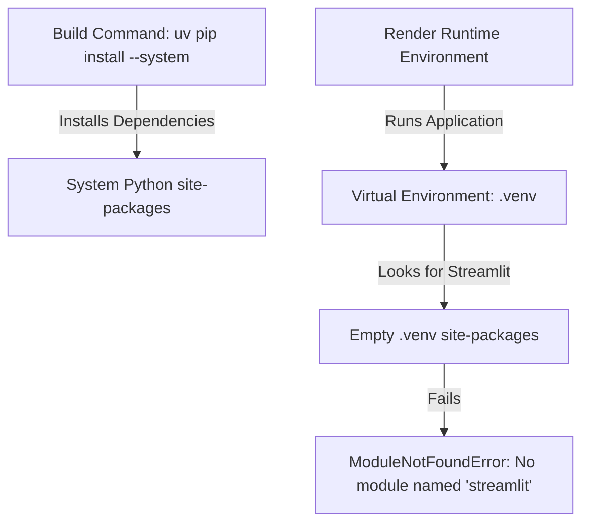

# Render Runtime Debug Report

**Date:** 2026-06-03  
**Status:** COMPLETE  
**Reference Failures:** Render runtime crash (`No module named streamlit`)  
**Deployment Plan Reference:** [render_deployment_plan.md](file:///home/aryan/May-2026/Content-Creation/docs/deployment/render_deployment_plan.md)  
**Readiness Report Reference:** [phase10_7_deployment_readiness_report.md](file:///home/aryan/May-2026/Content-Creation/docs/deployment/phase10_7_deployment_readiness_report.md)  
**Remediation Report Reference:** [phase10_7_1_remediation_report.md](file:///home/aryan/May-2026/Content-Creation/docs/deployment/phase10_7_1_remediation_report.md)  

---

## 1. Executive Summary

This report diagnoses the Render runtime failure where the build succeeds and logs report `streamlit==1.58.0 installed`, but execution fails instantly with:
```
/opt/render/project/src/.venv/bin/python: No module named streamlit
```
The root cause is a Python environment mismatch: the build command installs dependencies in the global system Python site-packages via the `--system` flag, whereas the Render runtime execution uses the isolated virtual environment at `/opt/render/project/src/.venv`. 

---

## 2. Investigation Details

### 2.1 Dependency Installation Path
- **Build-time Python Interpreter:** The build command uses the system-wide Python interpreter (e.g., `/usr/bin/python3` or `/opt/render/project/python/bin/python3`).
- **Streamlit Installation Location:** Streamlit is installed into the global site-packages directory of the host system (e.g., `/usr/local/lib/python3.11/site-packages` or `/opt/render/project/python/lib/python3.11/site-packages`).
- **Target Environment:** The installation targets the **system Python** environment. It explicitly bypasses the Render virtual environment `/opt/render/project/src/.venv` because the `--system` flag was specified in the build step.

### 2.2 Runtime Interpreter
- **Runtime Python Interpreter:** Render runs the start command inside the virtual environment using the interpreter at `/opt/render/project/src/.venv/bin/python`.
- **Interpreter Alignment:** No alignment. The dependency installation target and runtime executor are different Python environments. The virtual environment `/opt/render/project/src/.venv` is completely empty of the project's dependencies.

### 2.3 Build Command Analysis
- **Current Build Command:**
  ```bash
  curl -LsSf https://astral.sh/uv/install.sh | sh && export PATH="$HOME/.local/bin:$PATH" && uv pip install --system -e .
  ```
- **Analysis:**
  - The `--system` flag explicitly instructs `uv` to target the system Python instead of searching for or creating a virtual environment.
  - While this avoids "no virtualenv found" errors in standard non-virtualenv CI runners, it conflicts directly with Render's setup.
  - Render pre-creates a virtual environment at `/opt/render/project/src/.venv` and configures the container to run from it.
  - Editable mode (`-e .`) works as expected, but it was linked to the system python, not the virtual environment.

### 2.4 Render Runtime Expectations
- Render automatically initializes a Python virtual environment at `/opt/render/project/src/.venv`.
- Render adds this virtualenv's `bin/` directory to the front of the `PATH` during both build and runtime.
- Render expects the build script to install all dependencies directly inside this virtual environment.
- The correct deployment pattern is to let `uv` target this virtual environment (either implicitly via auto-detection, or explicitly using `--python .venv` or `-p .venv`).

---

## 3. Root Cause Analysis

The root cause of the runtime crash is the environment mismatch shown below:



Because `uv pip install --system` was instructed to ignore virtual environments, it bypassed `/opt/render/project/src/.venv`. Thus, the virtual environment lacks `streamlit`, leading to the startup failure.

---

## 4. Local Reproduction

To reproduce this environment discrepancy locally:

1. Create a dummy virtual environment:
   ```bash
   python3 -m venv test_venv
   ```
2. Install Streamlit using `uv` with the `--system` flag:
   ```bash
   uv pip install --system streamlit
   ```
3. Attempt to run Streamlit using the virtualenv's interpreter:
   ```bash
   ./test_venv/bin/python -c "import streamlit"
   ```
4. **Expected Result:**
   ```
   Traceback (most recent call last):
     File "<string>", line 1, in <module>
   ModuleNotFoundError: No module named 'streamlit'
   ```
This local test confirms that `uv pip install --system` populates the global Python environment, leaving the virtualenv clean and unable to import the package.

---

## 5. Recommended Fixes

### 5.1 Recommended Fix: Target Render Virtualenv via uv Auto-detection
Remove the `--system` flag from the build command. Since Render pre-creates `/opt/render/project/src/.venv` and runs the build command from the repository root, `uv` will automatically detect the `.venv` directory in the current working directory and install the packages there.

**Updated Build Command:**
```bash
curl -LsSf https://astral.sh/uv/install.sh | sh && export PATH="$HOME/.local/bin:$PATH" && uv pip install -e .
```

---

### 5.2 Alternative Fix: Explicitly Target Virtualenv Path
If we want to be 100% explicit and guarantee that `uv` targets the Render-managed virtual environment regardless of environment configuration, we can specify the path to the virtual environment using the `-p` (or `--python`) flag.

**Updated Build Command (Explicit Path):**
```bash
curl -LsSf https://astral.sh/uv/install.sh | sh && export PATH="$HOME/.local/bin:$PATH" && uv pip install -p .venv -e .
```
*(Alternatively: `uv pip install -p /opt/render/project/src/.venv -e .`)*

---

### 5.3 Non-Editable Production Build Command
For a production deployment, we can also disable editable mode (`-e`) and install the package cleanly:
```bash
curl -LsSf https://astral.sh/uv/install.sh | sh && export PATH="$HOME/.local/bin:$PATH" && uv pip install .
```

---

## 6. Deployment Plan Updates Required

The following updates must be applied to [render_deployment_plan.md](file:///home/aryan/May-2026/Content-Creation/docs/deployment/render_deployment_plan.md):

1. Update the **Build Command** to use the recommended target option:
   ```bash
   curl -LsSf https://astral.sh/uv/install.sh | sh && export PATH="$HOME/.local/bin:$PATH" && uv pip install -p .venv -e .
   ```
2. Document that the `--system` flag must not be used on Render due to virtual environment isolation.

---

## 7. Validation Steps

Once the build command is updated on Render:

1. **Verify Build Logs:** Check that `uv pip install` output shows installation targets within the `.venv` directory:
   ```
   Auditing /opt/render/project/src/.venv
   Installing content-creation in .venv
   ```
2. **Verify Streamlit Executable:** In the build/start checks, verify that `streamlit` is available in `/opt/render/project/src/.venv/bin/streamlit`.
3. **Verify Runtime Import:** Test import inside the virtual environment:
   ```bash
   /opt/render/project/src/.venv/bin/python -c "import streamlit; print(streamlit.__version__)"
   ```

---

## Final Recommendation

> **READY FOR DEPLOYMENT RETRY**
> 
> The root cause has been isolated to the `--system` flag in the `uv` build command bypassing Render's pre-created virtual environment. Updating the build command to target the virtual environment explicitly via `-p .venv` or implicitly via auto-detection will resolve the runtime failure.
