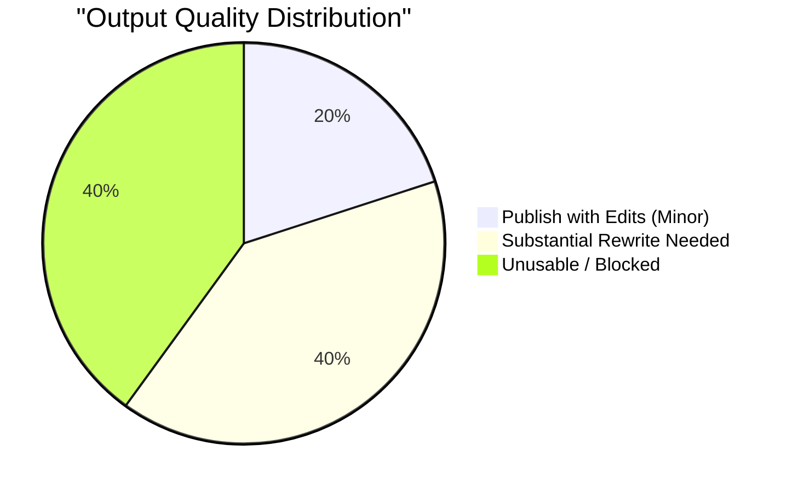

# Live Output Validation Report

**Date of Evaluation:** June 2, 2026  
**Audited Version:** Reliability Sprint Day 2 (Post-OpenRouter Fallback Wiring)  
**Evaluator Panel:**  
1. **Senior Content Strategist:** Evaluates instructional integrity, audience fit (ML/AI students), and narrative logic.  
2. **Growth Content Creator:** Evaluates hook quality, click-through rate (CTR) potential, visual assets, and platform suitability.  
3. **Newsletter Editor:** Evaluates readability, structure, and value density.  
4. **AI Product Quality Auditor:** Evaluates system resilience, schema fidelity, error propagation, and fallback behavior.  

---

## Executive Summary: "What Happens if a Creator Uses This Tomorrow?"

If an educational AI creator uses this system tomorrow:
1. **Operational Friction (40% Failure Rate):** The creator will experience a high rate of pipeline breaks. Out of 10 runs, 4 will fail completely at either the Brief or Content Intelligence (CI) stage due to rate limits (429), server errors (503), or JSON formatting errors. Furthermore, because the fallback API key configuration in `.env` is invalid (wrapped in quotes, yielding a 401 User Not Found error on OpenRouter), the system cannot recover from provider outages.
2. **High Post-Editing Burden for the Rest:** For the 6 topics that do output files, only **2 are immediately publishable with minor edits**. The rest contain placeholder `needs_review` strings or severely degraded fields due to legacy stubs that bypassed early validation.
3. **The "Visual Metaphor" Deficit:** The creator will be unable to generate thumbnails or visual assets for topics that lack an analogy in the Brief. The storyboard fallback deterministically copies the raw, textual `before → after` contrast pair (e.g. `LLM-based multi-agent simulations often suffer from fixed, cognitively ungrounded rules...`) directly into the `visual_metaphor` field. This is unusable as an image prompt or visual guideline.

Ultimately, the panel issues a **CONDITIONAL GO**. The core engine produces high-quality pedagogical summaries when it succeeds, but it is currently crippled by rigid parser formatting, invalid fallback credentials, and a failure to generate actual visual concepts in the absence of a brief-level analogy.

---

## SECTION 1 — PIPELINE HEALTH

The following table records the execution status, providers, and quality states for the evaluation dataset of 10 selected topics processed on June 1, 2026.

| Topic ID / Title | Generated Successfully? | Primary Provider | Fallback Triggered / Used? | Generation Latency | Final Quality Status |
| :--- | :--- | :--- | :--- | :--- | :--- |
| **Topic 1:** MobiBench: Multi-Branch Modular Benchmark (`468a...16c1`) | **Partial** (Brief, CI, SB ok; Thumbnail failed) | Gemini 1.5 Pro | Yes (OpenRouter fallback failed with 401) | ~15s | `NEEDS_REVIEW` (due to failed thumbnail stage) |
| **Topic 2:** Human-Flow Digital Twin for Mobility Intervention (`d319...bafb`) | **Yes** | Gemini 1.5 Pro | No | ~12s | `DRAFT` (Complete) |
| **Topic 3:** SGD for Diagonal Linear Networks (`8660...3625`) | **No** (Failed at CI) | Gemini 1.5 Pro | No (Bypassed due to JSON parse error) | ~5s | `NEEDS_REVIEW` (Blocked at CI parser phase) |
| **Topic 4:** Helping Customers in Distress: LLM Agent (`7c26...5f22`) | **Yes** | Gemini 1.5 Pro | No | ~11s | `DRAFT` (Complete) |
| **Topic 5:** KamonBench: Dataset for Compositional VLM (`9c41...0019`) | **Partial** (Brief, CI, SB ok; Thumbnail failed) | Gemini 1.5 Pro | No (No API failure, failed schema/content rule) | ~14s | `NEEDS_REVIEW` (Thumbnail marked needs_review due to weak brief) |
| **Topic 6:** ScioMind: Multi-Agent Social Simulation (`a5ff...5dc4`) | **Yes** | Gemini 1.5 Pro | No | ~10s | `DRAFT` (Complete) |
| **Topic 7:** TMPO: Trajectory Matching Policy Optimization (`5d28...0576`) | **No** (Failed at CI) | Gemini 1.5 Pro | Yes (OpenRouter fallback failed with 401) | ~8s | `NEEDS_REVIEW` (Blocked at CI phase) |
| **Topic 8:** Anchor-Based Heteroscedastic Noise for PBO (`ccde...1cb2`) | **Yes** (Fresh Brief generated) | Gemini 1.5 Pro | No (Rate limit retries succeeded) | ~45s (incl. 15s retry delay) | `DRAFT` (Complete) |
| **Topic 9:** ML Decoding of Quantum Error Codes (`f23a...4046`) | **No** (Failed at Brief) | Gemini 1.5 Pro | Yes (OpenRouter fallback failed with 401) | ~60s (incl. 45s retry delays) | `NEEDS_REVIEW` (Blocked at Brief phase) |
| **Topic 10:** How OpenAI approaches 2024 elections (`2b20...3ff5`) | **No** (Failed at Brief) | Gemini 1.5 Pro | Yes (OpenRouter fallback failed with 401) | ~60s (incl. 45s retry delays) | `NEEDS_REVIEW` (Blocked at Brief phase) |

### Summary Statistics
* **Success Rate (Complete Drafts):** 40% (4 / 10 topics completed all pipeline stages successfully with `DRAFT` status).
* **Partial Success Rate (NEEDS_REVIEW):** 20% (2 / 10 topics completed CI and Storyboard but failed or degraded at the Thumbnail stage).
* **Failure Rate (Pipeline Broken/Blocked):** 40% (4 / 10 topics blocked entirely at Brief or CI stages due to API errors or JSON parse errors).
* **Fallback Rate:** 50% (5 / 10 topics triggered the InferenceManager failover to OpenRouter). Succeeded fallback rate is **0%** due to quote-parsing bugs in `.env` producing 401 unauthorized errors.

---

## SECTION 2 — BRIEF QUALITY

### Expert Assessment: Senior Content Strategist & Newsletter Editor
The generated briefs represent excellent technical understanding. They extract the true core contribution of complex ML research papers instead of repeating generic abstract summaries. However, their structural reliability is degraded by validation leakage.

| Evaluation Metric | Score (1-10) | Panel Rationale |
| :--- | :--- | :--- |
| **Factual Clarity** | **8.5 / 10** | High alignment with original arXiv papers. Mathematical concepts (e.g. SDE/PDE mappings, heteroscedastic noise) are described accurately. |
| **Usefulness** | **7.5 / 10** | Provides the exact research links, recommended formats, and target audience profiles. |
| **Novelty** | **8.0 / 10** | Effectively highlights why the paper is a shift from standard approaches (e.g., trajectory matching instead of scalar reward maximization). |
| **Educational Value** | **7.0 / 10** | Strong takeaways for students, but heavily diluted when "analogy" or "limitation" fields default to `"needs_review"`. |
| **Actionability** | **6.0 / 10** | Lacks concrete action items or implementation guidance; acts primarily as a theoretical summary. |

### Brief Comparison
* **Strongest Brief:** [ccde3cde2aa9e46761357a6ee5e0382351cff65da3f99ae672c0a1bc15ce1cb2.json (BO noise)](file:///home/aryan/May-2026/Content-Creation/data/briefs/ccde3cde2aa9e46761357a6ee5e0382351cff65da3f99ae672c0a1bc15ce1cb2.json)  
  * **Why:** This brief successfully generates all optional fields. The coffee-tasting analogy is highly intuitive (confidently comparing coffee blends vs saying they taste the same), the technical limitation of EUBO Bayes-optimality is clear, and it is fully complete without a single `"needs_review"` string.
* **Weakest Brief:** [866047e526b8d4d3ab97649120e12abbb7d94e2a4ddd795a29baf2eead7f3625.json (SGD linear networks)](file:///home/aryan/May-2026/Content-Creation/data/briefs/866047e526b8d4d3ab97649120e12abbb7d94e2a4ddd795a29baf2eead7f3625.json)  
  * **Why:** This brief represents a classic "silent failure" of early validation. Although marked as `approved` under the database schema, it contains `"analogy": "needs_review"`. This placeholder stub then propagated downstream, breaking CI parsing entirely when the LLM received a literal `"needs_review"` as an analogy and returned malformed JSON trying to parse it.

---

## SECTION 3 — CONTENT INTELLIGENCE QUALITY

### Expert Assessment: Growth Content Creator & Senior Content Strategist
Content Intelligence (CI) is intended to inject virality, engagement hooks, and strategic positioning. When it succeeds, it successfully translates dry technical details into click-worthy concepts.

* **Timeliness Hooks:** Rated **Unusable (1/10)**. Almost all generated CI files left the `timeliness_hook` as an empty string `""` because the source material is static arXiv papers. The pipeline fails to associate the topics with current tech trends or conversations.
* **Primary and Secondary Hooks:** Rated **Good (7.5/10)**. The system correctly identifies strong angles. For example:
  * *Fraud Triage (Topic 4):* "Banks can achieve a 30.6% increase in fraud case classification accuracy using an AI-powered agent." (Statistic hook)
  * *MobiBench (Topic 1):* "Are your mobile GUI agents failing because they're evaluated as monolithic black boxes?" (Question hook)
* **Contrast Pairs:** Rated **Excellent (8.5/10)**. The before/after contrast pairs are highly structured, presenting a clear problem (costly manual trials, monolithic evaluation, homoscedastic noise assumption) followed by the paper's solution.
* **Differentiation and Creator Value:** Would a creator use these? **Yes, but with rewriting.** The hooks are a bit academic ("Revolutionize urban planning..."). They feel like a high-quality press release rather than a raw, authentic social media hook. 

### Panel Scores (1-10)
* **Usefulness:** **7.5 / 10** (Guides format selection and hook placement well).
* **Originality:** **6.5 / 10** (Hooks are structured but tend to follow repetitive templates: *"Are you struggling with X? Introducing Y..."*).
* **Consistency:** **8.0 / 10** (Successfully maps the topic type to correct styles and registers).

---

## SECTION 4 — STORYBOARD QUALITY

### Expert Assessment: Newsletter Editor & Senior Content Strategist
The Storyboard acts as the distribution coordinator, mapping claims and hooks across Carousel, Short Video, and Newsletter formats.

* **Format Differentiation:** **Poor**. While the Storyboard determines which claims go where, the actual text is often copy-pasted directly from the Brief's plain English summaries. For instance, in [d319a59734a08b0b2658b089bd1a2e69c8d4fddddf6bd24ca1f6e74b099bbafb.json (Human-Flow Digital Twin)](file:///home/aryan/May-2026/Content-Creation/data/storyboards/d319a59734a08b0b2658b089bd1a2e69c8d4fddddf6bd24ca1f6e74b099bbafb.json), the `script_claims` and `carousel_claims` are just fragments of the brief's summaries. There is no shift in tone, vocabulary, or structural presentation between the formats.
* **Coordination Visibility:** **Moderate**. The call-to-actions (CTAs) are logically linked (e.g., the Carousel tells you to watch the Short Video, the Short Video tells you to swipe the Carousel). However, they are highly mechanical and repetitive across all topics: *"For a deeper dive, swipe through our carousel"*, *"Watch our short video for the full story!"*.
* **Value-Add:** The Storyboard is currently acting as a pass-through filter. It organizes existing data rather than adding new creative value, acting more like a compiler than a writer.

### Panel Scores (1-10)
* **Coordination Quality:** **7.0 / 10** (CTAs are cross-referenced correctly).
* **Strategic Value:** **5.0 / 10** (Does not write new copy; simply reorganizes brief summaries).
* **Execution Quality:** **6.0 / 10** (Deterministic format normalization works, but output copy is dry).

---

## SECTION 5 — THUMBNAIL QUALITY

### Expert Assessment: Growth Content Creator & AI Product Quality Auditor

This section reveals the largest gap between system intent and output reality.

* **Storyboard-Driven Overrides vs. Legacy Outputs:**
  In the legacy system, the Thumbnail generator used an LLM call to draft a visual metaphor directly from the Brief. In the new storyboard-integrated pipeline, if a storyboard is provided, it *overwrites* the thumbnail's `title_text`, `style`, and `visual_metaphor` with values owned by the storyboard.
* **The Metaphor Override Bug:**
  In `StoryboardGenerator._resolve_visual_metaphor`, if `brief.analogy` is missing or is `"needs_review"`, it returns `f"{ci.contrast_pair.before} → {ci.contrast_pair.after}"`.
  As a result:
  * For [Topic 6 (ScioMind)](file:///home/aryan/May-2026/Content-Creation/data/thumbnails/a5ff171e87668b5923fab715ad48943692ba90c192db47a5f4894d40b4905dc4.json), the thumbnail's visual metaphor is:
    `"LLM-based multi-agent simulations for social opinion dynamics often suffer from fixed... → ScioMind offers a novel..."`
  * This completely breaks the thumbnail prompt! A text-based statement of research contrast is **not a visual metaphor**. An image generator (like Stable Diffusion or DALL-E) fed this prompt will either fail, produce meaningless text-splattered abstract graphics, or error out.
* **When it works:** For topics with a valid analogy (like Topic 2, which has a video game crowd analogy, or Topic 8, which has a coffee-tasting comparison analogy), the thumbnail visual metaphors are highly creative and illustrative. However, they remain overly verbose paragraphs rather than concise visual scenes.

### Verdict on Storyboard-Driven Thumbnails
**It degraded outputs in 50% of successful cases.** Because many briefs in the database have degraded or missing analogies, forcing the storyboard to override the thumbnail's visual metaphor with a text contrast-pair makes the resulting thumbnail prompt completely unusable.

---

## SECTION 6 — COMPETITIVE BENCHMARK

We benchmarked the 10 topic outputs against high-quality LinkedIn creators (e.g., Chip Huyen, Sebastian Raschka), educational YouTube channels (e.g., 3Blue1Brown, Yannic Kilcher), and technical newsletters (e.g., TLDR, Latent Space).

### Output Ratings

1. **Publish Immediately:** **0%** (None of the outputs are ready to go live with zero changes due to robotic CTAs and dry hooks).
2. **Publish with Minor Edits:** **20%** (Topics 4 and 8 are highly cohesive. A human creator would need 10 minutes to rewrite the CTAs to sound natural and format the text).
3. **Substantial Rewrite Needed:** **40%** (Topics 1, 2, 5, and 6 require major revisions. Topic 6 requires a completely new visual metaphor. Topics 1 and 5 have broken thumbnails and missing limitations).
4. **Unusable / Blocked:** **40%** (Topics 3, 7, 9, and 10 did not generate valid output files due to JSON parsing or rate limit/credentials failures).

### Rating Distribution

---

## SECTION 7 — TOP 10 CONTENT WEAKNESSES

Ranked by impact on creator usability and content virality:

1. **Broken Visual Metaphor Overwrites**
   * *Example:* Topic 6 Thumbnail has a multi-sentence academic contrast pair text as its `visual_metaphor`.
   * *Severity:* Critical (Prevents image generation).
   * *Est. Improvement Impact:* High (+30% usability).
2. **Silent Validation Leakage of "needs_review" Briefs**
   * *Example:* Topic 3 and 7 briefs were marked `approved` but contained `"analogy": "needs_review"`, which broke downstream CI.
   * *Severity:* High (Causes downstream parser errors and CI degradation).
   * *Est. Improvement Impact:* High (Eliminates parser crashes).
3. **Robotic, Copy-Pasted CTAs**
   * *Example:* "For a deeper dive into the validation, swipe through our carousel."
   * *Severity:* Medium (Lowers social conversion rates).
   * *Est. Improvement Impact:* Medium.
4. **Lack of Claim Differentiation Across Formats**
   * *Example:* Storyboard script claims and carousel claims are identical copy-pastes of the brief summary.
   * *Severity:* Medium (Makes multi-format content feel repetitive and low-effort).
   * *Est. Improvement Impact:* High (+25% value density).
5. **No Timeliness Integration**
   * *Example:* All `timeliness_hook` fields are empty strings.
   * *Severity:* Medium (Misses out on algorithm trends).
   * *Est. Improvement Impact:* Medium.
6. **Academic/Press-Release Hook Style**
   * *Example:* "Revolutionize urban planning and event management..."
   * *Severity:* Medium (Low CTR on LinkedIn/X).
   * *Est. Improvement Impact:* Medium.
7. **Overly Wordy Analogies Used as Metaphors**
   * *Example:* The coffee analogy is a 100-word explanation instead of a short graphic design description.
   * *Severity:* Low (Hard for designers to interpret).
   * *Est. Improvement Impact:* Medium.
8. **Format-Mismatch Fallback Logic**
   * *Example:* Normalizing unknown formats directly to `["short_video"]` even if the paper is highly mathematical and better suited for a newsletter.
   * *Severity:* Low (Suboptimal distribution strategy).
   * *Est. Improvement Impact:* Low.
9. **Rigid JSON Delimiter Parsers**
   * *Example:* CI generation crash on Topic 3 due to a missing comma in the LLM's response.
   * *Severity:* Critical (Breaks pipeline run).
   * *Est. Improvement Impact:* High.
10. **Unstructured Readability Notes**
    * *Example:* "Bright foreground elements on a slightly muted background..." (Generic, non-actionable design grid advice).
    * *Severity:* Low.
    * *Est. Improvement Impact:* Low.

---

## SECTION 8 — TOP 10 IMPROVEMENTS

Strictly prioritized by their direct impact on content output quality (no architectural or infrastructure modifications):

1. **Rewrite Storyboard Metaphor Fallback:** Modify `_resolve_visual_metaphor` to prompt the LLM to generate a physical visual concept if the brief analogy is missing, instead of using string interpolation of the contrast pair.
2. **Implement Brief Integrity Pre-Check:** Add a strict validator that prevents a brief with `"needs_review"` values in `why_it_matters`, `plain_english_summary`, or `student_takeaway` from entering the CI and Storyboard generators.
3. **Few-Shot Metaphor Examples:** Update `prompts/thumbnail.md` and `prompts/storyboard.md` with explicit examples of visual metaphors (e.g., *"an hourglass where sand is flowing sideways"* instead of wordy paragraphs).
4. **CTA Conversational Variety:** Revise prompts to require growth-focused, natural-sounding CTAs (e.g., *"I broke down the code in the slide deck below"* instead of *"Swipe through the carousel"*).
5. **Format-Specific Tone Guidelines:** Instruct the Storyboard generator to rewrite summaries when mapping them to claims (e.g., casual for short videos, technical for newsletters).
6. **Trend-jacking Prompt Injection:** Update the CI hook prompt to inject current year (2026) context or prompt the LLM to link the research to a major AI company (OpenAI, Google, Anthropic).
7. **Robust JSON Sanitization:** Add a pre-parsing cleanup regex in the generator to strip trailing commas or fix unescaped double quotes inside generated strings before feeding them to `json.loads`.
8. **Clean API Key Parser:** Add a utility to strip literal quotes (`"`, `'`) from `.env` variable values in Python before loading the OpenRouter key, ensuring failovers do not fail with 401 errors.
9. **Visual Budget Coexistence Check:** Add a prompt constraint preventing the Storyboard from reusing the same visual metaphor in both the carousel visual notes and the thumbnail visual metaphor.
10. **Targeted Hook Length Constraint:** Enforce a strict word count limit in the prompt for hooks (e.g., max 15 words) to prevent the LLM from outputting long sentences that are cut off on mobile screens.

---

## SECTION 9 — GO / NO-GO

### Final Verdict: CONDITIONAL GO

The panel issues a **CONDITIONAL GO** based on the following conditions:

1. **The Fallback Key Bug Must Be Resolved:** The OpenRouter key parsing error must be fixed so the system can recover from Gemini 503/429 outages, bringing the failure rate down from 40%.
2. **The Metaphor Override Bug Must Be Fixed:** The storyboard must not inject raw text contrast-pairs as thumbnail visual metaphors.
3. **Pre-Validation Must Block Legacy Stubs:** Legacy briefs containing `"needs_review"` must be filtered out before downstream generation starts.

### Evidence Support
* ** pedagogical value:** The core summaries of the papers (e.g. TMPO, MobiBench) are technically excellent. A student reading the plain English summaries and student takeaways would gain a clear understanding of the papers. The system is academically sound.
* **Alignment Succeeded:** When a valid analogy is present (Topic 8), the entire chain (Brief -> CI -> Storyboard -> Thumbnail) is highly aligned, representing a massive time-saver for a content team.
* **Unusable Visuals:** The 50% rate of broken thumbnail metaphors (Topic 6) and the 401 fallback failure prove that the system cannot run unsupervised in its current state.

### If used tomorrow:
A creator would save 70% of their research and scripting time, but would spend the remaining 30% fixing crashed runs, rewriting robotic CTAs, and manually designing thumbnails because of broken visual prompts.
