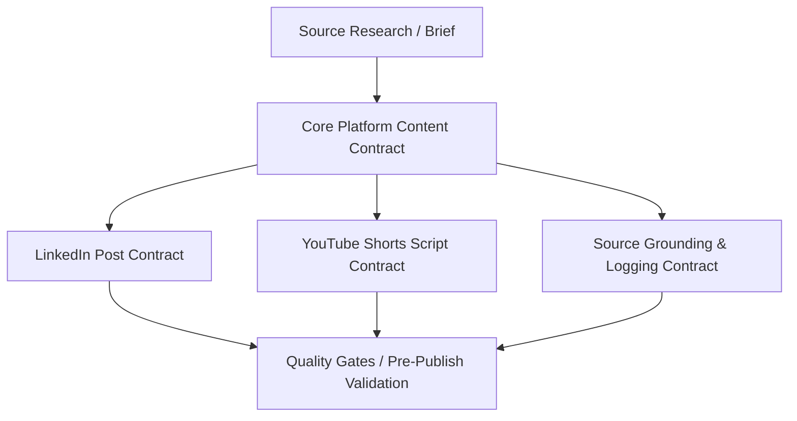

# Platform Content Contracts — Core Specifications

This document defines the core specifications, architecture, and shared requirements for platform-aware content generation. It establishes a common foundation that all platform-specific contracts must inherit and satisfy.

---

## 1. Hierarchy of Contracts

The Content Creation Automation Platform uses a multi-tier contract structure to ensure that all generated outputs are technically sound, structurally compliant, and aligned with user expectations.

1. **Source Brief**: The upstream input containing normalized technical facts, quotes, figures, and bibliographic citations.
2. **Core Platform Contract** (This Document): Defines shared properties like tone of voice, formatting principles, link handling, and safety constraints.
3. **Platform-Specific Contracts** (LinkedIn / YouTube Shorts): Define character counts, script structures, pacing, layout rules, and media pairings.
4. **Source Grounding Contract**: Specifies how claim tracing is structured, preserved, and verified throughout the generation pipeline.
5. **Quality Gates**: The final automated and manual validation rules that assets must pass before ingestion or publishing.

---

## 2. Shared Content Requirements

All downstream generators (LinkedIn, YouTube Shorts, etc.) must adhere to these foundational constraints:

### 2.1 Technical Rigor over Hype
* **Educational Value**: The content must explain *how* and *why* a technology works. Avoid buzzwords ("revolutionary," "game-changing," "mind-blowing").
* **Target Audience**: Upper-level undergraduate students, junior data scientists, and ML practitioners. Assume basic knowledge of calculus, linear algebra, and Python.
* **Accuracy**: Do not simplify algorithms to the point of technical falsehood. If a transformer uses causal masking, do not describe it simply as "predicting the next word" without explaining the masking mechanism.

### 2.2 Formatting and Layout Principles
* **Readability**: Break large blocks of text into digestible paragraphs (max 3 sentences per block).
* **Whitespace**: Use intentional empty lines to guide the reader's eye. Dense blocks are rejected by readers on all platforms.
* **Semantic Hierarchy**: Use headers, lists, and bold text consistently to establish a clear reading path.

### 2.3 Link and Citation Handling
* **Grounded URLs**: Any link included in the output must be retrieved directly from the input brief's `source_links` or metadata.
* **Formatting**: Avoid raw markdown links on platforms that do not support them (like LinkedIn). Instead, output clean, copy-pasteable URLs or instruct the publisher to place links in specific locations (e.g., "Link in comments").
* **No Broken Links**: Links must point to verified primary sources (arXiv, GitHub repos, official project pages) rather than generic search queries.

---

## 3. Core Anti-Patterns

Any output exhibiting the following patterns will fail validation at the quality gate:

| Anti-Pattern | Description | Remediation |
| :--- | :--- | :--- |
| **The Hype Loop** | Leading with sensationalist statements ("AI just changed forever...") | Lead with a concrete technical question or a specific problem solved by the research. |
| **Attribute Loss** | Dropping citation metadata or author attribution during translation to platform layout | Always preserve primary author names and institutions in the final credits block. |
| **Loose Grounding** | Introducing external context or concepts not present in the source brief | Constrain the generator prompt to only use facts and figures explicitly declared in the input brief. |
| **Emoji Pollution** | Using more than 3 emojis per post, or placing them mid-sentence | Limit emoji usage to structural markers (e.g., bullet points) and use a maximum of 3 per post. |
