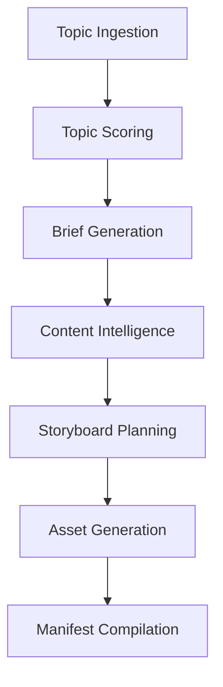

# Backend Architecture Signoff: v0.6 Editorial Content Pipeline

**Date:** 2026-06-03  
**Status:** **APPROVED & READY FOR STREAMLIT INTEGRATION**  
**Authoritative Source:** [docs/release/v0.6_backend_signoff.md](file:///home/aryan/May-2026/Content-Creation/docs/release/v0.6_backend_signoff.md)

---

## 1. Overview of Backend Architecture

The v0.6 backend implements a robust, editorial-first content production pipeline designed to ingest, filter, plan, and generate multi-format educational assets for ML/AI students. 

### Data Flow Pipeline Order:

1. **Ingestion & Scoring:** Filter and prioritize papers/topics using deterministic scoring rules.
2. **Brief Generation:** Summarizes technical documents to extract core facts and research links.
3. **Content Intelligence:** Determines primary curiosity gaps, timeliness hooks, and contrast angles.
4. **Storyboard Planning:** Formulates creative pacing, format-specific narrative blocks (hooks, CTAs, claims), and visual metaphors.
5. **Asset Generation:** Generates output formats (Thumbnail Prompts, Video Scripts, Carousel Slides, Newsletters) via explicit, storyboard-first APIs.
6. **Manifest Compilation:** Bundles ready assets and brief info for planner consumption.

---

## 2. Interface Contracts & Architectural Guarantees

### Strict Signature Contracts
All asset generators strictly implement explicit, strongly-typed signature contracts without compatibility layers, runtime remapping, or dynamic argument sniffing:
* **Thumbnail:** `ThumbnailGenerator.generate(self, storyboard: Optional[Storyboard], brief: Brief) -> ThumbnailPrompt`
* **Script:** `ScriptGenerator.generate(self, storyboard: Optional[Storyboard], brief: Brief, format: str) -> Script`
* **Carousel:** `CarouselGenerator.generate(self, storyboard: Optional[Storyboard], brief: Brief) -> Carousel`
* **Newsletter:** `NewsletterGenerator.generate(self, storyboard: Optional[Storyboard], brief: Brief) -> Newsletter`

### Content Ownership Boundary
* **Storyboard Ownership (Creative):** Formulates narrative Hooks, CTAs, Claims, and Visual Metaphors. Assets consume format-specific storyboard fields.
* **Brief Ownership (Factual):** Formulates underlying facts, technical takeaways, limitations, audience fit, and source URLs.

---

## 3. Remediation Outcomes (Phase 7.2 / 7.3)

Prior validation runs highlighted two critical issues which are fully resolved:
* **VF-001 (Completed Workflow Masks Missing Artifacts):** Resolved by validating *both* workflow completion state and file existence. If a stage is marked completed but its file is deleted, a warning is printed and the pipeline regenerates the artifact (Option A).
* **VF-002 (Missing Storyboard Allows Fallback Asset Generation):** Resolved by adding an assertion check in `AssetGenerationService` which raises a `ValueError` if the storyboard is missing, blocking asset generation loudly (Option B) rather than silently falling back.

---

## 4. Accepted Limitations & Design Asymmetries

* **Brief Status Asymmetry:** The `brief` status remains `"pending"` in the workflow manager (an accepted v0.6 asymmetry). The orchestrator evaluates brief readiness by list index and file presence on disk.
* **Manifest Coverage Scope:** Manifests verify only Brief and Asset readiness for the downstream planner. Upstream Content Intelligence or Storyboard file absences are treated as lineage failures handled by pipeline service exceptions, not manifest computations.

---

## 5. Readiness for Streamlit / FastAPI Integration

> [!IMPORTANT]
> **VERDICT: SIGNED OFF & READY**
> 
> The backend is fully verified and ready to serve as the foundation for the frontend Streamlit UI and FastAPI endpoints.
>
> ### Why it is Ready:
> 1. **Robust Resumability:** The pipeline accurately resumes from intermediate states, self-heals storage/workflow divergence, and preserves idempotency.
> 2. **Deterministic Failure Halting:** Upstream service exceptions correctly halt downstream stages immediately.
> 3. **Explicit API Boundaries:** The visual and textual asset generators expose clean, unified schemas and strict storyboard-first signatures.
> 4. **Authoritative Schema:** The database models and file formats are frozen and verified by a 245-method pytest validation suite.
