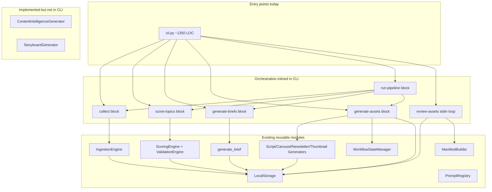
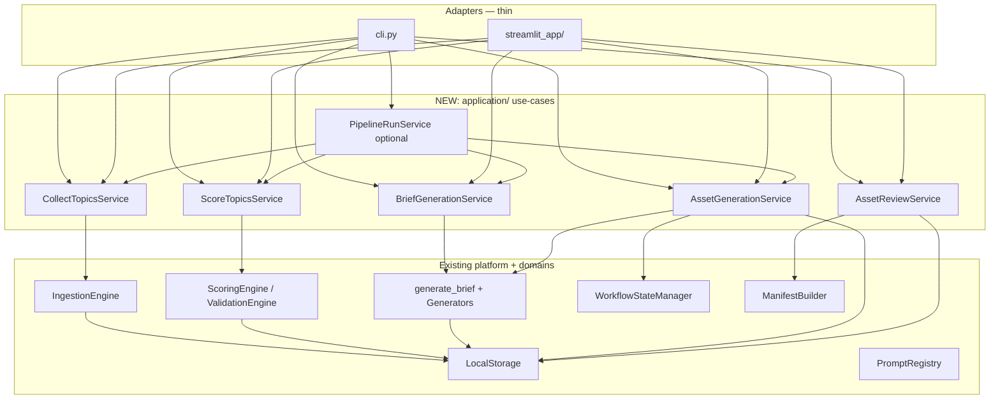

# Backend Integration Plan — Streamlit × Existing CLI Pipeline

**Date:** 2026-06-02  
**Role:** Senior Staff Engineer  
**Status:** Architecture only — no implementation  
**Related:** [product_definition.md](./product_definition.md), [page_inventory.md](./page_inventory.md), [dead_code_audit.md](../audit/dead_code_audit.md), [e2e_test_strategy.md](../audit/e2e_test_strategy.md)

---

## 1. Executive summary

### Recommendation: **Option B — Shared service layer**

Introduce a thin **`application/` use-case layer** that owns pipeline orchestration currently embedded in `cli.py`. The CLI becomes a **presentation adapter** (argparse + stdout). Streamlit becomes a **UI adapter** (widgets + `st.session_state` + progress callbacks). Both call the **same services** and the **same** `WorkflowStateManager` + `LocalStorage` instances rooted at one `base_dir`.

| Option | Verdict |
|--------|---------|
| **A — Direct CLI invocation** | **Rejected** — subprocess breaks structured errors, progress streaming, and interactive review; still couples UI to CLI UX details (`input()`, exit codes). |
| **B — Shared service layer** | **Selected** — minimum refactor with maximum reuse; satisfies all five required capabilities without logic duplication. |
| **C — Application controller layer (standalone)** | **Rejected as primary** — without B underneath, controllers become a second copy of `cli.py`; with B, a *thin* UI controller in Streamlit is sufficient. |

### Minimum architectural change (one sentence)

**Extract five use-case modules from `cli.py` into `src/content_creation/application/`, then point CLI and Streamlit at them — do not add a parallel orchestration path in the UI.**

---

## 2. Requirements traceability

| Requirement | How Option B satisfies it |
|-------------|---------------------------|
| Streamlit calls **existing services** | Use-cases compose `IngestionEngine`, `ScoringEngine`, generators, `LocalStorage`, etc. — no reimplementation. |
| **No duplicate CLI logic** | Asset/brief/score loops exist once in `application/`; CLI delegates. |
| **No bypassing workflow state** | `AssetGenerationService` owns `WorkflowStateManager`; UI never writes assets without `stage_completed` / `mark_completed` / `mark_failed`. |
| collect / score / briefs / assets / review | Mapped to five use-cases (§6). |
| Minimum change | ~250–350 LOC moved, not a full rewrite; no new database; no domain model changes. |

---

## 3. Current architecture (as-is)



### Critical duplication today

| Logic | Locations |
|-------|-----------|
| **Asset generation loop** (thumbnail + format mapping + workflow) | `cli.py` `generate-assets` **and** `run-pipeline` stage 4 (~95% identical) |
| **Brief generation loop** (top N scored, skip existing, sleep) | `generate-briefs` **and** `run-pipeline` stage 3 |
| **Score loop** | `score-topics` **and** `run-pipeline` stage 2 |

Streamlit must **not** copy a third instance of the asset loop.

### Workflow state (non-negotiable)

`WorkflowStateManager` (`data/workflow_state/{topic_id}.json`) is updated only in the **generate-assets** / **run-pipeline** path today:

- `stage_completed()` — skip regeneration  
- `mark_completed()` — after successful save  
- `mark_failed()` — on exception  

Any UI that calls generators and `storage.save_*` **without** this manager will desync CLI resumability and violate requirement §3.

---

## 4. Target architecture (Option B)



### Package layout (proposed)

```
src/content_creation/
    application/
        __init__.py
        context.py              # ApplicationContext: base_dir, storage, configs
        collect.py              # CollectTopicsService
        scoring.py              # ScoreTopicsService
        brief_generation.py     # BriefGenerationService
        asset_generation.py     # AssetGenerationService  ← workflow-aware
        asset_review.py         # AssetReviewService
        pipeline.py             # PipelineRunService (wraps stages + PipelineLogger)
        results.py                # Typed result DTOs (counts, errors, stage summaries)
    cli.py                      # argparse only → calls application.*
    streamlit_app/              # NEW (outside or inside src — team choice)
        Home.py / pages/
```

**No new persistence layer.** `ApplicationContext` holds:

```python
# Conceptual — not implemented in this doc
@dataclass
class ApplicationContext:
    base_dir: Path
    storage: LocalStorage
    feeds_config_path: Path
    scoring_config_path: Path
    workflow: WorkflowStateManager
    prompt_registry: PromptRegistry
```

Constructed once per Streamlit session (`@st.cache_resource`) and once per CLI invocation.

---

## 5. Option analysis (A / B / C)

### Option A — Direct CLI invocation

```text
subprocess.run(["content-creation", "generate-assets", "--top", "5"])
```

| Pros | Cons |
|------|------|
| Zero refactor before UI | **Duplicates entry point**, not services — violates spirit of req §1 |
| CLI remains single source | No structured return values (counts, per-stage errors) |
| | `review-assets` uses **stdin** — unusable in Streamlit |
| | Hard to show live progress; must parse stdout |
| | Env/cwd/subprocess bugs on Streamlit Cloud |
| | Cannot inject `st.status` or cancel |

**Verdict:** Reject.

---

### Option B — Shared service layer (selected)

| Pros | Cons |
|------|------|
| Single orchestration copy | One-time extract from `cli.py` |
| CLI + UI stay in sync | Requires discipline: no new logic in `cli.py` |
| Typed results for UI | Small API design effort (`results.py`) |
| Natural place for `rate_limit_sleep`, progress callbacks | |
| Tests target services (better mutation/E2E ROI) | |

**Verdict:** Adopt.

---

### Option C — Application controller layer (thick)

Controllers that own session, navigation, DTO mapping, **and** orchestration — without a service layer underneath.

| Pros | Cons |
|------|------|
| Familiar MVC shape | **Second monolith** if orchestration lives only in controllers |
| Good for large teams | Overkill for MVP; Streamlit already is the view |

**Verdict:** Use **thin** Streamlit page functions that call **B**; do not build a separate controller hierarchy above services.

---

## 6. Use-case mapping (required capabilities)

### 6.1 Collect

| Aspect | Specification |
|--------|---------------|
| **Service** | `CollectTopicsService.run(source_filter: str \| None)` |
| **Composes** | `load_yaml_config(feeds.yaml)` → `IngestionEngine(config, storage).run(source_filter)` |
| **Inputs** | `ApplicationContext`, optional source id |
| **Outputs** | `CollectResult(new_items: list[TopicItem], count: int)` |
| **Failure modes** | Missing config → `ConfigurationError`; per-feed errors logged, partial success (engine behavior) |
| **Assertions (tests/UI)** | `result.count == len(result.new_items)`; staged files exist under `data/staged/` |
| **CLI today** | `collect` command lines 154–166 |
| **Streamlit** | Page 2 — "Collect Feeds" button → service → refresh table |

**Do not** call `BaseCollector.collect()` from UI unless `IngestionEngine` is updated to use it — engine is the supported path.

---

### 6.2 Score

| Aspect | Specification |
|--------|---------------|
| **Service** | `ScoreTopicsService.run(limit: int \| None)` |
| **Composes** | `load_scoring_config` → `ScoringEngine.score_items` → `ValidationEngine.validate_item` per scored → `storage.save_scored` |
| **Inputs** | staged items from `storage.list_staged()` |
| **Outputs** | `ScoreResult(scored: int, rejected: int, items: list[ScoredTopicItem])` |
| **Failure modes** | No staged items → empty result (not error); invalid yaml → raise |
| **Assertions** | Scored JSON has `priority_score`; rejected have `status=rejected` |
| **CLI today** | `score-topics` lines 216–247 |
| **Streamlit** | Page 3 — optional weight sliders **must not** silently fork config unless "Save weights" writes `scoring.yaml` or passes override dict into service |

**Note:** Live slider recalc without persisting YAML is a **UI feature** — implement as `ScoreTopicsService.run_with_config(ScoringConfig)` to avoid duplicating engine setup in Streamlit.

---

### 6.3 Generate briefs

| Aspect | Specification |
|--------|---------------|
| **Service** | `BriefGenerationService.run(top_n: int)` |
| **Composes** | `storage.list_scored()` → filter `TopicStatus.SCORED` → sort by `priority_score` → skip existing brief file → `generate_brief(item, registry, api_key)` → `storage.save_brief` |
| **Inputs** | `GEMINI_API_KEY` from env (validated in service) |
| **Outputs** | `BriefGenerationResult(generated: int, skipped: int, failures: list[TopicFailure])` |
| **Failure modes** | Missing API key → `ApiKeyMissing`; short `raw_text` → per-item failure; inference failure → fallback brief (existing `generate_brief` behavior) |
| **Assertions** | Each generated id has `data/briefs/{id}.json`; `Brief.topic_id == item.id` |
| **CLI today** | `generate-briefs` lines 308–349 |
| **Streamlit** | Page 4 — per-topic or batch button calling same service |

**Rate limiting:** Move `time.sleep(5)` into service as `rate_limit_seconds: float = 5.0` (configurable; set `0` in tests).

---

### 6.4 Generate assets (workflow-critical)

| Aspect | Specification |
|--------|---------------|
| **Service** | `AssetGenerationService.run(top_n: int)` |
| **Composes** | `WorkflowStateManager` + generators + `FREETEXT_TO_FORMAT` / `FORMAT_TO_ASSET` + `storage.save_*` |
| **Inputs** | briefs from `storage.list_briefs()` (top N by `generated_at`) |
| **Outputs** | `AssetGenerationResult(counts: dict, skipped: int, failures: int, details: list)` |
| **Workflow rules** | **Mandatory:** check `wf.stage_completed` before generate; **always** `mark_completed` or `mark_failed`; never skip manager |
| **Failure modes** | Generator exception → `mark_failed`, continue other formats; missing briefs → empty result |
| **Assertions** | Workflow file contains `completed` for each success; artifact path exists |
| **CLI today** | `generate-assets` lines 351–449 **≈** `run-pipeline` 593–660 |
| **Streamlit** | Page 7 / "Generate Assets" — must use this service only |

#### Thumbnail without storyboard (current production)

`ThumbnailGenerator.generate(brief)` — **no storyboard argument** in CLI today. UI matches production until CI/Storyboard is integrated.

#### Future: CI → Storyboard → Thumbnail (extension point)

Add **`AssetGenerationService.run_with_intelligence(top_n, include_storyboard=True)`** or a chained **`IntelligencePipelineService`** that:

1. Runs `ContentIntelligenceGenerator` → `ContentIntelligenceRepository`  
2. Runs `StoryboardGenerator` → `StoryboardRepository`  
3. Calls `thumb_gen.generate(brief, storyboard=sb)`  

This is **Phase 2** (see §9). Do not implement a Streamlit-only chain.

---

### 6.5 Review outputs

| Aspect | Specification |
|--------|---------------|
| **Service** | `AssetReviewService` |
| **Composes** | `storage.update_asset_status` → `ManifestBuilder.build` → `storage.save_manifest` |
| **Inputs** | `topic_id`, list of `AssetDecision(asset_type, ReviewStatus)` |
| **Outputs** | `ReviewResult(approved: int, rejected: int, manifest: TopicManifest)` |
| **Failure modes** | Missing manifest → error; missing asset file → `update_asset_status` returns false |
| **Assertions** | Manifest `overall_status` / `ready_for_planner` updated |
| **CLI today** | `review-assets` lines 1181–1326 (**stdin** — not UI-viable) |
| **Streamlit** | Page 6 — buttons Approve/Reject per asset type → build `AssetDecision` list → service |

**Extract** review logic from stdin loop into declarative API. CLI can keep a thin `input()` adapter wrapping `AssetReviewService` for terminal users.

**Read path for UI:** `LocalStorage` + load JSON into Pydantic models (`Brief`, `Script`, etc.) — already used across tests; no new repository APIs required for MVP.

---

## 7. Reusable components vs CLI-specific code

### 7.1 Already reusable (call directly from services)

| Component | Role |
|-----------|------|
| `IngestionEngine` | Collect orchestration |
| `ScoringEngine`, `ValidationEngine`, `load_scoring_config` | Score |
| `generate_brief` | Brief synthesis |
| `ScriptGenerator`, `CarouselGenerator`, `NewsletterGenerator`, `ThumbnailGenerator` | Assets |
| `LocalStorage` | All reads/writes |
| `WorkflowStateManager` | Stage resumability |
| `ManifestBuilder` | Post-review aggregation |
| `PromptRegistry` | Prompt resolution |
| `InferenceManager` (inside generators) | LLM calls |

### 7.2 CLI-specific (stay in `cli.py` or terminal adapter)

| Code | Reason |
|------|--------|
| `argparse` setup | CLI only |
| `print()` / formatted tables | CLI only |
| `input()` loops | Terminal review adapter only |
| `sys.exit` codes | CLI only |
| `PipelineLogger` JSONL | `PipelineRunService` optional callback — Streamlit may use `st.status` instead |
| `--version`, `--help` | CLI only |

### 7.3 Must extract before UI (blocking)

| Extract to | From `cli.py` | LOC (approx.) |
|------------|---------------|---------------|
| `AssetGenerationService` | `generate-assets` + `run-pipeline` stage 4 | ~90 |
| `BriefGenerationService` | `generate-briefs` + stage 3 | ~45 |
| `ScoreTopicsService` | `score-topics` + stage 2 | ~35 |
| `CollectTopicsService` | `collect` + stage 1 | ~15 |
| `AssetReviewService` | `review-assets` core decisions | ~40 |
| `ApplicationContext` factory | repeated `LocalStorage(base_dir)` setup | ~25 |

**Optional but recommended:** `PipelineRunService` — composes the five services + optional `PipelineLogger` (eliminates sixth copy of orchestration in `run-pipeline`).

### 7.4 Do not extract yet (out of MVP scope)

| Module | Reason |
|--------|--------|
| `PostingPlanner`, `DryRunValidator` | Not in required five capabilities |
| `batch-approve` | UI can call `AssetReviewService` repeatedly or add `BatchApproveService` later |
| `init-analytics` / `update-analytics` | Publishing phase |
| Full `scoring/rules.py` integration | Engine uses `SimpleRule` |

---

## 8. Streamlit integration pattern

### 8.1 Session bootstrap

```text
@st.cache_resource
def get_app_context() -> ApplicationContext:
    base_dir = Path(os.getenv("CONTENT_FACTORY_ROOT", Path.cwd()))
    return ApplicationContext.create(base_dir)
```

Use **one** `base_dir` for Streamlit Cloud (secrets) and local dev.

### 8.2 Progress and errors

Services accept optional **`ProgressReporter`** protocol:

```text
class ProgressReporter(Protocol):
    def on_stage(self, name: str, message: str) -> None: ...
    def on_item(self, topic_id: str, asset_type: str, status: str) -> None: ...
```

- CLI: `PrintProgressReporter`  
- Streamlit: `StreamlitProgressReporter` (`st.write`, `st.status`)

**No business logic in reporters.**

### 8.3 Caching rules

| Cache | Safe? |
|-------|-------|
| `@st.cache_resource` `ApplicationContext` | Yes |
| `@st.cache_data` on `list_scored()` | Only with TTL or manual invalidation after mutations |
| `@st.cache_resource` generators | Yes (per product_definition §7) |

Invalidate cache after any service `run()` that writes disk.

### 8.4 What Streamlit must not do

- Subprocess `content-creation ...`  
- Duplicate format-mapping loops from `cli.py`  
- Write `data/briefs/` without going through `storage.save_brief`  
- Skip `WorkflowStateManager` on asset generation  
- Instantiate generators without shared `PromptRegistry(base_dir)`

---

## 9. Phased delivery

### Phase 0 — Extract services (prerequisite, no UI)

1. Add `application/` package and `ApplicationContext`.  
2. Move five loops from `cli.py` into services.  
3. Refactor CLI commands to one-liners calling services.  
4. Add unit tests on services (feeds E2E strategy).  

**Exit criteria:** `cli.py` line count drops ~30%; `generate-assets` and `run-pipeline` share `AssetGenerationService`.

### Phase 1 — Streamlit MVP (required five capabilities)

| Page (from inventory) | Service |
|-----------------------|---------|
| Collect | `CollectTopicsService` |
| Score | `ScoreTopicsService` |
| Brief | `BriefGenerationService` |
| Assets | `AssetGenerationService` |
| Review | `AssetReviewService` |

Dashboard = read-only `storage` directory counts (no service required).

### Phase 2 — Intelligence + Storyboard (product alignment)

1. Add `IntelligencePipelineService` (CI → Storyboard repos).  
2. Extend `AssetGenerationService` to pass `storyboard` into `ThumbnailGenerator.generate`.  
3. Wire Streamlit Page 5 — **after** CLI parity decision (CLI should call same service for traceability).

### Phase 3 — Publishing (optional)

`PipelineRunService`, `plan-week`, `dry-run` for full factory demo.

---

## 10. API contract sketch (for UI developers)

### CollectTopicsService

```text
run(source_filter: str | None = None) -> CollectResult
```

### ScoreTopicsService

```text
run(limit: int | None = None) -> ScoreResult
run_with_config(config: ScoringConfig, limit: int | None = None) -> ScoreResult  # optional sliders
```

### BriefGenerationService

```text
run(top_n: int = 5) -> BriefGenerationResult
run_for_topic(topic_id: str) -> Brief  # single-select UI
```

### AssetGenerationService

```text
run(top_n: int = 5) -> AssetGenerationResult
run_for_topic(topic_id: str) -> AssetGenerationResult  # single topic
```

### AssetReviewService

```text
apply_decisions(topic_id: str, decisions: list[AssetDecision]) -> ReviewResult
get_review_queue(topic_id: str) -> list[AssetReviewItem]  # manifest-driven
```

---

## 11. Risk register

| Risk | Mitigation |
|------|------------|
| Streamlit reimplements asset loop | Code review gate: no `FORMAT_TO_ASSET` in `streamlit_app/` |
| Workflow desync | Code review: all asset writes go through `AssetGenerationService` |
| CI/Storyboard only in UI | Phase 2 service shared with future CLI command |
| `Path.cwd()` differs on Cloud | `CONTENT_FACTORY_ROOT` env + explicit `ApplicationContext` |
| Long-running LLM blocks UI | `st.spinner` + optional background thread (future); service stays sync |
| Rate limit sleep slows UX | Parameterize sleep; default 5s CLI, 0–1s UI with warning |

---

## 12. Success criteria

1. **No third copy** of the asset generation loop outside `application/asset_generation.py`.  
2. Streamlit and CLI produce **identical files** on disk for the same inputs (golden path test).  
3. Re-running asset generation respects **`workflow_state`** skips.  
4. Approve/reject in UI updates **`review_status` in JSON** and rebuilds manifest — CLI `review-assets` sees same state.  
5. `cli.py` commands remain functional with **no behavior change** after refactor (regression tests / E2E-01–06).

---

## 13. Summary table

| Layer | Responsibility |
|-------|----------------|
| **Domains / generation** | LLM + Pydantic models (unchanged) |
| **Platform** | `LocalStorage`, `WorkflowStateManager`, `InferenceManager` (unchanged) |
| **`application/`** | **NEW** — use-cases extracted from CLI |
| **`cli.py`** | argparse + stdout adapter |
| **`streamlit_app/`** | widgets + calls `application/` |

**Selected approach:** **Option B — Shared service layer**, with Streamlit and CLI as thin adapters. **Minimum work before UI:** extract `AssetGenerationService` and `BriefGenerationService` first (highest duplication and workflow risk), then score/collect/review.

---

*End of plan. No code was written or modified.*
