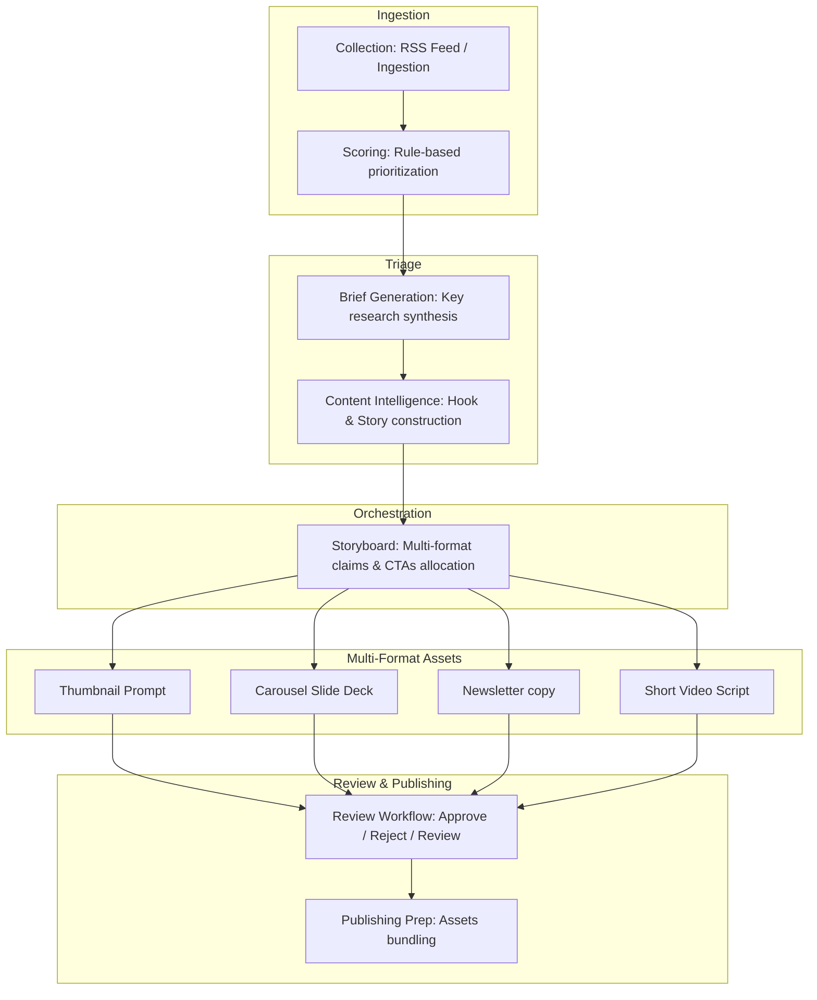

# Product Definition: Streamlit Pipeline Dashboard UI

**Author:** Senior Product Manager, SaaS Architect, and UX Lead  
**Document Status:** Approved (Draft)  
**Target Path:** [product_definition.md](file:///home/aryan/May-2026/Content-Creation/docs/ui/product_definition.md)  
**Context:** MVP UI Wrapper for the Content Creation Platform  

---

## 1. Product Vision & Objectives

The **Content Creation Platform UI** is the visual cockpit for our editorial-first automated content pipeline. It provides a lightweight, interactive interface built on Streamlit that orchestrates and visualizes the transition of raw arXiv papers and tech releases into highly engaging, multi-format educational assets. 

Rather than redesigning the backend, this UI acts as a thin presentation layer. It directly exposes the Python SDK methods, file system repositories, and state managers. The primary goal is to make the technical AI pipeline digestible, reviewable, and testable by non-developer users (e.g., content creators, editors, and recruiters).

### Deployment Objectives
* **Demonstrate Architecture:** Provide a step-by-step visual representation of our clean architecture layers (Ingestion → Scoring → Brief → Content Intelligence → Storyboard → Multi-format Assets).
* **Demonstrate AI Pipeline:** Allow users to run the generative pipeline on selected topics, viewing real-time status updates and provider failovers (e.g. Gemini falling back to OpenRouter).
* **High Recruiter Usability:** Ensure a recruiter can load the page, immediately view pre-generated high-quality assets (such as [Topic 8 (Preferential Bayesian Optimization)](file:///home/aryan/May-2026/Content-Creation/data/briefs/ccde3cde2aa9e46761357a6ee5e0382351cff65da3f99ae672c0a1bc15ce1cb2.json)), run a live pipeline generation with a single click, and review logs without opening a terminal.
* **Streamlit Deployability:** Limit dependencies and design choice complexity to allow instant deployment on **Streamlit Community Cloud** reading from a standard GitHub repository branch.

---

## 2. Analysis of Platform Capabilities

The UI must wrap and visualize the following 11 core capabilities of the platform:



1. **Collection:** Interfaces with raw ingested feeds (`data/raw/` or database) to show new incoming research items.
2. **Scoring:** Visualizes how a topic scored based on rule criteria (e.g., `ScoringEngine` weights). Displays total score, flags fired, and quality checks.
3. **Brief Generation:** Visualizes the core, peer-reviewed Brief containing summarized fields, takeaways, and student analogies.
4. **Content Intelligence:** Exposes the psychological hooks, curiosity gaps, before/after contrast pairs, and topic classifications generated by the LLM.
5. **Storyboard:** Shows the structural mapping of visual metaphors, layout style choices, and canon format selection.
6. **Thumbnail:** Renders the copy, style guidelines, negative prompts, and visual instructions for image generators.
7. **Carousel:** Formats the slide-by-slide sequence (title, body text, visual notes, and visual cues) for quick copy-pasting.
8. **Newsletter:** Presents the final Markdown draft sections (What Happened, Why It Matters, Student Takeaways, Source Links).
9. **Script:** Generates and presents the short video voiceover script structure.
10. **Review Workflow:** Displays status badges (`APPROVED`, `NEEDS_REVIEW`, `DRAFT`) based on [ReviewStatus](file:///home/aryan/May-2026/Content-Creation/src/content_creation/shared/enums.py) and provides action buttons to transition status on disk.
11. **Publishing Preparation:** Renders a download utility or copy button that packs all approved assets for a topic into a single deployment folder/archive.

---

## 3. Product Strategy & User Personas

### Personas

#### 1. The Portfolio Reviewer (Recruiter / Hiring Manager)
* **Description:** A busy technical recruiter or team lead auditing Aryan’s repository.
* **Goal:** Quickly verify that the AI pipeline is functional, the code generates premium outputs, the codebase uses modern engineering practices, and the system handles failures gracefully.
* **Key Needs:** One-click demos, visible logs, clear error tracking, and side-by-side comparisons of successful outputs.

#### 2. The Educational Content Creator (Target Creator)
* **Description:** A tech influencer or educator publishing weekly on LinkedIn, YouTube, and email newsletters.
* **Goal:** Triage 20 papers a day, generate drafts for the top 3, review visual styles, and export files.
* **Key Needs:** Minimal clicking, editable text drafts, visual consistency checks, and a clean interface.

### Success Criteria
* **Zero CLI Friction:** Recruiters should never have to clone the repository or run bash scripts to inspect output quality.
* **Time-to-Value < 30 seconds:** A user landing on the page should immediately see high-quality content previews (e.g., Topic 8) within three clicks.
* **State Sync:** Moving a topic status to "Approved" in the UI must write directly to the underlying `data/workflow_state/` repository, ensuring CLI operations remain in sync.

---

## 4. MVP Scope Definition

To build the smallest possible deployable Streamlit application, we categorize features using the MoSCoW framework.

### Must Have (Minimum Viable Product)
* **Interactive Topic Catalog:** A sidebar list of ingested topics categorized by status (Staged, Scored, Draft, Needs Review, Approved).
* **Topic Score Card:** A clean visualization of scoring breakdowns, total prioritizations, and warning flags.
* **Unified Asset Previewer:** Tabs showing:
  - **The Brief** (Takeaway, Analogy, Limitations)
  - **Social Hooks** (CI statistics, bold claims, curiosity gap)
  - **Storyboard & Script** (CTAs, claims-split, visual styles)
  - **Thumbnail Prompt** (Negative prompt array, layout rules)
  - **Newsletter & Carousel** (Markdown blocks)
* **Live Run Trigger:** A "Generate Content Suite" button that executes the core pipeline using python generation files on a selected topic, outputting live text progress logs directly to a Streamlit container.
* **Status Manager:** Toggle controls to change a topic's workflow state (e.g., mark a degraded brief as `APPROVED` or send it back to `NEEDS_REVIEW`).
* **OpenRouter Failover Monitor:** Renders warnings/notifications showing whether fallback providers were used during the live run (visualizing error failover transparency).

### Should Have
* **Prompt Registry Viewer:** A tab allowing the user to view the markdown files in the [prompts directory](file:///home/aryan/May-2026/Content-Creation/prompts) to understand the system instructions guiding the LLMs.
* **Editable Scoring Configuration:** A panel with sliders allowing temporary adjustments of the criteria weights, live-recalculating scores via `ScoringEngine`.
* **Export Bundler:** A button that packages all generated JSON/Markdown files for the selected topic into a single `.zip` download.

### Won't Have (Explicit Non-Goals)
* **User Authentication:** No login pages or multi-tenant database management.
* **Billing / Subscriptions:** No payment gateways.
* **Team Collaboration:** No comments, edits tracking, or concurrent user collision prevention.
* **RAG (Retrieval-Augmented Generation):** No PDF parsing or custom vector databases inside the UI; the pipeline only runs on pre-collected arXiv metadata.
* **TTS (Text-to-Speech):** No audio playback or voice synthesis controls.
* **Video/Image Rendering:** No visual output engine (no direct Midjourney/Stable Diffusion API or video rendering). It outputs *prompts* and *text*, not pixels.
* **Analytics Dashboards:** No charts showing post performance, view counts, or CTR tracking.

---

## 5. UI Layout & Wireframe Blueprint

The interface utilizes Streamlit's standard two-column layout: a left-hand navigation sidebar and a main workspace containing tabbed views.

### Wireframe Structure

```
+--------------------------------------------------------------------------------+
|  Content Creation Automation Lab (Aryan Kumar Portfolio)                       |
+--------------------------------------------------------------------------------+
| SIDEBAR               | MAIN CONTENT AREA                                      |
|                       |                                                        |
| [Select Topic Source] | +----------------------------------------------------+ |
| (o) Staged Topics     | | Topic: Anchor-Based Heteroscedastic Noise...       | |
| ( ) Approved Assets   | | ID: ccde3cde2aa9... | Score: 8.4 | Status: DRAFT   | |
| ( ) Ingested Feeds    | +----------------------------------------------------+ |
|                       | | [Overview] | [Brief & CI] | [Assets] | [Prompt Log] | |
| [Topic List]          | +----------------------------------------------------+ |
| - Anchor-Based PBO    | | [Overview Tab Active]                              | |
| - MobiBench (Review)  | |                                                    | |
| - SGD linear networks | | * Why it matters:                                  | |
| - Customers Distress  | |   "Most preferential BO methods assume..."         | |
|                       | |                                                    | |
| [Actions]             | | * Validation Warnings:                             | |
| [ Run Pipeline ]      | |   (OK) Analogy present | (OK) Limitation present   | |
|                       | |                                                    | |
| [Status Toggle]       | | [Approve Asset] [Send to Review]                   | |
| [ APPROVED ] [DRAFT]  | |                                                    | |
|                       | | * Failover Log:                                    | |
| [Credentials Status]  | |   - Gemini API: OK                                 | |
| * Gemini: Connected   | |   - OpenRouter: Fallback Configured                | |
| * OpenRouter: Config  | +----------------------------------------------------+ |
+--------------------------------------------------------------------------------+
```

### UX Design Details (UX Lead Perspective)
* **Workflow Status Indicator:** Uses Streamlit status tags. Complete drafts get a green `DRAFT` or `APPROVED` badge. Incomplete or failed runs display a red `NEEDS_REVIEW` badge.
* **Side-by-Side Prompt Verification:** The `Brief & CI` tab shows the input brief card beside the generated Content Intelligence hooks. This allows editors to instantly verify grounding (checking for hallucinated hooks).
* **Live Execution Output Console:** Streamlit's `st.code()` or `st.status()` block is used as a terminal console during pipeline execution. When the user clicks "Run Pipeline," the stdout and stderr streams of the Python generators are piped live, letting recruiters see the backend retry logic and fallback mechanisms.

---

## 6. SaaS Architecture & Integration Strategy

The Streamlit UI application operates directly on the workspace files without maintaining a separate database. It utilizes existing code modules to interact with the storage layers:

```
Streamlit App UI
  │
  ├─── Ingestion Layer  ──► Ingestion / RSS collector scripts
  │
  ├─── Core Controllers ──► ScoringEngine(config), ThumbnailGenerator(api_key, registry)
  │
  └─── Storage Domain   ──► LocalStorage(base_dir) / WorkflowStateManager()
                             └─ Reads & writes JSON files in data/
```

* **SDK Direct Imports:** The application imports `LocalStorage` from [local.py](file:///home/aryan/May-2026/Content-Creation/src/content_creation/storage/local.py) and `WorkflowStateManager` from [state.py](file:///home/aryan/May-2026/Content-Creation/src/content_creation/workflow/state.py).
* **Config Sync:** The YAML file at `config/scoring.yaml` is the authoritative source for the scoring panel configuration. Sliders initialize their values by parsing this file.
* **Workflow Resumability:** When st.button calls write methods, they use the `WorkflowStateManager.mark_completed` or `WorkflowStateManager.mark_failed` endpoints, updating state files in `data/workflow_state/` to reflect UI-driven status changes.

---

## 7. Streamlit Deployment Blueprint

### Community Cloud Requirements
To make the repository instantly deployable on Streamlit Community Cloud:
1. **Dependency Profile:** A standard `requirements.txt` file (or `pyproject.toml` parsing) must include:
   - `streamlit>=1.30.0`
   - `pydantic`
   - `pyyaml`
   - `google-generativeai`
   - `python-dotenv`
2. **Secrets Configuration:** Inside Streamlit's settings dashboard, environment secrets must be configured to pass API keys:
   ```toml
   GEMINI_API_KEY = "AIzaSy..."
   OPENROUTER_API_KEY = "sk-or..."
   ```
3. **File Cache Optimization:** Use Streamlit caching (`@st.cache_resource` and `@st.cache_data`) for instantiating generators (`ContentIntelligenceGenerator`, `StoryboardGenerator`) to prevent re-reading markdown files from the prompts folder on every page reload.
