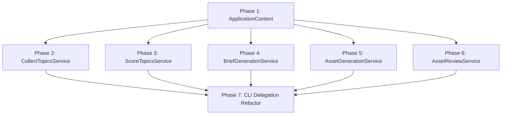

# Service Extraction Execution Plan

This document defines the dependency-aware, step-by-step execution sequence for extracting the Content Creation service layer from [cli.py](file:///home/aryan/May-2026/Content-Creation/src/content_creation/cli.py) to a dedicated `application/` package. The plan is designed to minimize implementation risk, preserve behavior, and ensure zero test regressions at each phase.

---

## Refactoring Milestones

1.  **First Code Change:** Creation of the `src/content_creation/application/` directory, package initialization `__init__.py`, and definition of the `ApplicationContext` (Phase 1).
2.  **First Behavior-Preserving Extraction:** Extracting topic collection logic into `CollectTopicsService` without modifying the CLI interface (Phase 2).
3.  **First CLI Simplification:** Cutting over the `collect` command in `cli.py` to delegate to `CollectTopicsService` (Phase 7).

---

## Dependency-Aware Phase Sequence

---

## Phase 1: ApplicationContext

### Objective
Establish the `application/` package root and construct the dependency injection container (`ApplicationContext`) to centralize system configuration and shared resource initialization.

*   **Files Modified/Created:**
    *   `src/content_creation/application/__init__.py` (New)
    *   `src/content_creation/application/context.py` (New)
*   **Estimated LOC Moved/Created:** ~35 LOC
*   **Risk Level:** **Very Low**
*   **Rollback Procedure:** Remove the `src/content_creation/application/` folder.
*   **Validation Procedure:** Confirm the package is importable and that context instantiation relative to the workspace root runs without errors.
*   **Expected Test Impact:** None. Existing tests are untouched.

### Phase 1 Specifications
*   **PRECONDITIONS:**
    1.  Clean git working state on target branch.
    2.  All 125 existing tests pass.
*   **IMPLEMENTATION STEPS:**
    1.  Create the `application/` directory and define `__init__.py`.
    2.  Define `ApplicationContext` in `context.py` holding `base_dir`, `storage`, `workflow`, `prompt_registry`, `feeds_config_path`, and `scoring_config_path`.
    3.  Implement `ApplicationContext.create(base_dir: Path)` method.
*   **POSTCONDITIONS:**
    1.  `ApplicationContext` can successfully instantiate using `Path.cwd()` in a scratch script.
*   **GO / NO-GO CHECKPOINT:**
    *   *Check:* Does running `uv run python -m pytest` pass? (GO if Yes).

---

## Phase 2: CollectTopicsService

### Objective
Extract the collection and feed ingestion logic from `cli.py` into a reusable, UI-agnostic application service.

*   **Files Modified/Created:**
    *   `src/content_creation/application/collect.py` (New)
    *   `src/content_creation/application/results.py` (New)
*   **Estimated LOC Moved:** ~20 LOC
*   **Risk Level:** **Low**
*   **Rollback Procedure:** Delete `collect.py` and remove references to `CollectResult` in `results.py`.
*   **Validation Procedure:** Write a unit test that calls `CollectTopicsService.run` and asserts that staging directories contain normalized files.
*   **Expected Test Impact:** No changes to existing tests; write new unit tests targeting `CollectTopicsService` directly.

### Phase 2 Specifications
*   **PRECONDITIONS:**
    1.  Phase 1 is completed and verified.
*   **IMPLEMENTATION STEPS:**
    1.  Define `CollectResult` DTO in `results.py`.
    2.  Implement `CollectTopicsService` in `collect.py` wrapping config loading and `IngestionEngine` run.
    3.  Introduce abstract `ProgressReporter` Protocol to allow optional stream logging.
*   **POSTCONDITIONS:**
    1.  Service runs independently of CLI arguments and parses configuration relative to the context base path.
*   **GO / NO-GO CHECKPOINT:**
    *   *Check:* Does the service stage files identical to those generated by the `cli.py collect` command? (GO if Yes).

---

## Phase 3: ScoreTopicsService

### Objective
Extract the scoring and validation logic from `cli.py` into a reusable service.

*   **Files Modified/Created:**
    *   `src/content_creation/application/scoring.py` (New)
*   **Estimated LOC Moved:** ~35 LOC
*   **Risk Level:** **Low**
*   **Rollback Procedure:** Delete `scoring.py` and clear its exports from `__init__.py`.
*   **Validation Procedure:** Run the service programmatically against staged topics and verify they are correctly validated and written to `data/scored/`.
*   **Expected Test Impact:** Zero regression on existing tests; add unit tests for `ScoreTopicsService`.

### Phase 3 Specifications
*   **PRECONDITIONS:**
    1.  Phase 1 context is available.
*   **IMPLEMENTATION STEPS:**
    1.  Define `ScoreResult` DTO in `results.py`.
    2.  Implement `ScoreTopicsService` in `scoring.py` to instantiate `ScoringEngine` and `ValidationEngine`.
    3.  Implement iteration over staged topics, validation flag updates, and output persisting.
*   **POSTCONDITIONS:**
    1.  Scored JSON payloads generated by the service contain correct scores and validation flags.
*   **GO / NO-GO CHECKPOINT:**
    *   *Check:* Does the score and validation engine logic match the CLI execution without altering schema formats? (GO if Yes).

---

## Phase 4: BriefGenerationService

### Objective
Extract the LLM-based brief generation loop (including filtering, sorting, skipping, and rate limiting) into a robust application service.

*   **Files Modified/Created:**
    *   `src/content_creation/application/brief_generation.py` (New)
*   **Estimated LOC Moved:** ~45 LOC
*   **Risk Level:** **Medium** (handles Gemini API credentials and sleeps)
*   **Rollback Procedure:** Revert `brief_generation.py` and clean exports.
*   **Validation Procedure:** Call the service with a mock API key or mock generator to ensure rate limits and skips behave as designed.
*   **Expected Test Impact:** Existing generator tests remain passing. Add new test coverage for skipping already synthesized briefs and error threshold handling.

### Phase 4 Specifications
*   **PRECONDITIONS:**
    1.  Phase 1 is complete.
    2.  Configured API credentials environment is ready.
*   **IMPLEMENTATION STEPS:**
    1.  Define `BriefGenerationResult` DTO.
    2.  Write `BriefGenerationService.run` wrapping sorted list filtering.
    3.  Implement skip check: check if `data/briefs/{id}.json` exists before calling generator.
    4.  Embed the rate-limiting delay parameter (default `5.0` seconds) inside the batch processing loop.
*   **POSTCONDITIONS:**
    1.  Service runs, skips existing files, handles individual API timeouts gracefully, and returns a detailed failure checklist.
*   **GO / NO-GO CHECKPOINT:**
    *   *Check:* Does the service synthesize a brief matching the production schema when supplied with a valid API key? (GO if Yes).

---

## Phase 5: AssetGenerationService

### Objective
Extract format mapping, generator instantiation, and [WorkflowStateManager](file:///home/aryan/May-2026/Content-Creation/src/content_creation/workflow/state.py) transitions from the CLI command into a robust application service.

*   **Files Modified/Created:**
    *   `src/content_creation/application/asset_generation.py` (New)
*   **Estimated LOC Moved:** ~90 LOC (the most complex extraction)
*   **Risk Level:** **Medium-High** (governs file updates, formats, and state managers)
*   **Rollback Procedure:** Delete `asset_generation.py` and clear its imports.
*   **Validation Procedure:** Perform integration tests validating that workflow states are accurately set to `completed` or `failed` on asset generation cycles.
*   **Expected Test Impact:** High coverage required to ensure that resuming from existing workflow files remains functional.

### Phase 5 Specifications
*   **PRECONDITIONS:**
    1.  `WorkflowStateManager` and domain asset generators are verified working.
*   **IMPLEMENTATION STEPS:**
    1.  Define `AssetGenerationResult` DTO.
    2.  Write the format mapper loop that resolves `recommended_formats` to `FORMAT_TO_ASSET` formats.
    3.  Implement workflow guard checks: skip generation if the stage shows `completed` in workflow state files.
    4.  Implement generators orchestration (`ThumbnailGenerator`, `ScriptGenerator`, etc.).
    5.  Integrate workflow status reporting (`mark_completed` / `mark_failed`) into exception blocks.
*   **POSTCONDITIONS:**
    1.  Workflow states on disk match actual asset files.
    2.  All exceptions raised during generation are captured, logged, and update workflow state to `failed` without interrupting other assets.
*   **GO / NO-GO CHECKPOINT:**
    *   *Check:* Does executing the service twice result in the second run skipping all assets with zero calls to generators? (GO if Yes).

---

## Phase 6: AssetReviewService

### Objective
Extract programmatic asset approval, rejection status writing, and manifest compilation from the interactive CLI loop.

*   **Files Modified/Created:**
    *   `src/content_creation/application/asset_review.py` (New)
*   **Estimated LOC Moved:** ~40 LOC
*   **Risk Level:** **Medium**
*   **Rollback Procedure:** Delete `asset_review.py` and revert related changes.
*   **Validation Procedure:** Assert that applying an approval decision updates the file status and triggers the rebuilding of the target manifest.
*   **Expected Test Impact:** Existing manifest construction tests continue passing. Add unit tests for programmatic decisions.

### Phase 6 Specifications
*   **PRECONDITIONS:**
    1.  Asset structures and manifest models are finalized.
*   **IMPLEMENTATION STEPS:**
    1.  Define the `AssetDecision` dataclass container.
    2.  Define `ReviewResult` containing updated manifests and decision counts.
    3.  Implement `apply_decisions` loading manifests, invoking status updates, and calling `ManifestBuilder.build()`.
*   **POSTCONDITIONS:**
    1.  Asset files contain updated `review_status`.
    2.  Recompiled manifest has updated `overall_status` and `ready_for_planner`.
*   **GO / NO-GO CHECKPOINT:**
    *   *Check:* Does applying `ReviewStatus.APPROVED` via the service correctly update the status and rebuild the manifest on disk? (GO if Yes).

---

## Phase 7: CLI Delegation Refactor

### Objective
Clean up [cli.py](file:///home/aryan/May-2026/Content-Creation/src/content_creation/cli.py) to act as a thin parser shell, routing all CLI commands to the newly created application services and displaying results.

*   **Files Modified/Created:**
    *   `src/content_creation/cli.py` (Modified)
*   **Estimated LOC Modified/Removed:** ~350 LOC removed / replaced with service calls
*   **Risk Level:** **High** (direct impact on end-user interface)
*   **Rollback Procedure:** Revert `cli.py` changes using git (`git checkout HEAD -- src/content_creation/cli.py`).
*   **Validation Procedure:** Run all CLI commands manually and in automated testing suites, ensuring they yield identical outcomes, outputs, and exit codes.
*   **Expected Test Impact:** Existing E2E CLI command validation tests must pass without any modifications.

### Phase 7 Specifications
*   **PRECONDITIONS:**
    1.  Phases 1 through 6 are completed and fully tested.
*   **IMPLEMENTATION STEPS:**
    1.  Import `ApplicationContext` and all application services in `cli.py`.
    2.  Refactor `collect` command to instantiate `ApplicationContext`, call `CollectTopicsService`, and print output.
    3.  Refactor `score-topics`, `generate-briefs`, `generate-assets`, and `batch-approve` commands.
    4.  Refactor `review-assets` to preserve the interactive stdin loop, query assets using the context, display content, collect decisions, and pass them as a list of `AssetDecision` objects to `AssetReviewService.apply_decisions`.
    5.  Refactor `run-pipeline` to run the services sequentially using the progress logger.
*   **POSTCONDITIONS:**
    1.  [cli.py](file:///home/aryan/May-2026/Content-Creation/src/content_creation/cli.py) contains zero direct engine setups, loop logic, or format maps. It serves only as a command-line interface parser and output formatter.
*   **GO / NO-GO CHECKPOINT:**
    *   *Check:* Do all 125+ unit and E2E tests pass? (GO if Yes).
