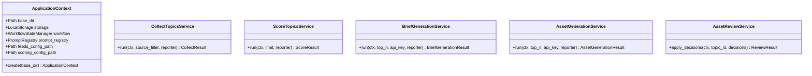

# Service Extraction Plan — Backend Integration Refactoring

This document outlines the architectural plan for extracting core orchestration and business logic from the Content Creation Factory CLI into a shared application service layer. This shared layer allows the CLI and Streamlit interfaces to function as thin adapters over a single, unified backend implementation, avoiding logic duplication and ensuring workflow state integrity.

---

## 1. Subcommand Layer-by-Layer Analysis

The repository contains six critical subcommands currently orchestrated directly within [cli.py](file:///home/aryan/May-2026/Content-Creation/src/content_creation/cli.py). We break down their current logic into four distinct architecture layers.

### 1.1 Ingest (collect)
*   **CLI-Only Responsibilities:**
    *   Parsing CLI options (`--source` and `--all`).
    *   Printing status messages (`Ingestion complete. Added {N} new items.`).
    *   Returning shell exit code `0` on success, `1` on missing parameters.
*   **Business/Application Responsibilities:**
    *   Checking input filters and resolving source selection (all vs. specific feed).
    *   Instantiating and executing the feed ingestion.
    *   Returning staged list summary data.
*   **Domain Responsibilities:**
    *   Ingesting raw feeds and parsing source-specific formats.
    *   Normalizing feeds into canonical `TopicItem` objects (enforcing validation and mapping fields like `"unknown"`).
*   **Platform Responsibilities:**
    *   Loading configuration files (`feeds.yaml`).
    *   Disk write operations to `data/raw/` and `data/staged/` directories via `LocalStorage`.

### 1.2 Score Topics (score-topics)
*   **CLI-Only Responsibilities:**
    *   Parsing `--limit` parameters.
    *   Printing console output summaries showing counts of scored and rejected items.
*   **Business/Application Responsibilities:**
    *   Loading and parsing the scoring config file.
    *   Querying the list of staged topics from storage and applying limits.
    *   Coordinating the scoring and validation loop, then saving results.
*   **Domain Responsibilities:**
    *   Calculating priority scores based on relevance and quality metrics (`ScoringEngine`).
    *   Checking validation flags and assigning status (`ValidationEngine`).
*   **Platform Responsibilities:**
    *   Reading files from `data/staged/` and writing scored JSON files to `data/scored/` via `LocalStorage`.

### 1.3 Generate Briefs (generate-briefs)
*   **CLI-Only Responsibilities:**
    *   Retrieving `GEMINI_API_KEY` from the shell environment.
    *   Parsing `--top` limit parameter.
    *   Printing processing counters and tracking errors to stdout/stderr.
*   **Business/Application Responsibilities:**
    *   Retrieving scored items, filtering for status `TopicStatus.SCORED`, and sorting by priority.
    *   Filtering out already generated brief files to prevent duplicate API costs.
    *   Iterating through topics, executing rate-limiting sleep between calls, and handling failures safely to avoid halting the batch run.
*   **Domain Responsibilities:**
    *   Running educational summarization and formatting via `generate_brief()`.
    *   Enforcing grounded-only responses using LLM instructions.
*   **Platform Responsibilities:**
    *   Loading templates from `PromptRegistry`.
    *   Writing generated brief documents to `data/briefs/` using `LocalStorage`.

### 1.4 Generate Assets (generate-assets)
*   **CLI-Only Responsibilities:**
    *   Handling API key presence verification and CLI argument parsing (`--top`).
    *   Formatting lists of generation status and errors for the console.
*   **Business/Application Responsibilities:**
    *   Reading briefs from storage sorted by creation date.
    *   Mapping recommend formats in briefs (`recommended_formats`) to canonical format types (`short_video`, `carousel`, `newsletter`, `thumbnail`) using `FREETEXT_TO_FORMAT` and `FORMAT_TO_ASSET` mappings.
    *   Checking workflow execution state prior to invoking format generators to skip already completed assets.
    *   Managing generator instantiation and execution loops.
    *   Marking stage status in the workflow state engine (`mark_completed` / `mark_failed`) and saving artifacts.
*   **Domain Responsibilities:**
    *   Asset format generation logic (invoking prompts for `ScriptGenerator`, `CarouselGenerator`, etc.).
*   **Platform Responsibilities:**
    *   Checking and updating workflow state files under `data/workflow_state/` via [WorkflowStateManager](file:///home/aryan/May-2026/Content-Creation/src/content_creation/workflow/state.py).
    *   Saving JSON asset outputs to their respective directories via `LocalStorage`.
    *   Resolving prompt files from `PromptRegistry`.

### 1.5 Run Pipeline (run-pipeline)
*   **CLI-Only Responsibilities:**
    *   Providing CLI-specific logging output formatting.
    *   Validating key presence and parsing pipeline-wide variables.
*   **Business/Application Responsibilities:**
    *   Chaining pipeline stages sequentially (Collect → Score → Briefs → Assets → Build Manifests → Auto-Approve).
    *   Managing execution logging state via `PipelineLogger`.
    *   Translating inputs (such as `--auto-approve`) into instructions across downstream services.
*   **Domain Responsibilities:**
    *   (Delegated to specific stage engines and generators).
*   **Platform Responsibilities:**
    *   Logging raw step metrics to pipeline logs (`data/logs/`).

### 1.6 Review Assets (review-assets)
*   **CLI-Only Responsibilities:**
    *   Displaying interactive summaries and formatting JSON content directly to standard output.
    *   Reading user inputs from stdin (e.g., `Show full content? (y/n)`, `Decision (a=approve/r=reject/s=skip)`).
    *   Collecting typed text input for rejection reasons.
*   **Business/Application Responsibilities:**
    *   Verifying manifest existence for a topic and loading it.
    *   Providing structured asset data to the presentation layer.
    *   Applying lists of approval/rejection decisions to corresponding assets and calling manifest rebuild.
*   **Domain Responsibilities:**
    *   Evaluating manifest completeness status transitions.
*   **Platform Responsibilities:**
    *   Updating asset statuses on disk (`LocalStorage.update_asset_status`).
    *   Reassembling topic manifest details and saving them via `ManifestBuilder`.

---

## 2. Architectural Concerns and Ownership Boundaries

To guarantee that Streamlit and CLI do not desynchronize, we establish strict ownership boundaries for shared resources.

```
┌────────────────────────────────────────────────────────┐
│                   Presentation Layer                   │
│         [cli.py]               [streamlit_app]         │
└───────────┬───────────────────────────┬────────────────┘
            │                           │
            └─────────────┬─────────────┘
                          ▼
┌────────────────────────────────────────────────────────┐
│                   Application Layer                    │
│                 [ApplicationContext]                   │
│    [CollectTopicsService]      [ScoreTopicsService]    │
│    [BriefGenerationService]    [AssetGenerationService]│
│    [AssetReviewService]        [PipelineRunService]    │
└─────────────────────────┬──────────────────────────────┘
                          ▼
┌────────────────────────────────────────────────────────┐
│              Domain & Platform Modules                 │
│      [LocalStorage]           [WorkflowStateManager]   │
│      [PromptRegistry]         [Generators / Engines]   │
└────────────────────────────────────────────────────────┘
```

### 2.1 Duplicated Orchestration
*   **Problem:** Batch processing loops, sorting logic, and skip checks are currently duplicated between standalone commands (e.g., `generate-assets`) and composite commands (e.g., `run-pipeline`).
*   **Solution:** Extract these loops into unified application services. The `PipelineRunService` will call the individual services directly, removing duplicate logic block implementations.

### 2.2 Reusable Workflows
*   The primary workflow units represent isolated, transactional business actions:
    1.  *Ingestion:* Load sources → Fetch items → Normalise & Stage.
    2.  *Scoring:* Load items → Rank & Validate → Store Scored.
    3.  *Brief Synthesis:* Query scored → Sort top N → Deduplicate → Synthesize briefs.
    4.  *Asset Creation:* Query briefs → Map types → Run generators with workflow checks → Persist.
    5.  *Asset Audit:* Fetch manifest → Apply status changes → Compile manifest.

### 2.3 Workflow State Ownership
*   **Current State:** Subcommands interact directly with `WorkflowStateManager`.
*   **Boundary:** In the new architecture, the `WorkflowStateManager` is owned and accessed **exclusively** by the application layer (specifically `AssetGenerationService` and `PipelineRunService`). Neither the CLI parser nor the Streamlit widgets will write to or modify workflow states directly.

### 2.4 Storage Ownership
*   **Current State:** Both CLI commands and engines instantiate `LocalStorage` ad-hoc.
*   **Boundary:** The application layer owns `LocalStorage` instances. UI adapters are permitted to use read-only methods (e.g., `list_scored`, `list_briefs`) to display data to users, but **all writes, updates, and state mutations must flow through Application Services**.

### 2.5 Prompt Ownership
*   Neither CLI nor Streamlit components should directly load, register, or handle prompt files. `PromptRegistry` setup is handled inside the application layer context and passed directly to domain generators.

---

## 3. Application Layer Design (`src/content_creation/application/`)

We propose the creation of a new Python package: `src/content_creation/application/`.

### 3.1 ApplicationContext
*   **Responsibility:** Serve as the unified dependency container. It acts as the single bootstrap point for directories, database/storage clients, and template configuration resources.
*   **Signature & Attributes:**
    ```python
    @dataclass(frozen=True)
    class ApplicationContext:
        base_dir: Path
        storage: LocalStorage
        workflow: WorkflowStateManager
        prompt_registry: PromptRegistry
        feeds_config_path: Path
        scoring_config_path: Path

        @classmethod
        def create(cls, base_dir: Path) -> "ApplicationContext":
            """Bootstraps all paths and services relative to base_dir."""
            storage = LocalStorage(base_dir)
            workflow = WorkflowStateManager(base_dir / "data" / "workflow_state")
            prompt_registry = PromptRegistry(base_dir)
            feeds_config_path = base_dir / "config" / "feeds.yaml"
            scoring_config_path = base_dir / "config" / "scoring.yaml"
            
            return cls(
                base_dir=base_dir,
                storage=storage,
                workflow=workflow,
                prompt_registry=prompt_registry,
                feeds_config_path=feeds_config_path,
                scoring_config_path=scoring_config_path
            )
    ```
*   **Dependencies:** `LocalStorage`, `WorkflowStateManager`, `PromptRegistry`.
*   **Ownership Boundary:** Holds configuration references. It is stateless after initialization.

### 3.2 Progress Reporting Protocol
To support live progress rendering in the CLI (stdout) and Streamlit (widgets / spinners) without exposing raw internals, services accept an optional `ProgressReporter`:

```python
class ProgressReporter(Protocol):
    def on_stage_start(self, stage: str, total_items: int) -> None: ...
    def on_item_success(self, item_id: str, action: str, details: str) -> None: ...
    def on_item_failure(self, item_id: str, action: str, error: str) -> None: ...
```

### 3.3 Services Definition



#### CollectTopicsService
*   **Responsibility:** Manage source configuration loading and execute the ingestion engine process.
*   **Inputs:**
    *   `ctx: ApplicationContext`
    *   `source_filter: Optional[str] = None`
    *   `reporter: Optional[ProgressReporter] = None`
*   **Outputs:**
    *   `CollectResult` (dataclass holding `new_items: list[TopicItem]` and `count: int`)
*   **Dependencies:** `IngestionEngine`, `load_yaml_config`.
*   **Ownership Boundary:** Executes writes to `data/staged/` and `data/raw/` directories via `IngestionEngine` and context-provided storage.

#### ScoreTopicsService
*   **Responsibility:** Fetch staged entries, run scoring rules, execute validations, and save scored metadata.
*   **Inputs:**
    *   `ctx: ApplicationContext`
    *   `limit: Optional[int] = None`
    *   `reporter: Optional[ProgressReporter] = None`
*   **Outputs:**
    *   `ScoreResult` (dataclass containing `scored_count: int`, `rejected_count: int`, `items: list[ScoredTopicItem]`)
*   **Dependencies:** `ScoringEngine`, `ValidationEngine`, `load_scoring_config`.
*   **Ownership Boundary:** Updates `status` fields on items. It is the sole component writing files under `data/scored/`.

#### BriefGenerationService
*   **Responsibility:** Process the highest-scoring topics and synthesize educational summaries while handling Gemini API rate limits.
*   **Inputs:**
    *   `ctx: ApplicationContext`
    *   `top_n: int`
    *   `api_key: str`
    *   `rate_limit_delay: float = 5.0`
    *   `reporter: Optional[ProgressReporter] = None`
*   **Outputs:**
    *   `BriefGenerationResult` (dataclass containing `generated_count: int`, `skipped_count: int`, `failures: list[dict]`)
*   **Dependencies:** `generate_brief`, `PromptRegistry`.
*   **Ownership Boundary:** Validates LLM credentials before run. Guarantees that existing brief files on disk are skipped to preserve token budget.

#### AssetGenerationService
*   **Responsibility:** Convert structured briefs into format-specific script, newsletter, carousel, and thumbnail assets while observing and updating workflow state.
*   **Inputs:**
    *   `ctx: ApplicationContext`
    *   `top_n: int`
    *   `api_key: str`
    *   `rate_limit_delay: float = 5.0`
    *   `reporter: Optional[ProgressReporter] = None`
*   **Outputs:**
    *   `AssetGenerationResult` (dataclass containing `counts: dict[str, int]`, `skipped_count: int`, `failed_count: int`)
*   **Dependencies:** `ScriptGenerator`, `CarouselGenerator`, `NewsletterGenerator`, `ThumbnailGenerator`, `WorkflowStateManager`, format mapping lookup models.
*   **Ownership Boundary:** **Sole writer of workflow states.** Catches errors internally to complete valid assets even if another format fails.

#### AssetReviewService
*   **Responsibility:** Update asset review flags and regenerate manifests to coordinate weekly planners.
*   **Inputs:**
    *   `ctx: ApplicationContext`
    *   `topic_id: str`
    *   `decisions: list[AssetDecision]` (where `AssetDecision` holds `asset_type: str`, `status: ReviewStatus`, and optional `rejection_reason: str`)
*   **Outputs:**
    *   `ReviewResult` (dataclass containing `approved: int`, `rejected: int`, `manifest: TopicManifest`)
*   **Dependencies:** `ManifestBuilder`.
*   **Ownership Boundary:** Changes files under asset subdirectories via `LocalStorage.update_asset_status` and rebuilds the topic manifest.

---

## 4. Implementation Phasing

To decouple UI construction and prevent regression bugs, the refactoring is divided into two distinct phases.

### 4.1 Phase 0A: Minimum Extraction Required Before Streamlit

Establishes the foundation package and extracts services involving external API integrations, workflow management, and input loops.

```
src/content_creation/
├── application/ (NEW)
│   ├── __init__.py
│   ├── context.py
│   ├── brief_generation.py
│   ├── asset_generation.py
│   ├── asset_review.py
│   └── results.py
└── cli.py (MODIFIED)
```

*   **Files Affected:**
    *   [context.py](file:///home/aryan/May-2026/Content-Creation/src/content_creation/application/context.py) (New)
    *   [results.py](file:///home/aryan/May-2026/Content-Creation/src/content_creation/application/results.py) (New)
    *   [brief_generation.py](file:///home/aryan/May-2026/Content-Creation/src/content_creation/application/brief_generation.py) (New)
    *   [asset_generation.py](file:///home/aryan/May-2026/Content-Creation/src/content_creation/application/asset_generation.py) (New)
    *   [asset_review.py](file:///home/aryan/May-2026/Content-Creation/src/content_creation/application/asset_review.py) (New)
    *   [cli.py](file:///home/aryan/May-2026/Content-Creation/src/content_creation/cli.py) (Modified to route `generate-briefs`, `generate-assets`, `review-assets`, and `batch-approve`)
*   **Estimated Risk:** **Medium**
    *   *Rationale:* Refactoring the asset generation loop and interactive stdin reviews impacts core workflow state handling. Regressions in these modules could break CLI scripts.
*   **Rollback Strategy:**
    *   We maintain git branches explicitly. The main command structures can be reverted using:
        ```bash
        git checkout HEAD -- src/content_creation/cli.py
        rm -rf src/content_creation/application/
        ```
*   **Validation Strategy:**
    1.  *Golden Master Output Comparison:* Run `generate-assets` on the branch with a mocked API setup. Compare the resulting files under `data/` and `data/workflow_state/` with output generated prior to the refactoring. They must be identical.
    2.  *Interactive Test Suit Simulation:* Execute the refactored CLI commands using programmatic input piping (e.g. `yes a | content-creation review-assets --topic-id <id>`) and verify manifest outcomes.
    3.  *Test Runner execution:* Verify that all existing unit tests in `tests/test_review.py` and `tests/test_planner.py` pass.

### 4.2 Phase 0B: Additional Extractions That Can Wait

Decouple ingestion, scoring, and end-to-end pipeline execution from the CLI parser.

*   **Files Affected:**
    *   [collect.py](file:///home/aryan/May-2026/Content-Creation/src/content_creation/application/collect.py) (New)
    *   [scoring.py](file:///home/aryan/May-2026/Content-Creation/src/content_creation/application/scoring.py) (New)
    *   [pipeline.py](file:///home/aryan/May-2026/Content-Creation/src/content_creation/application/pipeline.py) (New)
    *   [cli.py](file:///home/aryan/May-2026/Content-Creation/src/content_creation/cli.py) (Modified to route `collect`, `score-topics`, and `run-pipeline`)
*   **Estimated Risk:** **Low**
    *   *Rationale:* These services run simple batch transitions with minimal conditional state logic.
*   **Rollback Strategy:**
    *   Revert changes to `cli.py` for these specific commands and delete the respective service files.
*   **Validation Strategy:**
    1.  Verify command output correctness of `uv run python -m content_creation.cli collect --all` against existing production logs.
    2.  Verify validation flags persist identically for scored entries after invoking the refactored scoring engine.

---

## 5. Success Criteria and Verification Plan

To verify the extraction successfully decouples CLI and Streamlit, we define strict validation gates.

### 5.1 Verification Checklist

| Metric | Verification Check | Expected Outcome | Pass/Fail |
|---|---|---|---|
| **Zero duplication** | Check `cli.py` and `streamlit_app/` for generator calls and format maps. | No imports of generators, prompts, or format lists inside views. | |
| **Thin View Adapters** | Inspect `cli.py` subcommand block size. | Subcommands delegate to service within 15 lines of code. | |
| **Resumability** | Run `AssetGenerationService` twice. | Second run skips completed stages using `workflow_state` json files. | |
| **Manifest Sync** | Approve an asset in Streamlit, then check the CLI status command. | CLI and Streamlit show the exact same status and approved assets. | |
| **Tests Integrity** | Execute all unit tests in repository. | `pytest` reports 100% of the 125+ tests pass with zero warnings. | |

### 5.2 Decoupled CLI Implementation Sketch

After extraction, the CLI subcommands will follow this simple delegation pattern:

```python
if args.command == "generate-briefs":
    ctx = ApplicationContext.create(base_dir)
    service = BriefGenerationService()
    
    # Simple console progress implementation
    class ConsoleReporter:
        def on_stage_start(self, stage, total): print(f"Starting {stage} for {total} items...")
        def on_item_success(self, item_id, action, details): print(f"  ✓ {item_id[:12]}: {details}")
        def on_item_failure(self, item_id, action, error): print(f"  ✗ {item_id[:12]} failed: {error}")
        
    result = service.run(ctx, top_n=args.top, api_key=api_key, reporter=ConsoleReporter())
    print(f"Generated {result.generated_count} briefs, skipped {result.skipped_count}.")
    return 0
```

# Architecture Review Board Assessment

---

## QUESTION 1

Can Streamlit call the proposed services without importing CLI code?

### Answer
**PASS**

### Evidence
*   **Decoupled View Adapters:** The architecture diagram in Section 2 shows that the presentation layer adapters `[cli.py]` and `[streamlit_app]` are siblings that independently point to the application services. Neither has a dependency on the other.
*   **Service Isolation:** The service definitions in Section 3.3 and package layout in Section 4.1 place all services inside the `application/` package (e.g., `src/content_creation/application/brief_generation.py`). These modules contain zero imports from `cli.py` or references to parser logic.
*   **Typed Interface Results:** The input parameters (such as `limit: Optional[int]`) and outputs (DTO dataclasses defined in `results.py`) use basic types, entirely separating CLI-specific presentation or stream structures.

---

## QUESTION 2

Can a future FastAPI backend reuse the same services without modification?

### Answer
**PASS**

### Evidence
*   **UI/Framework Agnostic Signatures:** The service interfaces detailed in Section 3.3 accept basic Python primitives (`top_n: int`, `api_key: str`, etc.) and return pure Python dataclasses (e.g., `BriefGenerationResult`).
*   **Abstracted Progress Execution:** In Section 3.2, progress updates are streamed via an abstract `ProgressReporter` Protocol instead of print statements or widgets. FastAPI can pass a dummy reporter or one that feeds websocket/SSE endpoints without changing service internals.
*   **Environment Agnostic Context:** The `ApplicationContext` in Section 3.1 bootstraps using a standard base directory path (`base_dir: Path`), allowing it to run within any server environment context.

---

## QUESTION 3

Does business logic exist in exactly one place?

### Answer
**PASS**

### Evidence
*   **Consolidated Orchestration:** As analyzed in Section 2.1, loops for collection, scoring, briefs, assets, and reviews are extracted from [cli.py](file:///home/aryan/May-2026/Content-Creation/src/content_creation/cli.py) and placed solely in the `application/` services.
*   **Composite Reusability:** The `PipelineRunService` (proposed in Section 3.3 and 4.2) reuses the other standalone application services rather than recreating duplicate scoring or asset loops, resolving the duplication risk highlighted in Section 2.1.

---

## QUESTION 4

Who owns workflow state?

### Answer
**PASS**

### Evidence
*   **Exclusive Modifying Layer:** Section 2.3 establishes that `WorkflowStateManager` is owned and accessed exclusively by the application layer.
*   **Update Responsibility:** The `AssetGenerationService` is defined in Section 3.3 as the "sole writer of workflow states", executing all transitions (`mark_completed` / `mark_failed`) and checking `stage_completed` within the generation workflow.
*   **Read Access:** Adapters (CLI / Streamlit) do not write to or manage workflow states directly, maintaining a single-writer pattern at the service boundary.

---

## QUESTION 5

Who owns storage mutations?

### Answer
**PASS**

### Evidence
*   **Restricted Storage Mutations:** Section 2.4 establishes that UI adapters are restricted to read-only queries. All writes, updates, and state mutations must flow through the application layer services.
*   **Encapsulated Writes:** Subcommand-specific files and manifests are written exclusively inside the service layer (e.g., `ScoreTopicsService` writing to `data/scored/` and `AssetReviewService` writing updated assets and manifests).

---

## QUESTION 6

Who owns prompt resolution?

### Answer
**PASS**

### Evidence
*   **Context Instantiation:** `PromptRegistry` is instantiated inside `ApplicationContext.create` (Section 3.1) and passed down to domain generators.
*   **No Adapter Bypass:** The presentation layer adapters cannot access prompts directly or modify template paths, as these are managed by `PromptRegistry` within the application context.

---

## FINAL DECISION

**APPROVED**

### Implementation Prerequisites
1.  **Repository Integrity Baseline:** Run `uv run python -m pytest` on the branch before modifications to verify that all 125 tests pass.
2.  **Protocol Interface Definition:** Establish and test the `ProgressReporter` Protocol to confirm that stdout-based console logs and UI progress indicators can be driven from the same callbacks.
3.  **Application Environment Hook:** Configure `ApplicationContext` initialization tests with environment variables to ensure `GEMINI_API_KEY` mapping behaves uniformly in both local environments and cloud containers.

